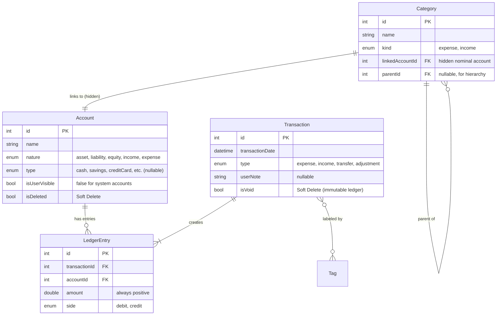

# Database Schema & Logic

Variance uses [Drift](https://drift.simonbinder.eu/) (SQLite) for local persistence. The model implements **true Double-Entry Bookkeeping (DEB)** with an immutable ledger.

## Conceptual Model (ERD)



## Double-Entry Bookkeeping

### The Accounting Equation
```
Assets = Liabilities + Equity + (Income - Expenses)
```

### Account Natures

| Nature | Debit Effect | Credit Effect | Examples |
|--------|--------------|---------------|----------|
| **Asset** | Increase ↑ | Decrease ↓ | Cash, Savings, Wallet |
| **Liability** | Decrease ↓ | Increase ↑ | Credit Card, Loan |
| **Equity** | Decrease ↓ | Increase ↑ | Opening Balances |
| **Income** | Decrease ↓ | Increase ↑ | Salary category |
| **Expense** | Increase ↑ | Decrease ↓ | Food category |

### Transaction Types & Ledger Entries

| Transaction | Debit Account | Credit Account |
|-------------|---------------|----------------|
| **Expense** | Category (expense account) | Source (asset) |
| **Income** | Destination (asset) | Category (income account) |
| **Transfer** | To Account | From Account |
| **Adjustment** | Account or Equity | Equity or Account |

### Balance Computation

Balances are **never cached**. They are always computed from ledger entries:

```dart
// For Asset & Expense accounts:
balance = sum(debits) - sum(credits)

// For Liability, Equity & Income accounts:
balance = sum(credits) - sum(debits)
```

### Immutable Ledger Pattern

- Transactions are **never deleted**
- To "delete": Set `isVoid = true` (voided transactions are excluded from balance calculations)
- To "edit": Void the original, create a new transaction

---

## Schema Reference

### 1. Accounts

Represents a store of value (user-visible) or a nominal account (hidden, for categories).

| Column | Type | Constraints | Description |
|--------|------|-------------|-------------|
| `id` | `Int` | PK, AutoInc | Unique ID |
| `name` | `Text` | Max 100 chars | Display Name |
| `nature` | `Enum` | `AccountNature` | `asset`, `liability`, `equity`, `income`, `expense` |
| `type` | `Enum` | `AccountType`, Nullable | `cash`, `savings`, `bankAccount`, `creditCard`, `loan`, `investment`, `insurance`, `wallet` |
| `isUserVisible` | `Bool` | Default `true` | False for category accounts and equity |
| `currencyCode` | `Text` | Default `'INR'` | ISO 4217 Code |
| `includeInTotals` | `Bool` | Default `true` | Include in Net Worth calculations |
| `isDeleted` | `Bool` | Default `false` | Soft Delete Flag |
| `createdAt` | `DateTime` | Auto | Audit timestamp |
| `updatedAt` | `DateTime` | Auto | Audit timestamp |
| `statementDay` | `Int` | Nullable, 1-31 | Credit card statement day |
| `paymentDueDay` | `Int` | Nullable, 1-31 | Credit card payment day |
| `creditLimit` | `Real` | Nullable | Credit card limit |
| `interestRate` | `Real` | Nullable | % for Loans/Savings |
| `principal` | `Real` | Nullable | Loan principal |
| `installmentAmount` | `Real` | Nullable | Loan EMI |
| `nextDueDate` | `DateTime` | Nullable | Loan payment date |
| `maturityDate` | `DateTime` | Nullable | FD/Savings maturity |

### 2. Categories

Classifies where money comes from or goes to. Each category is backed by a hidden nominal account.

| Column | Type | Constraints | Description |
|--------|------|-------------|-------------|
| `id` | `Int` | PK, AutoInc | Unique ID |
| `name` | `Text` | Max 100 chars | Display Name |
| `kind` | `Enum` | `CategoryKind` | `expense`, `income` |
| `parentId` | `Int` | FK → `Categories.id`, Nullable | For sub-categories |
| `linkedAccountId` | `Int` | FK → `Accounts.id` | Hidden nominal account |
| `iconData` | `Text` | Nullable | Icon codePoint or asset |
| `color` | `Int` | Nullable | ARGB integer |
| `isDeleted` | `Bool` | Default `false` | Soft Delete Flag |
| `createdAt` | `DateTime` | Auto | Audit timestamp |
| `updatedAt` | `DateTime` | Auto | Audit timestamp |

### 3. Transactions

The header of a financial event (immutable).

| Column | Type | Constraints | Description |
|--------|------|-------------|-------------|
| `id` | `Int` | PK, AutoInc | Unique ID |
| `transactionDate` | `DateTime` | Not Null | When it happened |
| `type` | `Enum` | `TransactionType` | `expense`, `income`, `transfer`, `adjustment` |
| `userNote` | `Text` | Nullable | User description |
| `externalReference` | `Text` | Nullable | SMS ID, bank ref |
| `isVoid` | `Bool` | Default `false` | Voided = soft deleted |
| `createdAt` | `DateTime` | Auto | Audit timestamp |
| `updatedAt` | `DateTime` | Auto | Audit timestamp |

### 4. LedgerEntries

Immutable journal lines for double-entry bookkeeping.

| Column | Type | Constraints | Description |
|--------|------|-------------|-------------|
| `id` | `Int` | PK, AutoInc | Unique ID |
| `transactionId` | `Int` | FK → `Transactions.id` | Parent transaction |
| `accountId` | `Int` | FK → `Accounts.id` | Affected account |
| `amount` | `Real` | > 0 | Always positive |
| `side` | `Enum` | `LedgerSide` | `debit`, `credit` |
| `createdAt` | `DateTime` | Auto | Audit timestamp |

**Invariant:** For every transaction, `sum(debits) = sum(credits)`.

### 5. Tags

Flexible labels for cross-cutting analysis.

| Column | Type | Description |
|--------|------|-------------|
| `id` | `Int` | PK |
| `name` | `Text` | Unique label (max 50) |
| `color` | `Int` | Nullable, ARGB |
| `isDeleted` | `Bool` | Soft Delete Flag |

### 6. TransactionTags (Join Table)

| Column | Type | Constraints |
|--------|------|-------------|
| `transactionId` | `Int` | FK → `Transactions`, PK (Composite) |
| `tagId` | `Int` | FK → `Tags`, PK (Composite) |

### 7. RecurringPatterns

Templates for repeating transactions.

| Column | Type | Description |
|--------|------|-------------|
| `id` | `Int` | PK |
| `frequency` | `Enum` | `daily`, `weekly`, `monthly`, `yearly` |
| `interval` | `Int` | Multiplier (e.g., every 2 weeks) |
| `startDate` | `DateTime` | When pattern begins |
| `endDate` | `DateTime` | Nullable, when it ends |
| `nextRunDate` | `DateTime` | Pre-computed next occurrence |
| `automationType` | `Enum` | `automatic`, `manualReminder` |
| `templateTransactionType` | `Enum` | `TransactionType` |
| `templateAmount` | `Real` | Amount to use |
| `templateAccountId` | `Int` | FK → Primary account |
| `templateCategoryId` | `Int` | FK → Category (nullable) |
| `templateSecondaryAccountId` | `Int` | FK → Secondary account (for transfers) |
| `templateNote` | `Text` | Nullable |
| `isDeleted` | `Bool` | Soft Delete Flag |

---

## Integrity Service

The `IntegrityService` provides validation utilities for verifying DEB invariants. Located at `lib/database/integrity.dart`.

### Available Methods

| Method | Purpose | When to Use |
|--------|---------|-------------|
| `checkTransactionBalance(txId)` | Verify sum(debits) = sum(credits) | After creating transactions |
| `checkAllTransactionsBalance()` | Returns list of unbalanced tx IDs | Periodic health check |
| `computeAccountBalance(accountId)` | Calculate from ledger | Debugging, verification |
| `checkGlobalEquation()` | Verify Assets = Liab + Equity + Net Income | End of day/month checks |
| `canSoftDeleteAccount(accountId)` | Check if balance is zero | Before account deletion |

### Usage Guidelines

#### 1. Development & Testing
```dart
// After implementing a new repository method, verify it creates balanced entries
final txId = await transactionRepo.createExpense(...);
final isBalanced = await integrity.checkTransactionBalance(txId);
assert(isBalanced, 'Bug: createExpense created unbalanced entries!');
```

#### 2. App Startup Health Check
```dart
// Detect data corruption early
final unbalanced = await integrity.checkAllTransactionsBalance();
if (unbalanced.isNotEmpty) {
  logger.e('Data corruption detected! Unbalanced txs: $unbalanced');
  // Show error to user or attempt recovery
}
```

#### 3. User-Triggered Verification (Settings → "Verify Data")
```dart
final result = await integrity.checkGlobalEquation();

// Display to user
print('Assets: ₹${result.assets}');
print('Liabilities: ₹${result.liabilities}');
print('Net Income: ₹${result.netIncome}');
print('Equation balanced: ${result.isBalanced}');  // Should always be true!
```

#### 4. Before Account Deletion
```dart
if (await integrity.canSoftDeleteAccount(accountId)) {
  await accountRepo.softDeleteAccount(accountId);
} else {
  showError('Transfer remaining balance before deleting');
}
```

### Recommended Integration Points

| Location | Method | Purpose |
|----------|--------|---------|
| App startup | `checkAllTransactionsBalance()` | Detect data corruption |
| Settings → "Verify Data" | `checkGlobalEquation()` | User-triggered health check |
| Unit tests | All methods | Verify repository correctness |
| Delete account flow | `canSoftDeleteAccount()` | Enforce zero-balance rule |

> [!CAUTION]
> **Performance:** Do NOT call integrity checks on every transaction. They scan the entire ledger and are expensive for large datasets. Use `accountRepo.getAccountBalance()` for balance display instead.

---

## Repository API Quick Reference

### AccountRepository

```dart
// Create with opening balance (creates equity transaction)
Future<int> createAccount({
  required String name,
  required AccountType type,
  required AccountNature nature,
  double initialBalance = 0.0,
  ...
});

// Balance is COMPUTED, not stored
Future<double> getAccountBalance(int accountId);

// Check before deleting
Future<bool> canSoftDelete(int accountId);
```

### CategoryRepository

```dart
// Creates category + hidden nominal account
Future<int> createCategory({
  required String name,
  required CategoryKind kind,
  int? parentId,
  ...
});
```

### TransactionRepository

```dart
// Create transactions (automatically creates balanced ledger entries)
Future<int> createExpense({required int accountId, required int categoryId, ...});
Future<int> createIncome({required int accountId, required int categoryId, ...});
Future<int> createTransfer({required int fromAccountId, required int toAccountId, ...});
Future<int> createAdjustment({required int accountId, required double newBalance});

// Soft delete (void, not delete)
Future<void> voidTransaction(int id);

// Edit = void + recreate
Future<int> editTransaction({required int originalTransactionId, ...});
```
