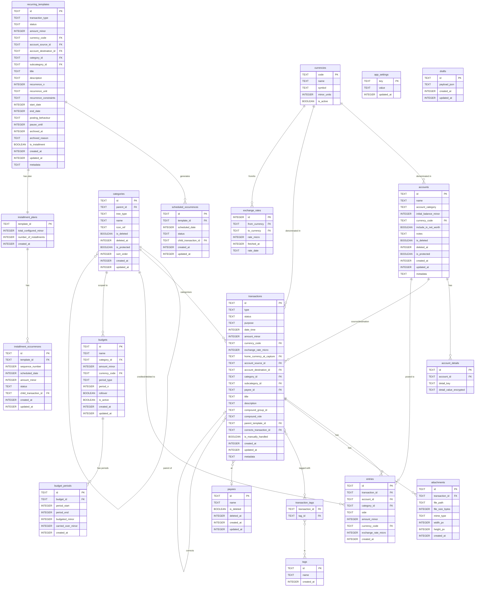

# Data Model

## Table of Contents

1. [Overview](#1-overview)
   1. [ER Diagram (Mermaid)](#11-er-diagram-mermaid)
   2. [Design Principles](#12-design-principles)
   3. [Extensibility Strategy](#13-extensibility-strategy)
2. [Schema Migration Policy](#2-schema-migration-policy)
   1. [Drift Migration Setup](#21-drift-migration-setup)
   2. [Versioning Convention](#22-versioning-convention)
   3. [Additive-Only Policy](#23-additive-only-policy)
3. [Core Tables](#3-core-tables)
   1. [accounts](#31-accounts)
   2. [account_details](#32-account_details)
   3. [transactions](#33-transactions)
   4. [entries](#34-entries)
   5. [categories](#35-categories)
   6. [tags](#36-tags)
   7. [transaction_tags](#37-transaction_tags)
   8. [payees](#38-payees)
4. [Currency & Rates](#4-currency--rates)
   1. [currencies](#41-currencies)
   2. [exchange_rates](#42-exchange_rates)
5. [Attachments](#5-attachments)
   1. [attachments](#51-attachments)
6. [Budgets](#6-budgets)
   1. [budgets](#61-budgets)
   2. [budget_periods](#62-budget_periods)
7. [Recurring & Scheduled](#7-recurring--scheduled)
   1. [recurring_templates](#71-recurring_templates)
   2. [scheduled_occurrences](#72-scheduled_occurrences)
8. [Installments](#8-installments)
   1. [installment_plans](#81-installment_plans)
   2. [installment_occurrences](#82-installment_occurrences)
9. [App Config](#9-app-config)
   1. [app_settings](#91-app_settings)
   2. [drafts](#92-drafts)
10. [Search](#10-search)
    1. [transactions_fts](#101-transactions_fts)
    2. [transactions_search_view](#102-transactions_search_view)
11. [Audit & Versioning](#11-audit--versioning)
    1. [schema_migrations](#111-schema_migrations)
    2. [Soft Delete Policy](#112-soft-delete-policy)
    3. [Void/Reversal Chain Policy](#113-voidreversal-chain-policy)
12. [Drift Type Mappings & Converters](#12-drift-type-mappings--converters)
13. [Index Catalogue](#13-index-catalogue)
14. [Open Questions](#14-open-questions)

---

## 1. Overview

### 1.1 ER Diagram (Mermaid)



### 1.2 Design Principles

| Principle | Decision |
|-----------|----------|
| **Primary keys** | UUID (TEXT) — supports future sync without PK collisions; consistent with SDS §2.5 |
| **Timestamps** | Unix epoch seconds as `INTEGER` — avoids timezone ambiguity; cheap arithmetic |
| **Monetary amounts** | `INTEGER` in minor units (smallest denomination) — eliminates floating-point error; industry standard |
| **Exchange rates** | `INTEGER` as micro-units (rate × 1,000,000) — 6-decimal precision; no floating-point |
| **Soft deletes** | `is_deleted BOOLEAN` + `deleted_at INTEGER NULL` on every mutable entity |
| **FK enforcement** | `PRAGMA foreign_keys = ON` at every connection open |
| **Encryption** | SQLCipher AES-256 at page level; key in Android Keystore (SDS §2.3.1) |
| **Null safety** | Columns that logically may be absent are `NULLABLE`; columns that are always present are `NOT NULL` |

### 1.3 Extensibility Strategy

Every table that tracks user domain data carries a `metadata TEXT NULL` column (JSON). This column is:
- Not indexed
- Not validated at the SQL layer
- Used only by future features or unplanned one-off fields that do not warrant a migration
- Never used as a replacement for a proper column when the field has query/index requirements

The pattern avoids the competitor anti-pattern of storing 170+ settings as a flat JSON blob in SharedPreferences (AP-1 in competitive analysis). Structured settings live in typed `app_settings` rows; the `metadata` escape hatch is for transient non-critical fields only.

---

## 2. Schema Migration Policy

### 2.1 Drift Migration Setup

```
lib/data/database/
├── database.dart              # @DriftDatabase shell — table registrations + DAO declarations only
├── schema/
│   ├── v1.json                # Generated schema snapshot — drift_dev schema dump
│   ├── v2.json                # One file per version
│   └── ...
├── migrations/
│   ├── migration_v1_to_v2.dart
│   └── ...
└── tables/
    ├── accounts_table.dart
    ├── transactions_table.dart
    ├── entries_table.dart
    ├── categories_table.dart
    ├── templates_table.dart
    ├── currencies_table.dart
    ├── exchange_rates_table.dart
    ├── attachments_table.dart
    ├── budgets_table.dart
    ├── settings_table.dart
    └── ...
```

- `MigrationStrategy` with explicit `onUpgrade` callback using Drift's `migrationSteps()` API.
- `onCreate` runs full schema for fresh installs.
- `SchemaVerifier` used in tests to validate all upgrade paths.
- Destructive fallback (`destroyEverything`) is disabled in production.
- On-disk version > app compiled version → `SchemaMismatchException` → user-visible error.

### 2.2 Versioning Convention

| Version | State |
|---------|-------|
| `v1` | Initial schema — all tables defined in this document |
| `v2+` | Each migration step is a separate file in `migrations/` |

Schema version is the integer stored in SQLite's `PRAGMA user_version`. Drift reads/writes this automatically.

### 2.3 Additive-Only Policy

- Adding columns: always `NULL DEFAULT NULL` to allow `ALTER TABLE ADD COLUMN`.
- Renaming or dropping columns: requires a full table reconstruction migration (Drift `recreateTable`).
- Any migration that changes a column type, name, or removes a column is a **breaking migration** requiring a dedicated migration step with test coverage.
- Data migrations (backfilling new columns) are committed as a separate step from schema migrations.

---

## 3. Core Tables

### 3.1 accounts

**Purpose:** All user-facing financial accounts (bank, cash, credit card, etc.) plus system-internal equity accounts (EQ). EQ accounts are flagged `is_protected = true` and `is_system = true`; they are never surfaced to users.

**Relationships:** One account belongs to exactly one currency. Account balances are computed from `entries`, never stored.

| Column | Type | Null | Default | Constraints | Purpose |
|--------|------|------|---------|-------------|---------|
| `id` | TEXT | NOT NULL | — | PK, UUID v4 | Stable identifier |
| `name` | TEXT | NOT NULL | — | UNIQUE (including soft-deleted; enforced at app layer) | Display name |
| `account_category` | TEXT | NOT NULL | — | CHECK IN ('cash','bank_account','credit_card','debit_card','top_up_wallet','loan','investment','other','equity') | Account type |
| `initial_balance_minor` | INTEGER | NOT NULL | 0 | — | One-time opening balance in minor units |
| `currency_code` | TEXT | NOT NULL | — | FK → currencies(code) | Immutable after creation |
| `include_in_net_worth` | INTEGER | NOT NULL | 1 | CHECK IN (0,1) | Boolean: include in net worth |
| `notes` | TEXT | NULL | NULL | — | Free-form note |
| `is_deleted` | INTEGER | NOT NULL | 0 | CHECK IN (0,1) | Soft-delete flag |
| `deleted_at` | INTEGER | NULL | NULL | — | Unix epoch seconds; set on soft-delete |
| `is_protected` | INTEGER | NOT NULL | 0 | CHECK IN (0,1) | True for EQ and BAI/BAE accounts; blocks user deletion |
| `is_system` | INTEGER | NOT NULL | 0 | CHECK IN (0,1) | True for system-generated accounts (EQ per currency); hidden from all user views |
| `display_order` | INTEGER | NULL | NULL | — | User-defined sort position; NULL = alphabetical |
| `created_at` | INTEGER | NOT NULL | — | — | Creation epoch |
| `updated_at` | INTEGER | NOT NULL | — | — | Last-modified epoch |
| `metadata` | TEXT | NULL | NULL | — | JSON escape hatch |

**Category-specific fields** are stored in `account_details` (§3.2) to avoid 30+ nullable columns on the accounts table.

**EQ design:** One EQ account per currency, created lazily when the first non-zero initial balance is posted for that currency. Named `__EQ_{currency_code}` (prefixed to prevent name collision with user accounts). `is_protected = 1`, `is_system = 1`, `include_in_net_worth = 0`.

#### 3.1.1 Indexes

| Index | Columns | Unique | Purpose |
|-------|---------|--------|---------|
| `idx_accounts_currency` | `currency_code` | No | Exchange rate join |
| `idx_accounts_deleted` | `is_deleted` | No | Default list filter |
| `idx_accounts_system` | `is_system` | No | Exclude EQ from views |

---

### 3.2 account_details

**Purpose:** Category-specific account fields (encrypted where sensitive). Avoids a wide nullable-column design on `accounts`.

| Column | Type | Null | Default | Constraints | Purpose |
|--------|------|------|---------|-------------|---------|
| `id` | TEXT | NOT NULL | — | PK, UUID v4 | Row identifier |
| `account_id` | TEXT | NOT NULL | — | FK → accounts(id) ON DELETE CASCADE | Parent account |
| `detail_key` | TEXT | NOT NULL | — | CHECK (valid key list) | Field name (e.g., `bank_name`, `card_number_encrypted`) |
| `detail_value` | TEXT | NULL | NULL | — | Plain-text value |
| `detail_value_encrypted` | TEXT | NULL | NULL | — | AES-encrypted blob for sensitive fields (card_number, account_number) |
| `updated_at` | INTEGER | NOT NULL | — | — | Last-modified epoch |

**Valid `detail_key` values:**

| Key | Account categories | Encrypted? |
|-----|--------------------|-----------|
| `bank_name` | bank_account | No |
| `account_number` | bank_account | Yes |
| `branch` | bank_account | No |
| `ifsc` | bank_account | No |
| `card_name` | credit_card, debit_card | No |
| `card_number` | credit_card, debit_card | Yes |
| `expiry_date` | credit_card, debit_card | No |
| `billing_date` | credit_card | No |
| `payment_due_date` | credit_card | No |
| `credit_limit_minor` | credit_card | No |
| `linked_bank_account_id` | credit_card, debit_card | No |
| `wallet_provider_name` | top_up_wallet | No |
| `linked_phone_number` | top_up_wallet | No |
| `lender_borrower_name` | loan | No |
| `principal_amount_minor` | loan | No |
| `interest_rate_micro` | loan | No |
| `emi_amount_minor` | loan | No |
| `emi_date` | loan | No |
| `due_date` | loan | No |
| `investment_type` | investment | No |
| `institution_name` | investment | No |
| `current_value_minor` | investment | No |

#### 3.2.1 Indexes

| Index | Columns | Unique | Purpose |
|-------|---------|--------|---------|
| `idx_account_details_account` | `account_id, detail_key` | Yes | Fast per-account field lookup |

---

### 3.3 transactions

**Purpose:** Atomic financial events. Each transaction has two or more corresponding `entries`. This table stores the header; `entries` stores the DEB lines.

**Immutability:** Financial fields (`amount_minor`, `currency_code`, `account_source_id`, `account_destination_id`, `category_id`, `subcategory_id`) are never updated in-place after the transaction reaches `status = posted`. Corrections produce a `purpose = reversal` + `purpose = correction` pair. Non-financial fields (`title`, `description`, `date_time`, `payee_id`) are updatable in-place.

| Column | Type | Null | Default | Constraints | Purpose |
|--------|------|------|---------|-------------|---------|
| `id` | TEXT | NOT NULL | — | PK, UUID v4 | Stable identifier |
| `type` | TEXT | NOT NULL | — | CHECK IN ('income','expense','transfer') | Transaction type |
| `status` | TEXT | NOT NULL | 'pending' | CHECK IN ('pending','posted','voided') | Ledger participation state (TC-001) |
| `purpose` | TEXT | NOT NULL | 'user' | CHECK IN ('user','reversal','correction','system') | Role in correction/reversal chain (TC-001) |
| `date_time` | INTEGER | NOT NULL | — | — | User-specified business date (Unix epoch seconds) |
| `amount_minor` | INTEGER | NOT NULL | — | > 0 | Transaction amount in minor units of `currency_code` |
| `currency_code` | TEXT | NOT NULL | — | FK → currencies(code) | Derived from source account; immutable |
| `exchange_rate_micro` | INTEGER | NULL | NULL | — | Rate × 1,000,000 from account currency to `home_currency_at_capture`; NULL if same currency (TC-029) |
| `home_currency_at_capture` | TEXT | NULL | NULL | FK → currencies(code) | Home currency when rate was captured; for chain-conversion after home currency change (TC-029) |
| `account_source_id` | TEXT | NULL | NULL | FK → accounts(id) | Source account for expense/transfer; NULL for income |
| `account_destination_id` | TEXT | NULL | NULL | FK → accounts(id) | Destination account for income/transfer; NULL for expense |
| `category_id` | TEXT | NULL | NULL | FK → categories(id) | Top-level category; NULL for transfer |
| `subcategory_id` | TEXT | NULL | NULL | FK → categories(id) | Optional subcategory; NULL for transfer |
| `payee_id` | TEXT | NULL | NULL | FK → payees(id) | Optional payee/merchant reference |
| `title` | TEXT | NULL | NULL | — | User label; in-place editable |
| `description` | TEXT | NULL | NULL | — | Long-form note; in-place editable |
| `compound_group_id` | TEXT | NULL | NULL | — | UUID shared by compound group members (e.g., transfer + fee); NULL for non-compound |
| `compound_role` | TEXT | NULL | NULL | CHECK IN ('primary','secondary',NULL) | Role within compound group; NULL for non-compound |
| `parent_template_id` | TEXT | NULL | NULL | FK → recurring_templates(id) | Link to generating template; NULL for manual entries |
| `corrects_transaction_id` | TEXT | NULL | NULL | FK → transactions(id) | For purpose=correction or purpose=reversal: ID of the transaction being corrected/reversed |
| `is_manually_handled` | INTEGER | NOT NULL | 0 | CHECK IN (0,1) | True when a child was edited/deleted outside normal scheduling |
| `created_at` | INTEGER | NOT NULL | — | — | System creation epoch |
| `updated_at` | INTEGER | NOT NULL | — | — | Last-modified epoch |
| `metadata` | TEXT | NULL | NULL | — | JSON escape hatch |

**Balance computation rule (TC-001):** All transactions with `status = 'posted'` contribute to account balances regardless of `purpose`. The `purpose = 'reversal'` transactions cancel their originals in the ledger.

**Default list display rule (TC-001, TC-015):** Show where `status = 'posted' AND purpose IN ('user','correction','system')`. Exclude `status = 'voided'` and `purpose = 'reversal'`.

#### 3.3.1 Correction Chain

When a financial edit is made:
1. The original transaction `status` → `voided`.
2. A new `purpose = 'reversal'` transaction is inserted with `corrects_transaction_id = original.id`.
3. A new `purpose = 'correction'` transaction is inserted with `corrects_transaction_id = original.id`.
4. The correction transaction is what appears in the transaction list.

For chains (correction of a correction): `corrects_transaction_id` points to the immediately preceding transaction in the chain, not the original root.

#### 3.3.2 Indexes

| Index | Columns | Unique | Purpose |
|-------|---------|--------|---------|
| `idx_txn_date` | `date_time` | No | Date range queries |
| `idx_txn_status_purpose` | `status, purpose` | No | Default list filter |
| `idx_txn_account_source` | `account_source_id` | No | Account ledger query |
| `idx_txn_account_dest` | `account_destination_id` | No | Account ledger query |
| `idx_txn_category` | `category_id` | No | Category aggregation |
| `idx_txn_template` | `parent_template_id` | No | Template child lookup |
| `idx_txn_compound` | `compound_group_id` | No | Compound group fetch |
| `idx_txn_corrects` | `corrects_transaction_id` | No | Correction chain walk |

---

### 3.4 entries

**Purpose:** Individual DEB ledger lines. Each transaction has ≥ 2 entries; the sum of debit entries equals the sum of credit entries (`Σ debit = Σ credit`).

**Exclusivity constraint:** Exactly one of `account_id` or `category_id` must be non-null per row. Enforced at the application layer (domain `Transaction.validate()`).

| Column | Type | Null | Default | Constraints | Purpose |
|--------|------|------|---------|-------------|---------|
| `id` | TEXT | NOT NULL | — | PK, UUID v4 | Stable identifier |
| `transaction_id` | TEXT | NOT NULL | — | FK → transactions(id) ON DELETE RESTRICT | Parent transaction |
| `account_id` | TEXT | NULL | NULL | FK → accounts(id) | Account leg; mutually exclusive with category_id |
| `category_id` | TEXT | NULL | NULL | FK → categories(id) | Category leg; mutually exclusive with account_id |
| `side` | TEXT | NOT NULL | — | CHECK IN ('debit','credit') | DEB side |
| `amount_minor` | INTEGER | NOT NULL | — | > 0 | Amount in minor units |
| `currency_code` | TEXT | NOT NULL | — | FK → currencies(code) | Currency of this entry |
| `exchange_rate_micro` | INTEGER | NULL | NULL | — | Rate to home currency × 1,000,000; NULL if same as home |
| `created_at` | INTEGER | NOT NULL | — | — | System write epoch (TC-025) |

**Balance formula for accounts** (PRD §4.6):
`balance = Σ(amount WHERE side='debit') − Σ(amount WHERE side='credit')`

#### 3.4.1 Indexes

| Index | Columns | Unique | Purpose |
|-------|---------|--------|---------|
| `idx_entries_transaction` | `transaction_id` | No | Entry fetch by transaction |
| `idx_entries_account` | `account_id` | No | Balance computation |
| `idx_entries_category` | `category_id` | No | Category balance |
| `idx_entries_account_side` | `account_id, side` | No | Debit/credit split by account |

---

### 3.5 categories

**Purpose:** Two-level category hierarchy (parent/child). Supports income and expense trees. System-protected categories (Balance Adjustment income/expense) cannot be deleted.

| Column | Type | Null | Default | Constraints | Purpose |
|--------|------|------|---------|-------------|---------|
| `id` | TEXT | NOT NULL | — | PK, UUID v4 | Stable identifier |
| `parent_id` | TEXT | NULL | NULL | FK → categories(id); NULL for root | Two-level hierarchy; NULL = top-level parent |
| `tree_type` | TEXT | NOT NULL | — | CHECK IN ('income','expense') | Which tree |
| `name` | TEXT | NOT NULL | — | Uniqueness enforced at app layer (case-insensitive, per tree/parent, incl. soft-deleted) | Display name |
| `icon_ref` | TEXT | NOT NULL | — | — | Material Symbols icon identifier |
| `is_deleted` | INTEGER | NOT NULL | 0 | CHECK IN (0,1) | Soft-delete flag |
| `deleted_at` | INTEGER | NULL | NULL | — | Soft-delete epoch |
| `is_protected` | INTEGER | NOT NULL | 0 | CHECK IN (0,1) | True for BAI/BAE and "Balance Adjustment" parent |
| `sort_order` | INTEGER | NULL | NULL | — | v2 manual reordering; NULL in v1 (alphabetical) |
| `created_at` | INTEGER | NOT NULL | — | — | Creation epoch |
| `updated_at` | INTEGER | NOT NULL | — | — | Last-modified epoch |

**Protected system categories (seeded at install):**

| Name | `tree_type` | `is_protected` | Notes |
|------|-------------|----------------|-------|
| Balance Adjustment | income | 1 | Parent; contains BAI subcategory |
| Balance Adjustment | expense | 1 | Parent; contains BAE subcategory |
| Financial | expense | 0 | Parent; contains "Fees & Charges" child |
| Fees & Charges | expense | 1 | Child of Financial; default fee category |

#### 3.5.1 Indexes

| Index | Columns | Unique | Purpose |
|-------|---------|--------|---------|
| `idx_categories_parent` | `parent_id` | No | Child lookup |
| `idx_categories_tree` | `tree_type, is_deleted` | No | Tree listing |
| `idx_categories_protected` | `is_protected` | No | Guard deletion |

---

### 3.6 tags

**Purpose:** Free-form tags for cross-cutting transaction grouping. Many-to-many with transactions via `transaction_tags`.

| Column | Type | Null | Default | Constraints | Purpose |
|--------|------|------|---------|-------------|---------|
| `id` | TEXT | NOT NULL | — | PK, UUID v4 | Stable identifier |
| `name` | TEXT | NOT NULL | — | UNIQUE (case-insensitive enforced at app layer) | Tag label |
| `created_at` | INTEGER | NOT NULL | — | — | Creation epoch |

> **v1 scope:** Tags are schema-ready but not surfaced in the v1 UI. The table is created in v1 to avoid a migration when tags are introduced. `transaction_tags` is likewise created empty.

---

### 3.7 transaction_tags

**Purpose:** Many-to-many join between transactions and tags.

| Column | Type | Null | Default | Constraints | Purpose |
|--------|------|------|---------|-------------|---------|
| `transaction_id` | TEXT | NOT NULL | — | FK → transactions(id) ON DELETE CASCADE | Transaction member |
| `tag_id` | TEXT | NOT NULL | — | FK → tags(id) ON DELETE CASCADE | Tag member |

**Composite PK:** `(transaction_id, tag_id)`.

#### 3.7.1 Indexes

| Index | Columns | Unique | Purpose |
|-------|---------|--------|---------|
| `idx_txn_tags_tag` | `tag_id` | No | Reverse lookup (all txns for a tag) |

---

### 3.8 payees

**Purpose:** Optional named payees/merchants attached to transactions.

| Column | Type | Null | Default | Constraints | Purpose |
|--------|------|------|---------|-------------|---------|
| `id` | TEXT | NOT NULL | — | PK, UUID v4 | Stable identifier |
| `name` | TEXT | NOT NULL | — | UNIQUE (case-insensitive enforced at app layer) | Payee name |
| `is_deleted` | INTEGER | NOT NULL | 0 | CHECK IN (0,1) | Soft-delete |
| `deleted_at` | INTEGER | NULL | NULL | — | Soft-delete epoch |
| `created_at` | INTEGER | NOT NULL | — | — | Creation epoch |
| `updated_at` | INTEGER | NOT NULL | — | — | Last-modified epoch |

> **v1 scope:** Schema-ready but not surfaced as a managed entity in v1 UI. Transactions may reference a `payee_id` but the payee management screen is v2.

---

## 4. Currency & Rates

### 4.1 currencies

**Purpose:** Bundled ISO 4217 currency reference table. Read-only at runtime; populated from a static JSON asset at first launch. Includes full active ISO 4217 list (~180 currencies) with decimal precision per TC-044.

| Column | Type | Null | Default | Constraints | Purpose |
|--------|------|------|---------|-------------|---------|
| `code` | TEXT | NOT NULL | — | PK, ISO 4217 3-letter | Currency code (e.g., 'USD', 'INR') |
| `name` | TEXT | NOT NULL | — | — | Full name (e.g., 'US Dollar') |
| `symbol` | TEXT | NOT NULL | — | — | Display symbol (e.g., '$', '₹') |
| `minor_units` | INTEGER | NOT NULL | 2 | CHECK IN (0,2,3) | Decimal places: 0=JPY, 2=USD, 3=BHD |
| `is_active` | INTEGER | NOT NULL | 1 | CHECK IN (0,1) | False for retired ISO currencies |

**Amount storage:** All monetary amounts are stored as `INTEGER` in minor units (the smallest denomination). For JPY (`minor_units=0`), ¥500 is stored as `500`. For USD (`minor_units=2`), $500.00 is stored as `50000`. For BHD (`minor_units=3`), BHD 500.000 is stored as `500000`.

**No indexes required:** Table is small (~180 rows), read-only, and accessed only by PK.

---

### 4.2 exchange_rates

**Purpose:** Cached exchange rates from the fawazahmed0 API (SDS §2.7). Upserted on each successful fetch. Staleness is determined by `fetched_at`.

| Column | Type | Null | Default | Constraints | Purpose |
|--------|------|------|---------|-------------|---------|
| `id` | INTEGER | NOT NULL | — | PK AUTOINCREMENT | Row identifier |
| `from_currency` | TEXT | NOT NULL | — | FK → currencies(code) | Base currency |
| `to_currency` | TEXT | NOT NULL | — | FK → currencies(code) | Target currency |
| `rate_micro` | INTEGER | NOT NULL | — | > 0 | Rate × 1,000,000 (6 decimal precision) |
| `fetched_at` | INTEGER | NOT NULL | — | — | Wall-clock fetch epoch |
| `rate_date` | TEXT | NOT NULL | — | ISO 8601 date | Publication date from API `date` field |

**Unique constraint:** `UNIQUE (from_currency, to_currency)` — `INSERT OR REPLACE` upserts on each fetch.

**Staleness threshold:** 14 days. UI shows disclaimer if `(now - fetched_at) > 14 * 86400` seconds.

#### 4.2.1 Indexes

| Index | Columns | Unique | Purpose |
|-------|---------|--------|---------|
| `idx_exchange_rate_pair` | `from_currency, to_currency` | Yes | Rate lookup by pair |
| `idx_exchange_rate_fetched` | `fetched_at` | No | Staleness check |

---

## 5. Attachments

### 5.1 attachments

**Purpose:** Photo attachments to transactions. Max 2 per transaction. Photos are stored as files in app-private storage; this table records metadata and the path. Photos are permanently deleted from storage when the parent transaction is soft-deleted (TC-007).

| Column | Type | Null | Default | Constraints | Purpose |
|--------|------|------|---------|-------------|---------|
| `id` | TEXT | NOT NULL | — | PK, UUID v4 | Stable identifier |
| `transaction_id` | TEXT | NOT NULL | — | FK → transactions(id) ON DELETE RESTRICT | Parent transaction |
| `file_path` | TEXT | NOT NULL | — | UNIQUE | Relative path within app-private storage |
| `file_size_bytes` | INTEGER | NOT NULL | — | — | Compressed file size |
| `mime_type` | TEXT | NOT NULL | 'image/jpeg' | — | Always JPEG post-compression |
| `width_px` | INTEGER | NULL | NULL | — | Compressed width |
| `height_px` | INTEGER | NULL | NULL | — | Compressed height |
| `created_at` | INTEGER | NOT NULL | — | — | Creation epoch |

**Compression parameters (TC-007):**
- Max dimension: 1920 px (width or height; no upscaling)
- Format: JPEG
- Target size: < 500 KB per photo
- Original not preserved

#### 5.1.1 Indexes

| Index | Columns | Unique | Purpose |
|-------|---------|--------|---------|
| `idx_attachments_txn` | `transaction_id` | No | Fetch by transaction |

---

## 6. Budgets

> **v1 scope:** Budget tables are created in v1 to avoid a migration but the budgeting feature is deferred to v2 (PRD §5.3). All rows will be empty at v1 launch.

### 6.1 budgets

**Purpose:** Budget envelope definition — either a total budget or a per-category budget for a recurring period.

| Column | Type | Null | Default | Constraints | Purpose |
|--------|------|------|---------|-------------|---------|
| `id` | TEXT | NOT NULL | — | PK, UUID v4 | Stable identifier |
| `name` | TEXT | NOT NULL | — | — | User label |
| `category_id` | TEXT | NULL | NULL | FK → categories(id) | NULL = total budget; set = per-category budget |
| `amount_minor` | INTEGER | NOT NULL | — | > 0 | Budget ceiling in minor units |
| `currency_code` | TEXT | NOT NULL | — | FK → currencies(code) | Home currency of budget |
| `period_type` | TEXT | NOT NULL | — | CHECK IN ('weekly','monthly','quarterly','annual') | Recurrence horizon |
| `period_n` | INTEGER | NOT NULL | 1 | — | N periods (e.g., period_n=1 + period_type=monthly = monthly) |
| `rollover` | INTEGER | NOT NULL | 0 | CHECK IN (0,1) | Carry unused amount to next period |
| `is_active` | INTEGER | NOT NULL | 1 | CHECK IN (0,1) | Active/inactive flag |
| `created_at` | INTEGER | NOT NULL | — | — | Creation epoch |
| `updated_at` | INTEGER | NOT NULL | — | — | Last-modified epoch |

---

### 6.2 budget_periods

**Purpose:** Materialized budget period instances. Each active budget generates a new period record on period boundary. Computed values (spent, remaining) are derived at query time from `entries`; `carried_over_minor` is the only stored rolled-over value.

| Column | Type | Null | Default | Constraints | Purpose |
|--------|------|------|---------|-------------|---------|
| `id` | TEXT | NOT NULL | — | PK, UUID v4 | Stable identifier |
| `budget_id` | TEXT | NOT NULL | — | FK → budgets(id) | Parent budget |
| `period_start` | INTEGER | NOT NULL | — | — | Period start epoch (inclusive) |
| `period_end` | INTEGER | NOT NULL | — | — | Period end epoch (exclusive) |
| `budgeted_minor` | INTEGER | NOT NULL | — | — | Effective ceiling including carryover |
| `carried_over_minor` | INTEGER | NOT NULL | 0 | — | Rolled-over amount from previous period |
| `created_at` | INTEGER | NOT NULL | — | — | Creation epoch |

#### 6.2.1 Indexes

| Index | Columns | Unique | Purpose |
|-------|---------|--------|---------|
| `idx_budget_periods_budget` | `budget_id` | No | Periods by budget |
| `idx_budget_periods_range` | `period_start, period_end` | No | Date range lookup |

---

## 7. Recurring & Scheduled

### 7.1 recurring_templates

**Purpose:** Template definition for recurring and installment transaction series. The `is_installment` flag distinguishes the two sub-types. Installment-specific metadata lives in `installment_plans` (1:1 relation).

**Lifecycle states (TC-043):** `active → paused → active` (resumable), `active/paused → archived` (terminal), `active/paused → deleted` (soft-delete, terminal).

| Column | Type | Null | Default | Constraints | Purpose |
|--------|------|------|---------|-------------|---------|
| `id` | TEXT | NOT NULL | — | PK, UUID v4 | Stable identifier |
| `transaction_type` | TEXT | NOT NULL | — | CHECK IN ('income','expense','transfer') | Immutable after creation |
| `status` | TEXT | NOT NULL | 'active' | CHECK IN ('active','paused','archived','deleted') | Lifecycle state |
| `amount_minor` | INTEGER | NOT NULL | — | > 0 | Per-occurrence amount (in-place editable) |
| `currency_code` | TEXT | NOT NULL | — | FK → currencies(code) | Derived from source account |
| `account_source_id` | TEXT | NULL | NULL | FK → accounts(id) | Source account; editable |
| `account_destination_id` | TEXT | NULL | NULL | FK → accounts(id) | Destination account; editable |
| `category_id` | TEXT | NULL | NULL | FK → categories(id) | Editable; NULL for transfer |
| `subcategory_id` | TEXT | NULL | NULL | FK → categories(id) | Editable |
| `payee_id` | TEXT | NULL | NULL | FK → payees(id) | Optional payee |
| `title` | TEXT | NULL | NULL | — | Editable |
| `description` | TEXT | NULL | NULL | — | Editable |
| `recurrence_n` | INTEGER | NOT NULL | — | > 0; IMMUTABLE | e.g., 2 in "every 2 weeks" |
| `recurrence_unit` | TEXT | NOT NULL | — | CHECK IN ('day','week','month','year'); IMMUTABLE | Time unit |
| `recurrence_constraints` | TEXT | NULL | NULL | JSON array of constraint enums; IMMUTABLE | Optional: weekdays_only, weekends_only, start_of_month, end_of_month, start_of_year, end_of_year |
| `start_date` | INTEGER | NOT NULL | — | Unix epoch date; IMMUTABLE | First occurrence date |
| `end_date` | INTEGER | NULL | NULL | IMMUTABLE for recurring; computed for installments | Last valid occurrence date |
| `posting_behaviour` | TEXT | NOT NULL | 'auto_post' | CHECK IN ('auto_post','remind_and_confirm') | Editable |
| `fee_mode` | TEXT | NULL | NULL | CHECK IN ('flat','percentage',NULL) | Transfer fee mode; NULL = no fee |
| `fee_amount_minor` | INTEGER | NULL | NULL | — | Flat fee amount in minor units |
| `fee_percentage_micro` | INTEGER | NULL | NULL | — | Percentage × 1,000,000 |
| `fee_category_id` | TEXT | NULL | NULL | FK → categories(id) | Fee expense category |
| `pause_until` | INTEGER | NULL | NULL | — | Unix epoch; resume after this time |
| `archived_at` | INTEGER | NULL | NULL | — | Archival epoch |
| `archived_reason` | TEXT | NULL | NULL | CHECK IN ('end_date_reached','installments_exhausted','early_close','user_stopped',NULL) | Archival trigger |
| `is_installment` | INTEGER | NOT NULL | 0 | CHECK IN (0,1) | Discriminator: 0=recurring, 1=installment |
| `is_deleted` | INTEGER | NOT NULL | 0 | CHECK IN (0,1) | Soft-delete flag |
| `deleted_at` | INTEGER | NULL | NULL | — | Soft-delete epoch |
| `created_at` | INTEGER | NOT NULL | — | — | Creation epoch |
| `updated_at` | INTEGER | NOT NULL | — | — | Last-modified epoch |
| `metadata` | TEXT | NULL | NULL | — | JSON escape hatch |

**Immutability note:** The application layer enforces that `transaction_type`, `recurrence_n`, `recurrence_unit`, `recurrence_constraints`, `start_date`, and `end_date` (for recurring) are never updated after the first write. The database schema does not enforce this constraint; it is a domain rule.

#### 7.1.1 Indexes

| Index | Columns | Unique | Purpose |
|-------|---------|--------|---------|
| `idx_templates_status` | `status` | No | Active/paused list |
| `idx_templates_installment` | `is_installment` | No | Filter by sub-type |
| `idx_templates_next` | `status, start_date` | No | Scheduler sweep |

---

### 7.2 scheduled_occurrences

**Purpose:** Materialized occurrence records for recurring (non-installment) templates. One row per expected occurrence. Provides the exception list for the scheduler (TC-003) and enables the "manually handled" flag.

**Architecture decision:** Both recurring and installment schedules use materialized records (rather than a computed-on-demand model) for consistency. Recurring occurrences are created lazily (generated N periods ahead), while installment occurrences are created eagerly at template creation. This simplifies the scheduler and enables per-occurrence status tracking without a separate exception list.

| Column | Type | Null | Default | Constraints | Purpose |
|--------|------|------|---------|-------------|---------|
| `id` | TEXT | NOT NULL | — | PK, UUID v4 | Stable identifier |
| `template_id` | TEXT | NOT NULL | — | FK → recurring_templates(id) ON DELETE CASCADE | Parent template |
| `scheduled_date` | INTEGER | NOT NULL | — | Unix epoch date | When this occurrence should fire |
| `status` | TEXT | NOT NULL | 'pending' | CHECK IN ('pending','posted','skipped','cancelled') | `skipped` = manually handled or pause-skipped; `cancelled` = template deleted |
| `child_transaction_id` | TEXT | NULL | NULL | FK → transactions(id) | Set once the occurrence is posted |
| `created_at` | INTEGER | NOT NULL | — | — | Creation epoch |
| `updated_at` | INTEGER | NOT NULL | — | — | Last-modified epoch |

**Lookahead window:** Recurring occurrences are materialized up to 90 days ahead. The scheduler generates new rows as the window advances on each app launch.

#### 7.2.1 Indexes

| Index | Columns | Unique | Purpose |
|-------|---------|--------|---------|
| `idx_sched_occ_template` | `template_id, scheduled_date` | No | Next occurrence lookup |
| `idx_sched_occ_status_date` | `status, scheduled_date` | No | Scheduler sweep (all pending past-due) |

---

## 8. Installments

### 8.1 installment_plans

**Purpose:** Installment-specific metadata for templates flagged `is_installment = 1`. One-to-one with the parent `recurring_templates` row.

| Column | Type | Null | Default | Constraints | Purpose |
|--------|------|------|---------|-------------|---------|
| `template_id` | TEXT | NOT NULL | — | PK, FK → recurring_templates(id) ON DELETE CASCADE | Parent template (also PK) |
| `total_configured_minor` | INTEGER | NOT NULL | — | > 0 | Target total; immutable except during early close (TC-021) |
| `number_of_installments` | INTEGER | NOT NULL | — | > 0 | Total planned count (editable for future installments) |
| `created_at` | INTEGER | NOT NULL | — | — | Creation epoch |

**Computed installment amounts (TC-026):**
- `running_total` = `SUM(amount_minor) WHERE status='posted' AND is_voided=false` across `installment_occurrences`
- `total_remaining` = `SUM(amount_minor) WHERE status='pending'`
- `projected_final_total` = `running_total + total_remaining`

These are never stored; always computed from `installment_occurrences` at query time.

---

### 8.2 installment_occurrences

**Purpose:** Individual materialized installment records. Created eagerly at template creation (all occurrences). Supports per-installment amount overrides and status tracking.

| Column | Type | Null | Default | Constraints | Purpose |
|--------|------|------|---------|-------------|---------|
| `id` | TEXT | NOT NULL | — | PK, UUID v4 | Stable identifier |
| `template_id` | TEXT | NOT NULL | — | FK → recurring_templates(id) ON DELETE CASCADE | Parent installment template |
| `sequence_number` | INTEGER | NOT NULL | — | > 0; UNIQUE per template | 1-based position in the series |
| `scheduled_date` | INTEGER | NOT NULL | — | Unix epoch date | When this installment should be posted |
| `amount_minor` | INTEGER | NOT NULL | — | > 0; user-adjustable for future unposted | Per-installment amount |
| `status` | TEXT | NOT NULL | 'pending' | CHECK IN ('pending','posted','cancelled') | `cancelled` = early close or template deleted |
| `child_transaction_id` | TEXT | NULL | NULL | FK → transactions(id) | Set once posted |
| `created_at` | INTEGER | NOT NULL | — | — | Creation epoch |
| `updated_at` | INTEGER | NOT NULL | — | — | Last-modified epoch |

#### 8.2.1 Indexes

| Index | Columns | Unique | Purpose |
|-------|---------|--------|---------|
| `idx_inst_occ_template_seq` | `template_id, sequence_number` | Yes | Ordered occurrence list |
| `idx_inst_occ_status_date` | `status, scheduled_date` | No | Scheduler sweep |

---

## 9. App Config

### 9.1 app_settings

**Purpose:** Key-value store for all user preferences and app configuration. Typed by convention (the application layer enforces types; SQLite stores TEXT). Avoids the competitor anti-pattern of a single JSON blob in SharedPreferences (AP-1).

| Column | Type | Null | Default | Constraints | Purpose |
|--------|------|------|---------|-------------|---------|
| `key` | TEXT | NOT NULL | — | PK | Setting identifier |
| `value` | TEXT | NULL | NULL | — | Setting value (type inferred by key) |
| `updated_at` | INTEGER | NOT NULL | — | — | Last-modified epoch |

**Defined keys (v1):**

| Key | Type | Default | Notes |
|-----|------|---------|-------|
| `home_currency` | TEXT (ISO 4217) | `INR` | From onboarding |
| `theme` | TEXT | `system` | `light`, `dark`, `system` |
| `color_scheme_mode` | TEXT | `dynamic` | `dynamic`, `custom` |
| `color_seed` | TEXT | NULL | Hex color string for custom seed |
| `animations_enabled` | INTEGER | `1` | Boolean |
| `number_decimal_separator` | TEXT | locale | `,` or `.` |
| `number_thousands_grouping` | TEXT | locale | `standard`, `indian` |
| `currency_symbol_placement` | TEXT | locale | `prefix`, `suffix` |
| `currency_symbol_spacing` | TEXT | locale | `none`, `space` |
| `week_start` | TEXT | `monday` | `monday`, `sunday` |
| `time_format` | TEXT | locale | `12h`, `24h` |
| `percentage_precision` | INTEGER | `0` | 0, 1, or 2 |
| `description_max_length` | INTEGER | `1000` | 500, 1000, 2000 |
| `back_button_behaviour` | TEXT | `ask` | `ask`, `auto_save_draft`, `discard` |
| `lock_timeout_seconds` | INTEGER | `0` | 0=immediately, 30, 60, 300 |
| `display_name` | TEXT | NULL | Home screen greeting name |
| `onboarding_complete` | INTEGER | `0` | Boolean |
| `schema_backup_version` | INTEGER | `1` | Backup format version (TC-054) |
| `last_exchange_rate_fetch` | INTEGER | NULL | Unix epoch of last successful fetch |

---

### 9.2 drafts

**Purpose:** Auto-saved transaction entry form state. Max 5 rows enforced at app layer (FIFO eviction when limit is reached). Not part of the ledger; purely a UX convenience.

| Column | Type | Null | Default | Constraints | Purpose |
|--------|------|------|---------|-------------|---------|
| `id` | TEXT | NOT NULL | — | PK, UUID v4 | Stable identifier |
| `payload_json` | TEXT | NOT NULL | — | — | Serialized form state |
| `created_at` | INTEGER | NOT NULL | — | — | Creation epoch (used for FIFO eviction) |
| `updated_at` | INTEGER | NOT NULL | — | — | Last auto-save epoch |

---

## 10. Search

### 10.1 transactions_fts

**Purpose:** FTS5 virtual table for full-text transaction search (SDS §2.8).

```sql
CREATE VIRTUAL TABLE transactions_fts USING fts5(
    transaction_id UNINDEXED,
    title,
    description,
    account_name,
    category_name,
    content='transactions_search_view',
    content_rowid='rowid',
    tokenize='unicode61 remove_diacritics 2'
);
```

FTS5 content sync is maintained by `AFTER INSERT`, `AFTER UPDATE`, `AFTER DELETE` triggers on `transactions`. Drift trigger definitions live in `TransactionDao`.

---

### 10.2 transactions_search_view

**Purpose:** Denormalized view used as the FTS5 content source. Not a persisted table.

```sql
CREATE VIEW transactions_search_view AS
SELECT
    t.rowid,
    t.id                        AS transaction_id,
    t.title,
    t.description,
    COALESCE(a_src.name, a_dst.name) AS account_name,
    COALESCE(c.name, '')         AS category_name
FROM transactions t
LEFT JOIN accounts a_src ON a_src.id = t.account_source_id
LEFT JOIN accounts a_dst ON a_dst.id = t.account_destination_id
LEFT JOIN categories c   ON c.id = t.category_id
WHERE t.status = 'posted'
  AND t.purpose IN ('user', 'correction', 'system')
  AND t.is_deleted = 0;
```

---

## 11. Audit & Versioning

### 11.1 schema_migrations

**Purpose:** Track applied migration steps. Drift manages `PRAGMA user_version` natively; this table is supplemental for human-readable migration history and debugging.

| Column | Type | Null | Default | Constraints | Purpose |
|--------|------|------|---------|-------------|---------|
| `version` | INTEGER | NOT NULL | — | PK | Schema version number |
| `applied_at` | INTEGER | NOT NULL | — | — | Unix epoch when migration ran |
| `description` | TEXT | NOT NULL | — | — | Human-readable migration summary |

---

### 11.2 Soft Delete Policy

All entities that can be user-deleted implement soft delete:

| Entity | `is_deleted` | `deleted_at` | Cascade behaviour |
|--------|-------------|-------------|-------------------|
| `accounts` | Yes | Yes | Templates referencing deleted account: handled per PRD §5.1.1 (migrate/stop). Entries remain. |
| `categories` | Yes | Yes | Templates referencing deleted category: handled per PRD §5.2.4. Entries remain. |
| `payees` | Yes | Yes | Transactions retain `payee_id`; display shows "(deleted payee)". |
| `recurring_templates` | Yes | Yes | `scheduled_occurrences` cancelled (`status='cancelled'`). Posted children unaffected. |
| `transactions` | Via `status='voided'` | Via `updated_at` | A reversing entry (`purpose='reversal'`) is posted atomically. Photos permanently deleted from storage. |

**Reinstating soft-deleted entities:** Not supported in v1. Schema supports it (rows are never physically deleted). v2 may add reinstatement for accounts/categories.

**Deleted account balance:** When a soft-deleted account had a non-zero balance, the account deletion flow (PRD §5.1.1 step 2) may transfer the balance to another account via a system transaction. This transfer is `purpose='system'`.

---

### 11.3 Void/Reversal Chain Policy

**Soft-delete of a transaction:**
1. Original transaction: `status` → `voided`
2. System inserts a new `purpose='reversal'` transaction with `corrects_transaction_id = original.id`
3. Reversal's entries negate the original's entries (same accounts/categories, sides flipped, same amounts)
4. Both original and reversal are excluded from the default list view

**Financial correction of a transaction:**
1. Original transaction: `status` → `voided`
2. System inserts `purpose='reversal'` transaction (same as above)
3. System inserts `purpose='correction'` transaction with `corrects_transaction_id = original.id`
4. Correction transaction is shown in the list; original and reversal are hidden
5. To correct a correction: the process repeats; `corrects_transaction_id` on the new reversal points to the correction, not the original

**Bidirectional chain navigation:** Given any transaction, find:
- What it corrects: `corrects_transaction_id`
- What corrects it: `SELECT id FROM transactions WHERE corrects_transaction_id = :this_id AND purpose = 'correction'`

---

## 12. Drift Type Mappings & Converters

### 12.1 Dart Table Column Mappings

| SQL Type | Drift Column | Dart Runtime Type |
|----------|-------------|-------------------|
| `TEXT` (UUID) | `TextColumn` | `String` |
| `INTEGER` (boolean 0/1) | `BoolColumn` | `bool` |
| `INTEGER` (epoch) | `IntColumn` + custom converter | `DateTime` |
| `INTEGER` (minor units) | `IntColumn` | `int` |
| `INTEGER` (micro units for rate) | `IntColumn` | `int` |
| `TEXT` (enum) | `TextColumn` + custom converter | Dart enum |
| `TEXT` (JSON) | `TextColumn` + custom converter | `Map<String, dynamic>` |
| `TEXT` (encrypted) | `TextColumn` + encrypt converter | `String` (cleartext) |

### 12.2 Custom Type Converters

| Converter | Column(s) | From DB | To Dart |
|-----------|-----------|---------|---------|
| `DateTimeEpochConverter` | All `*_at`, `date_time`, `scheduled_date` | `int` (epoch seconds) | `DateTime` (UTC) |
| `MoneyMinorConverter` | `amount_minor`, `initial_balance_minor` | `int` | `Money` value object (amount + currency) |
| `ExchangeRateMicroConverter` | `rate_micro`, `exchange_rate_micro` | `int` | `Decimal` (rate = value / 1_000_000) |
| `TransactionTypeConverter` | `type` | `String` | `TransactionType` enum |
| `TransactionStatusConverter` | `status` | `String` | `TransactionStatus` enum |
| `TransactionPurposeConverter` | `purpose` | `String` | `TransactionPurpose` enum |
| `AccountCategoryConverter` | `account_category` | `String` | `AccountCategory` enum |
| `TemplatStatusConverter` | `status` on templates | `String` | `TemplateStatus` enum |
| `RecurrenceUnitConverter` | `recurrence_unit` | `String` | `RecurrenceUnit` enum |
| `RecurrenceConstraintsConverter` | `recurrence_constraints` | `TEXT (JSON)` | `Set<RecurrenceConstraint>` |
| `EncryptedFieldConverter` | `detail_value_encrypted` | `String` (AES ciphertext) | `String` (cleartext) |
| `JsonMetadataConverter` | `metadata` | `TEXT (JSON)` | `Map<String, dynamic>?` |

### 12.3 Money Value Object

Amounts are never stored as `double`. The `Money` value object wraps `int minor_units` + `String currency_code`. Arithmetic operations are always performed on `int` (or `BigInt` for aggregations). Conversion to display string uses `currencies.minor_units` for decimal placement.

```
Money(amountMinor: 50000, currencyCode: 'USD') → "$500.00"
Money(amountMinor: 500, currencyCode: 'JPY')  → "¥500"
Money(amountMinor: 500000, currencyCode: 'BHD') → "BHD 500.000"
```

### 12.4 Autoincrement vs UUID Policy

| Table | PK type | Rationale |
|-------|---------|-----------|
| `exchange_rates` | `INTEGER AUTOINCREMENT` | Internal cache row; no sync requirement; UNIQUE constraint on pair does the dedup work |
| `schema_migrations` | `INTEGER` (version number, not autoincrement) | Semantic meaning — the version IS the PK |
| All other tables | `TEXT UUID v4` | Supports future sync; stable across devices; no collision risk |

---

## 13. Index Catalogue

Complete list of all non-PK indexes in the schema:

| Index Name | Table | Columns | Unique | Rationale |
|------------|-------|---------|--------|-----------|
| `idx_accounts_currency` | `accounts` | `currency_code` | No | Exchange rate joins |
| `idx_accounts_deleted` | `accounts` | `is_deleted` | No | Default list filter |
| `idx_accounts_system` | `accounts` | `is_system` | No | Exclude EQ from views |
| `idx_account_details_account` | `account_details` | `account_id, detail_key` | Yes | Per-account field lookup |
| `idx_txn_date` | `transactions` | `date_time` | No | Date range queries |
| `idx_txn_status_purpose` | `transactions` | `status, purpose` | No | Default list filter |
| `idx_txn_account_source` | `transactions` | `account_source_id` | No | Account ledger |
| `idx_txn_account_dest` | `transactions` | `account_destination_id` | No | Account ledger |
| `idx_txn_category` | `transactions` | `category_id` | No | Category aggregation |
| `idx_txn_template` | `transactions` | `parent_template_id` | No | Template children |
| `idx_txn_compound` | `transactions` | `compound_group_id` | No | Compound group |
| `idx_txn_corrects` | `transactions` | `corrects_transaction_id` | No | Correction chain |
| `idx_entries_transaction` | `entries` | `transaction_id` | No | Entry fetch |
| `idx_entries_account` | `entries` | `account_id` | No | Balance computation |
| `idx_entries_category` | `entries` | `category_id` | No | Category balance |
| `idx_entries_account_side` | `entries` | `account_id, side` | No | Split debit/credit |
| `idx_categories_parent` | `categories` | `parent_id` | No | Child lookup |
| `idx_categories_tree` | `categories` | `tree_type, is_deleted` | No | Tree listing |
| `idx_categories_protected` | `categories` | `is_protected` | No | Guard deletion |
| `idx_txn_tags_tag` | `transaction_tags` | `tag_id` | No | Reverse tag lookup |
| `idx_exchange_rate_pair` | `exchange_rates` | `from_currency, to_currency` | Yes | Rate lookup |
| `idx_exchange_rate_fetched` | `exchange_rates` | `fetched_at` | No | Staleness check |
| `idx_attachments_txn` | `attachments` | `transaction_id` | No | Attachment fetch |
| `idx_budget_periods_budget` | `budget_periods` | `budget_id` | No | Periods by budget |
| `idx_budget_periods_range` | `budget_periods` | `period_start, period_end` | No | Date range lookup |
| `idx_templates_status` | `recurring_templates` | `status` | No | Active/paused list |
| `idx_templates_installment` | `recurring_templates` | `is_installment` | No | Sub-type filter |
| `idx_templates_next` | `recurring_templates` | `status, start_date` | No | Scheduler sweep |
| `idx_sched_occ_template` | `scheduled_occurrences` | `template_id, scheduled_date` | No | Next occurrence |
| `idx_sched_occ_status_date` | `scheduled_occurrences` | `status, scheduled_date` | No | Scheduler sweep |
| `idx_inst_occ_template_seq` | `installment_occurrences` | `template_id, sequence_number` | Yes | Ordered list |
| `idx_inst_occ_status_date` | `installment_occurrences` | `status, scheduled_date` | No | Scheduler sweep |

---

## 14. Open Questions

| ID | Question | Blocking? | Owner |
|----|----------|-----------|-------|
| DM-005 | Home currency change logic: the `home_currency_at_capture` field on transactions enables chain-conversion for stale rates (TC-029 founder resolution). The display-layer chain-conversion formula needs to be formally specified in the API contracts document. **DEPRIORITIZED — not blocking v1; specify when API contracts doc is produced.** | No | LE (API Contracts) |

---

## 15. Resolved Decisions

| ID | Question (summary) | Decision | Source |
|----|-------------------|----------|--------|
| DM-001 | `compound_role` named roles vs. `sequence_number` for v2 N-member compound groups | Keep `'primary'/'secondary'` named roles for v1. `sequence_number` is a v2 concern; v1 has exactly 2 members per compound group. Schema already supports N-member groups via `compound_group_id` without `compound_role` changes. | TC-002 (LE Verdict) |
| DM-002 | `account_details.detail_key` — SQL CHECK constraint vs. app-layer-only validation | SQL-level CHECK constraint enumerates valid keys. Already implemented in §3.2 schema (column constraint: `CHECK (valid key list)` with full key table below). | §3.2 schema definition |
| DM-003 | `recurrence_constraints` JSON-in-column vs. normalized `template_constraints` table | JSON-in-column retained. Field is immutable after creation (TC-026), queried only to display the template — no filtering by constraint value at v1. Normalization adds complexity with no query benefit at v1 scale. | TC-026 (PM Response + LE Verdict) |
| DM-004 | `transactions.payee_id` — FK enforcement active from day one vs. deferred to v2 | FK enforcement active from day one. `payee_id` is nullable (NULL for all v1 transactions since UI does not surface payees); FK constraint costs nothing and preserves referential integrity when v2 surfaces the payees UI. | §3.3 schema (FK already defined); PRD §5 (payees = v2 UI only) |
