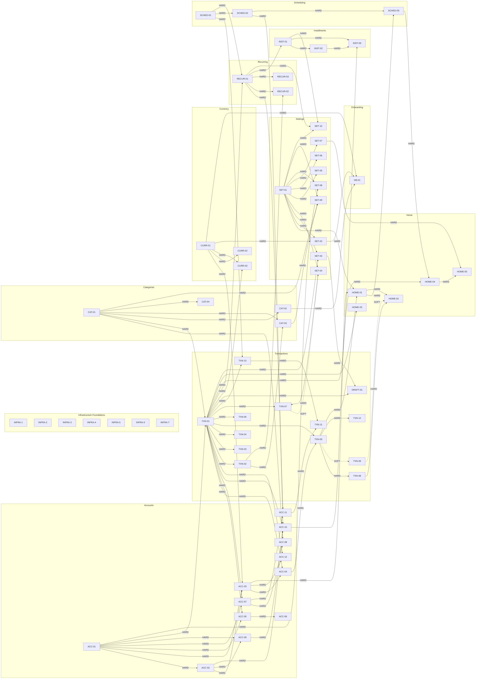

# Feature DAG — Variance v1

## Table of Contents

- [1. Overview](#1-overview)
  - [1.1 Purpose](#11-purpose)
  - [1.2 How to Read This Document](#12-how-to-read-this-document)
  - [1.3 Node ID Convention](#13-node-id-convention)
  - [1.4 Edge Types](#14-edge-types)
- [2. Infrastructure Foundations](#2-infrastructure-foundations)
  - [INFRA-1 — Database Schema + Drift Setup](#infra-1--database-schema--drift-setup)
  - [INFRA-2 — Domain Entities + Use Case Scaffolding](#infra-2--domain-entities--use-case-scaffolding)
  - [INFRA-3 — Riverpod DI Wiring](#infra-3--riverpod-di-wiring)
  - [INFRA-4 — GoRouter Navigation Shell](#infra-4--gorouter-navigation-shell)
  - [INFRA-5 — Theme + Token System](#infra-5--theme--token-system)
  - [INFRA-6 — Currency Bundle](#infra-6--currency-bundle)
  - [INFRA-7 — Ledger Engine](#infra-7--ledger-engine)
- [3. DAG Diagram](#3-dag-diagram)
  - [3.1 Full DAG (Mermaid)](#31-full-dag-mermaid)
  - [3.2 Critical Path](#32-critical-path)
- [4. Feature Nodes by Domain](#4-feature-nodes-by-domain)
  - [4.1 Accounts Domain](#41-accounts-domain)
  - [4.2 Transactions Domain](#42-transactions-domain)
  - [4.3 Categories Domain](#43-categories-domain)
  - [4.4 Currency Domain](#44-currency-domain)
  - [4.5 Recurring & Scheduling Domain](#45-recurring--scheduling-domain)
  - [4.6 Installments Domain](#46-installments-domain)
  - [4.7 Home / Dashboard Domain](#47-home--dashboard-domain)
  - [4.8 Settings Domain](#48-settings-domain)
  - [4.9 Onboarding Domain](#49-onboarding-domain)
- [5. Build Order](#5-build-order)
  - [5.1 Critical Path Analysis](#51-critical-path-analysis)
  - [5.2 Build Phases](#52-build-phases)
- [6. Reference Index](#6-reference-index)
  - [6.1 PRD → Node Map](#61-prd--node-map)
  - [6.2 TC → Node Map](#62-tc--node-map)
  - [6.3 Data Model Table → Node Map](#63-Data Model-table--node-map)
- [7. Open Questions & Flags](#7-open-questions--flags)

---

## 1. Overview

### 1.1 Purpose

Single source of truth for build order and feature dependencies.

### 1.2 How to Read This Document

- Each node = one shippable feature unit
- **Depends on** = must be done first
- **Required by** = what this unlocks
- HARD edge = B cannot start without A (schema, entity, interface)
- SOFT edge = B is easier after A, but shippable alone
- INFRA-1..7 = implicit HARD prereq for all feature nodes. Not repeated per node.

### 1.3 Node ID Convention

| Prefix | Domain |
|---|---|
| INFRA | Infrastructure foundations |
| ACC | Accounts |
| TXN | Transactions |
| DRAFT | Drafts |
| CAT | Categories |
| CURR | Currency |
| RECUR | Recurring templates |
| SCHED | Scheduling infrastructure |
| INST | Installments |
| HOME | Home / Dashboard |
| SET | Settings |
| OB | Onboarding |

### 1.4 Edge Types

| Type | Meaning | Mermaid syntax |
|---|---|---|
| HARD | B cannot run without A | `A -->|HARD| B` |
| SOFT | B easier after A, shippable alone | `A -.->|SOFT| B` |

---

## 2. Infrastructure Foundations

> All feature nodes (§4.1 through §4.9) HARD-depend on INFRA-1..7. This dependency is not repeated per feature node. Any feature node that lists no INFRA dep explicitly still requires all seven INFRA nodes to be complete before it can start.

---

#### INFRA-1 — Database Schema + Drift Setup

> Provides the encrypted SQLite database with all 18 tables, the FTS5 virtual table, WAL mode, and the migration scaffold that every other layer reads and writes.
> SQLCipher (AES-256, key in Android Keystore via `flutter_secure_storage`) is non-negotiable — encryption is page-level on the `.db` file.
> Nothing in the data layer can be implemented until this node ships.

**Sources**
- `2.3.1 Drift ORM` (`docs/02-technical/sds.md`)
- `2.3.2 WAL Mode and PRAGMA Configuration` (`docs/02-technical/sds.md`)
- `2.3.3 Migration Strategy` (`docs/02-technical/sds.md`)
- `2.3.4 DAO Structure` (`docs/02-technical/sds.md`)
- `1.3.3.1 ORM Choice: Drift` (`docs/02-technical/sds.md`)
- `2. Schema Migration Policy` (`docs/02-technical/data-model.md`)
- `3. Core Tables` (`docs/02-technical/data-model.md`)
- `4. Currency & Rates` (`docs/02-technical/data-model.md`)
- `5. Attachments` (`docs/02-technical/data-model.md`)
- `6. Budgets` (`docs/02-technical/data-model.md`)
- `7. Recurring & Scheduled` (`docs/02-technical/data-model.md`)
- `8. Installments` (`docs/02-technical/data-model.md`)
- `9. App Config` (`docs/02-technical/data-model.md`)
- `10. Search` (`docs/02-technical/data-model.md`)
- `11. Audit & Versioning` (`docs/02-technical/data-model.md`)

**Depends on:** *(none — root node)*
**Required by:** INFRA-2, INFRA-3, INFRA-6, INFRA-7, all feature nodes

- **Tables in scope (18 + 1 FTS):** `accounts`, `account_details`, `transactions`, `entries`, `categories`, `tags`, `transaction_tags`, `payees`, `currencies`, `exchange_rates`, `attachments`, `budgets`, `budget_periods`, `recurring_templates`, `scheduled_occurrences`, `installment_plans`, `installment_occurrences`, `app_settings`, `drafts` + `transactions_fts` (FTS5 virtual table). Data Model §3–§11.
- **PRAGMA set on every open:** `journal_mode=WAL`, `foreign_keys=ON`, `synchronous=NORMAL`, `busy_timeout=5000`, `cache_size=-20000`. SDS §2.3.2.
- **Migration strategy:** versioned hand-written steps; `SchemaVerifier` in tests only; `destroyEverything` disabled; on-disk version > compiled version → `SchemaMismatchException`. SDS §2.3.3.
- **DAO structure:** one `DatabaseAccessor` subclass per aggregate (`TransactionDao`, `AccountDao`, `CategoryDao`, `TemplateDao`, `ExchangeRateDao`, `CurrencyDao`). DAOs execute queries; no domain logic. SDS §2.3.4.
- **File location:** `getApplicationDocumentsDirectory()/variance.db`. SDS §2.3.1.
- **Done signal:** `flutter test` passes `SchemaVerifier` for v1 schema; `AppDatabase` opens without exception on a fresh emulator; all DAOs have generated `.g.dart` files; migration from v1→v1 (fresh install) does not throw.

---

#### INFRA-2 — Domain Entities + Use Case Scaffolding

> Provides all Freezed domain entities, abstract repository interfaces, the `Result<T>` / `Failure` sealed hierarchy, and empty use case shells with correct signatures.
> The domain layer must compile as pure Dart with zero Flutter dependency — CI enforces this.
> Without this node, no use case or repository implementation can be written.

**Sources**
- `1.3.2 Domain Layer` (`docs/02-technical/sds.md`)
- `1.5.1 Folder Structure` (`docs/02-technical/sds.md`)
- `1.5.3 Domain Boundary Rules` (`docs/02-technical/sds.md`)
- `2.5.1 Freezed — Domain Entities` (`docs/02-technical/sds.md`)
- `2.9.1 Decision — TC-033: Result Type Pattern` (`docs/02-technical/sds.md`)
- `2.9.2 Result Type Definition` (`docs/02-technical/sds.md`)
- `2.9.3 Layer-Boundary Rules` (`docs/02-technical/sds.md`)
- `1.3.3 Data Layer` (`docs/02-technical/sds.md`)

**Depends on:** *(none — pure Dart; no Drift dependency)*
**Required by:** INFRA-3, INFRA-7, all feature nodes

- **Entities (all `@freezed`, all in `lib/domain/entities/`):** `Transaction`, `Entry`, `Account`, `Category`, `RecurringTemplate`, `ScheduledOccurrence`, `InstallmentPlan`, `InstallmentOccurrence`, `Budget`, `BudgetPeriod`, `Payee`, `Tag`, `Currency`, `ExchangeRate`, `AppSettings`, `Draft`. SDS §1.5.1.
- **Repository interfaces (all in `lib/domain/repositories/`):** one per aggregate; method signatures must match the API contracts doc exactly.
- **`Result<T>` sealed type** at `lib/domain/core/result.dart`. `Failure` sealed hierarchy at `lib/domain/core/failure.dart` with: `DatabaseFailure`, `ValidationFailure`, `NetworkFailure`, `NotFoundFailure`, `BusinessRuleFailure`. SDS §2.9.2.
- **Use case shells:** empty `call()` methods with correct input/output types; no logic yet. Location: `lib/domain/usecases/`. SDS §1.5.1, §1.3.2.2.
- **Immutability rule:** zero setters; `copyWith` only; no `json_serializable` on domain entities — serialization belongs in data layer DTOs. SDS §2.5.1.
- **Done signal:** `dart analyze lib/domain/` returns zero errors; `dart pub get` with a pubspec that does NOT include `flutter` as a direct dependency compiles the domain package.

---

#### INFRA-3 — Riverpod DI Wiring

> Wires the provider graph from `AppDatabase` down through DAOs, repositories, and use cases — the composition root for the entire app.
> All providers use `@riverpod` annotation; raw `Provider(...)` constructor syntax is forbidden.
> Without this node, no screen can read from or write to the data layer.

**Sources**
- `2.2.1 Riverpod` (`docs/02-technical/sds.md`)
- `2.2.2 Provider Patterns in Use` (`docs/02-technical/sds.md`)
- `2.2.3 Dependency Injection Strategy` (`docs/02-technical/sds.md`)
- `2.2.4 Provider Scoping Rules` (`docs/02-technical/sds.md`)
- `1.5.1 Folder Structure` (`docs/02-technical/sds.md`)

**Depends on:** INFRA-1 (database), INFRA-2 (entities + interfaces)
**Required by:** INFRA-4, all feature nodes

- **Provider tree root:** `AppDatabaseProvider` (`keepAlive: true`) → DAO providers (`keepAlive: true`) → repository implementation providers (`keepAlive: true`) → use case providers → screen notifiers (route-scoped).
- **Scoping rules:** database / repositories / infrastructure services at global (root) scope; form notifiers scoped to their route via `ProviderScope` override; ephemeral local state via `ValueNotifier` (not Riverpod). SDS §2.2.4.
- **Code-gen:** all providers generated with `riverpod_generator`; output files follow `.g.dart` convention. SDS §2.10.
- **Done signal:** `main.dart` starts without runtime `ProviderException`; `flutter test` on a provider test instantiates `AppDatabaseProvider` against an in-memory Drift database and resolves at least one repository provider without error.

---

#### INFRA-4 — GoRouter Navigation Shell

> Provides the `StatefulShellRoute.indexedStack` 3-tab scaffold (Home / Accounts / Settings) and all named routes for every screen in the app.
> Route parameters are typed and validated at the builder; invalid parameters navigate to an error screen rather than crashing.
> Without this node, no screen can be navigated to from another.

**Sources**
- `2.4.1 GoRouter` (`docs/02-technical/sds.md`)
- `2.4.2 Route Structure` (`docs/02-technical/sds.md`)
- `2.4.3 Navigation Rules` (`docs/02-technical/sds.md`)
- `1.3.1.1 Navigation` (`docs/02-technical/sds.md`)
- `1.5.1 Folder Structure` (`docs/02-technical/sds.md`)

**Depends on:** INFRA-3 (providers needed for the onboarding redirect guard)
**Required by:** all feature nodes that define screen routes

- **Shell tabs:** Tab 0 `/` → HomeScreen; Tab 1 `/accounts` → AccountListScreen; Tab 2 `/settings` → SettingsScreen. Each tab is an independent `StatefulNavigationShell` branch preserving its own navigation stack. SDS §2.4.2.
- **Route tree:** see full route tree at SDS §2.4.2. All paths defined before any screen implementation.
- **Onboarding guard:** GoRouter `redirect` — if `onboardingComplete == false` in `app_settings`, all routes redirect to `/onboarding`. SDS §2.4.3.
- **Modal routes** (outside shell): `/onboarding`, `/filter`, `/exchange-rate-detail`. SDS §2.4.2.
- **Navigation rules:** `context.go(...)` for tab-root transitions; `context.push(...)` for within-tab stack pushes. SDS §2.4.3.
- **Done signal:** all named routes compile; tapping each bottom-nav tab renders a placeholder screen; the onboarding redirect fires correctly on a fresh install state; no `GoException` on any defined path parameter.

---

#### INFRA-5 — Theme + Token System

> Provides the centralized `ThemeData` (light + dark), `ColorScheme.fromSeed` with `DynamicColorBuilder` fallback, and the `ThemeExtension<VarianceColors>` semantic token layer.
> Semantic tokens (`incomeAmount`, `expenseAmount`, `warningAmount`, `accentPastel`) are named compile-time constants — no string-keyed color lookups anywhere.
> Without this node, no screen can use the correct financial color semantics.

**Sources**
- `2.18.1 Decision: Type-Safe ThemeExtension` (`docs/02-technical/sds.md`)
- `5.4.1 Appearance` (`docs/01-product/prd.md`)
- `TC-048: Minimum API level inconsistency with dynamic color` (`docs/01-product/technical-clarifications.md`)

**Depends on:** *(none — pure Flutter theming; no data dependency)*
**Required by:** all presentation-layer feature nodes

- **Dynamic color:** `DynamicColorBuilder` from `dynamic_color` package. If OEM restricts wallpaper extraction, fall back to `app_settings.color_seed`. SDS §2.18.1.
- **User preference:** `app_settings.color_scheme_mode` ∈ {`dynamic`, `custom`}. SDS §2.18.1.
- **`VarianceColors` tokens:** `incomeAmount` (green, theme-adaptive), `expenseAmount` (red, theme-adaptive), `warningAmount` (orange, theme-adaptive), `accentPastel` (lightened accent). All other color roles use Material 3 `ColorScheme` built-ins. SDS §2.18.1.
- **Both light and dark `ThemeData` required** — no single-theme shortcut. SDS §2.18.1.
- **Done signal:** `ThemeData` and `VarianceColors` compile; widget test confirms `Theme.of(context).extension<VarianceColors>()!.incomeAmount` resolves to a non-null color in both light and dark modes; `DynamicColorBuilder` fallback path tested with a mock that returns null.

---

#### INFRA-6 — Currency Bundle

> Provides the bundled `assets/data/currencies.json` (~180 active ISO 4217 currencies) and seeds the `currencies` table on fresh install.
> `CurrencyRepository` loads the asset once on app startup into a `keepAlive` Riverpod provider — no runtime network fetch ever.
> Without this node, account creation and transaction entry cannot present a currency picker.

**Sources**
- `2.16.1 Decision — TC-044: Bundled ISO 4217 Static Asset` (`docs/02-technical/sds.md`)
- `4.1 currencies` (`docs/02-technical/data-model.md`)
- `TC-044: Currency list — bundling and maintenance` (`docs/01-product/technical-clarifications.md`)

**Depends on:** INFRA-1 (currencies table must exist), INFRA-3 (provider)
**Required by:** ACC-01, and all feature nodes that reference currency

- **Asset path:** `assets/data/currencies.json`. SDS §2.16.1.
- **Schema per entry:** `{ "code": "USD", "name": "US Dollar", "symbol": "$", "minor_units": 2 }`. SDS §2.16.1.
- **Scope:** ~180 active ISO 4217 currencies; obsolete excluded. TC-044.
- **Seeding:** on fresh install, `onCreate` migration reads the asset and bulk-inserts into `currencies` table. `CurrencyDao` is read-only. SDS §2.16.1.
- **`minor_units` downstream contract:** input fields restrict decimal places to `minor_units`; amounts stored as integers in minor units; display formats to `minor_units` decimal places. SDS §2.16.1.
- **Done signal:** asset bundled and parseable; `currencies` table populated on fresh install with ≥ 170 rows; `CurrencyRepository.getAll()` returns correct entry for USD, JPY (0 decimals), and BHD (3 decimals).

---

#### INFRA-7 — Ledger Engine

> Provides the four stateless domain services — `LedgerEngine`, `BalanceCalculator`, `PostingCaseSelector`, `PeriodCalculator` — that implement all DEB invariants, posting cases, and period arithmetic.
> All ledger writes (user-initiated, background, adjustment) pass through these services; no use case may skip them.
> Without this node, no financial write operation can be implemented correctly.

**Sources**
- `1.3.2.1 Domain Services` (`docs/02-technical/sds.md`)
- `1.4.1 User-Initiated Write — Transaction Creation` (`docs/02-technical/sds.md`)
- `1.4.3 Background Write — Recurring Auto-Post` (`docs/02-technical/sds.md`)
- `1.4.4 Account Balance Read` (`docs/02-technical/sds.md`)
- `1.6.2 ACID Atomicity for All Ledger Operations` (`docs/02-technical/sds.md`)
- `1.6.7 Transaction Immutability and Correction Model` (`docs/02-technical/sds.md`)
- `4.4 Constraints` (`docs/01-product/prd.md`)
- `4.5 Transaction Rules by Type` (`docs/01-product/prd.md`)
- `4.6 Balance Calculation` (`docs/01-product/prd.md`)
- `4.7 Transaction Validity` (`docs/01-product/prd.md`)
- `4.8 Immutability \& Correction Model` (`docs/01-product/prd.md`)
- `4.9 Initial Balance \& Equity Account` (`docs/01-product/prd.md`)
- `4.10 Journal Adjustments` (`docs/01-product/prd.md`)
- `4.11 Ledger Posting Cases (Reference)` (`docs/01-product/prd.md`)
- `3.3 transactions` (`docs/02-technical/data-model.md`)
- `3.4 entries` (`docs/02-technical/data-model.md`)

**Depends on:** INFRA-2 (domain entities and `Result<T>` type)
**Required by:** ACC-01, ACC-05, ACC-06, ACC-07, ACC-08, and all TXN, RECUR, INSTALL nodes

- **`LedgerEngine`:** accepts `CreateTransactionInput`; calls `PostingCaseSelector`; builds balanced `Entry` set; asserts `Σdebit = Σcredit` before returning. Any imbalance is a `BusinessRuleFailure`. SDS §1.3.2.1, PRD §4.4.
- **`PostingCaseSelector`:** maps (event_type, entity_state) → posting case enum from PRD §4.11 and `ledger-entry.md`. Covers: expense/income/transfer creation, balance edit (visible + invisible), reversal, account-deletion transfer, recurring auto-post. SDS §1.3.2.1.
- **`BalanceCalculator`:** computes `balance = Σdebit − Σcredit` from `entries` rows; handles multi-currency conversion via `exchange_rate_to_home`; does not store result. SDS §1.3.2.1, SDS §1.4.4. Per TC-046, all category-balance aggregations use home-currency conversion (`Σ entry_amount * exchange_rate_to_home`).
- **`PeriodCalculator`:** O(1) `DateRange` computation for recurring templates and budgets; handles month-boundary and leap-year edge cases via Dart `DateTime` constructor arithmetic; no iteration loops. SDS §1.6.10.
- **ACID contract:** every ledger write executes inside a single Drift `database.transaction(() {...})` call — partial writes are not permitted. SDS §1.6.2.
- **EQ account lazy creation:** `LedgerEngine` must check for, and atomically create, the per-currency EQ account (`__EQ_{code}`) inside the same transaction when posting an opening balance entry. TC-045.
- **Immutability contract:** `LedgerEngine` never issues SQL `UPDATE` on `entries` rows; corrections produce new reversal + correction entry sets. SDS §1.6.7.
- **Done signal:** unit tests cover all posting cases from `ledger-entry.md` (Cases 1.1, 1.2, 1.3, 1.3a, 2.2a/b, 2.3a/b, 2.4a/b, 2.5a, 3.1); `Σdebit = Σcredit` assertion unit-tested with a deliberately imbalanced input that returns `BusinessRuleFailure`; `PeriodCalculator` tested for Feb 28/29 boundary and month-end clamping.

---

## 3. DAG Diagram

### 3.1 Full DAG (Mermaid)

#### Node Legend

| Node ID | Feature |
|---|---|
| INFRA-1 | Database Schema + Drift Setup |
| INFRA-2 | Domain Entities + Use Case Scaffolding |
| INFRA-3 | Riverpod DI Wiring |
| INFRA-4 | GoRouter Navigation Shell |
| INFRA-5 | Theme + Token System |
| INFRA-6 | Currency Bundle |
| INFRA-7 | Ledger Engine |
| ACC-01 | Account CRUD |
| ACC-02 | Account Category-Specific Fields |
| ACC-03 | Account Balance View + Net Worth |
| ACC-04 | Account Detail Screen |
| ACC-05 | Account Balance Edit (Journal Adjustment) |
| ACC-06 | Balance Reconciliation |
| ACC-07 | Internal Transfer |
| ACC-08 | Transfer with Fee |
| ACC-09 | Credit Card Balance Model |
| ACC-10 | Credit Card Payment Reminder |
| ACC-11 | Account Soft-Delete Lifecycle |
| ACC-12 | Negative Balance + Overdraft Warning |
| TXN-01 | Transaction Entry (Income/Expense) |
| TXN-02 | Transaction Immutability + Correction Model |
| TXN-03 | Transaction Detail View |
| TXN-04 | Photo Attachments |
| TXN-05 | Transaction List |
| TXN-06 | Duplicate Transaction Detection |
| TXN-07 | Large Transaction Warning |
| TXN-08 | Transaction Search (FTS5 + Dart Scoring) |
| TXN-09 | Transaction Filter |
| TXN-10 | Future-Dated / Pending Transactions |
| TXN-11 | Pending Tx Auto-Void on Account Delete |
| TXN-12 | Transaction Amount Colour Coding + List Layout |
| DRAFT-01 | Drafts (Auto-Save, Resume, Delete) |
| CAT-01 | Category CRUD (Two-Level, Income/Expense) |
| CAT-02 | Default Category Seeding |
| CAT-03 | Category Soft-Delete + Migration Flow |
| CAT-04 | Protected "Balance Adjustment" System Category |
| CURR-01 | Multi-Currency Display + Exchange Rate Cache |
| CURR-02 | Currency Symbol Disambiguation |
| CURR-03 | Exchange Rate Estimate During Entry + Staleness Warning |
| RECUR-01 | Recurring Transaction Templates |
| RECUR-02 | Recurring Template Editing + Child Tx Handling |
| RECUR-03 | Recurring Template Pause/Unpause |
| SCHED-01 | Scheduling Infrastructure (WorkManager + App-Launch Sweep) |
| SCHED-02 | Remind-and-Confirm Exact Alarm + Notifications |
| SCHED-03 | Pending Confirmations Screen + Home Alert Cards |
| INST-01 | Installment Template |
| INST-02 | Installment Running Total Tracking |
| INST-03 | Installment Early Close |
| HOME-01 | Home Screen Dashboard |
| HOME-02 | Home Screen Search + Filter |
| HOME-03 | Quick-Entry FAB |
| HOME-04 | Alerts Section |
| HOME-05 | Backup Reminder Alert |
| SET-01 | Settings Hub + Appearance |
| SET-02 | Locale + Format Settings |
| SET-03 | Transaction Entry Settings |
| SET-04 | Warnings + Limits Settings |
| SET-05 | Profile Settings (Display Name) |
| SET-06 | Security Settings (Lock + PIN) |
| SET-07 | Data Backup (Export ZIP) |
| SET-08 | Account Management Screen |
| SET-09 | Category Management Screen |
| SET-10 | Recurring + Installment Management Screen |
| OB-01 | Onboarding Wizard |

### 3.2 Critical Path

Longest HARD-dependency chain from INFRA to deepest leaf:

**INFRA-1 → INFRA-7 → TXN-01 → TXN-05 → TXN-08 → HOME-02**

Full path (12 hops):

1. INFRA-1 — DB schema exists
2. INFRA-7 — Ledger engine posts entries
3. ACC-01 — Accounts can be created
4. CAT-01 — Categories exist (co-dep with ACC-01 for TXN-01)
5. TXN-01 — Transactions can be entered
6. ACC-04 — Account detail available
7. TXN-05 — Transaction list rendered
8. TXN-08 — FTS5 search indexing live
9. SET-01 — Settings hub available
10. HOME-01 — Home dashboard rendered
11. HOME-02 — Search + filter on home screen

---

## 4. Feature Nodes by Domain

### 4.1 Accounts Domain

> All ACC nodes HARD-depend on INFRA-1..7 (implicit). Dep list below shows only direct intra-domain and cross-domain deps.

---

#### ACC-01 — Account CRUD

> User can create, view, edit, and soft-delete financial accounts.
> Account currency is immutable after creation; account name must be unique across all accounts including soft-deleted ones (PRD §5.1.1.3); EQ account is lazily created per-currency inside the same atomic write as the opening balance entry (TC-045).
> Consumes: `accounts` table (Data Model §3.1), `account_details` table (Data Model §3.2), `INFRA-7` for opening balance entry.

**Sources**
- `5.1.1 Account CRUD` (`docs/01-product/prd.md`)
- `5.1.1.1 Create Account — Fields` (`docs/01-product/prd.md`)
- `5.1.1.2 Currency Immutability` (`docs/01-product/prd.md`)
- `5.1.1.3 Account Name Uniqueness Constraint` (`docs/01-product/prd.md`)
- `5.1.1.4 Edit` (`docs/01-product/prd.md`)
- `TC-012: Account deletion balance transfer — "same type" constraint on template migration` (`docs/01-product/technical-clarifications.md`)
- `TC-020: Account deletion balance transfer — transaction editability conflict` (`docs/01-product/technical-clarifications.md`)
- `TC-027: Account entity — missing system fields` (`docs/01-product/technical-clarifications.md`)
- `TC-035: Soft-deleted entity reinstatement — what fields are restored?` (`docs/01-product/technical-clarifications.md`)
- `1.5.1 Folder Structure` (`docs/02-technical/sds.md`)
- `3.1 accounts` (`docs/02-technical/data-model.md`)
- `3.2 account_details` (`docs/02-technical/data-model.md`)

**Depends on:** INFRA-1, INFRA-2, INFRA-3, INFRA-7
**Required by:** ACC-02, ACC-03, ACC-04, ACC-05, ACC-06, ACC-07, ACC-08, ACC-09, ACC-10, ACC-11, ACC-12

- **Create:** collects name, account_category (fixed enum — 9 values), initial_balance, currency (ISO 4217, defaults to home currency), include_in_net_worth (boolean, default true), notes, and category-specific fields from `account_details`. PRD §5.1.1.1.
- **Currency immutability UX:** default home currency; info tooltip on field; visual change indicator if user selects a different currency; confirmation dialog before save. PRD §5.1.1.2.
- **Name uniqueness:** enforced at app layer; check includes soft-deleted accounts. PRD §5.1.1.3.
- **Reinstatement offer:** when name + account_category match a soft-deleted account, prompt: *"It looks like you previously had an account with this name. Would you like to reinstate it instead?"* — accept clears `is_deleted`; decline requires a new name. PRD §5.1.1.3, TC-035.
- **Opening balance posting:** if `initial_balance ≠ 0`, atomically post via `INFRA-7` (Cases 2.2a or 2.2b from `ledger-entry.md`); EQ account for this currency created in same transaction if it does not exist. TC-045.
- **Edit:** name, notes, include_in_net_worth, and all category-specific fields are editable. Account category is NOT editable after creation. PRD §5.1.1.4.
- **Soft-delete:** sets `is_deleted = true`, `deleted_at`; account is excluded from all pickers and account lists; name remains reserved; historical transactions still visible. PRD §5.1.1.4, §5.1.1.5.
- **System fields present on entity:** `id` (UUID v4), `created_at`, `updated_at`, `is_deleted`, `deleted_at`, `is_protected`, `is_system`, `display_order`. TC-027, Data Model §3.1.
- **EQ and system accounts:** `is_system = 1` accounts are hidden from all user-facing views. `is_protected = 1` blocks user deletion. Data Model §3.1.
- **Last-account guard:** when exactly one account exists, delete action is disabled with tooltip: *"You cannot delete your only account."* PRD §5.1.1.5.
- **System-generated transfer editability:** system-generated transactions (e.g., deletion balance transfer) expose Delete-with-warning in contextual menu; Edit action is absent. TC-020.
- **Edge case — reinstatement field state:** all fields restored exactly as they were at soft-delete time; user may edit via normal edit flow immediately after reinstatement. TC-035.
- **Done signal:** create / read / edit / soft-delete all pass unit tests; opening balance creates a balanced entry pair in `entries`; EQ account row created on first non-zero opening balance; name uniqueness check rejects a name matching a soft-deleted account; reinstatement offer fires correctly.

---

#### ACC-02 — Account Category-Specific Fields

> User can enter and edit category-specific fields (bank name, card number, billing date, etc.) when creating or editing an account.
> Sensitive fields (`card_number`, `account_number`) are encrypted at rest using AES via `flutter_secure_storage`; reveal requires authentication.
> Loan account post-save installment suggestion fires when applicable.

**Sources**
- `5.1.2 Account Categories (Fixed Set — No Custom Categories)` (`docs/01-product/prd.md`)
- `5.1.2.1 Linked bank account — behaviour by account category` (`docs/01-product/prd.md`)
- `TC-013: Notification reschedule triggers on credit card field edits` (`docs/01-product/technical-clarifications.md`)
- `3.2 account_details` (`docs/02-technical/data-model.md`)

**Depends on:** ACC-01
**Required by:** ACC-03 (credit limit warning needs `credit_limit_minor`), ACC-09, ACC-10

- **Storage:** all category-specific fields stored in `account_details` key-value rows; encrypted fields use `detail_value_encrypted` column; plain fields use `detail_value`. Data Model §3.2.
- **Valid `detail_key` values and which account categories they apply to:** see Data Model §3.2 (23 defined keys). All are in-place editable after creation.
- **Encrypted keys:** `card_number` (credit_card, debit_card), `account_number` (bank_account). Reveal requires biometric or PIN authentication. PRD §5.1.2.
- **CVV is never stored.** PRD §5.1.2.
- **Linked bank account (credit card):** triggers credit card payment reminders (§5.1.7). Does NOT trigger notification reschedule — form reads linked account at tap time. TC-013.
- **Linked bank account (debit card):** metadata only; no functional effect. PRD §5.1.2.1.
- **Loan installment suggestion:** post-save, if `initial_balance < 0` OR `emi_amount_minor` / `emi_date` provided, display suggestion: *"Would you like to set up a recurring installment payment for this loan?"* Pre-fill template form with destination = this loan, amount = emi_amount, recurrence = monthly on emi_date, start = today. PRD §5.1.2.1.
- **Done signal:** each account category's required and optional fields save and reload correctly; `card_number` saved encrypted and not readable without auth; loan suggestion fires on negative initial balance; notification schedule is NOT triggered by linked-bank-account field edit.

---

#### ACC-03 — Account Balance View + Net Worth

> User can see real-time computed balance per account and the aggregate net worth across included accounts.
> Balance is always computed from `entries` (never a stored column); net worth sums only `include_in_net_worth = 1` and `is_deleted = 0` accounts.
> Multi-currency balances are converted to home currency via `exchange_rate_to_home` for net worth aggregation.

**Sources**
- `5.1.4 Account Balance View` (`docs/01-product/prd.md`)
- `5.1.4.1 Negative balance visual treatment` (`docs/01-product/prd.md`)
- `5.1.4.2 Overdraft warning` (`docs/01-product/prd.md`)
- `5.1.4.3 Credit card limit warning (FG-C18)` (`docs/01-product/prd.md`)
- `TC-045: EQ (Opening Balance equity account) — balance and auditability` (`docs/01-product/technical-clarifications.md`)
- `TC-046: BAI and BAE (Balance Adjustment categories) — per-currency or global?` (`docs/01-product/technical-clarifications.md`)
- `1.4.4 Account Balance Read` (`docs/02-technical/sds.md`)
- `3.1 accounts` (`docs/02-technical/data-model.md`)
- `3.4 entries` (`docs/02-technical/data-model.md`)

**Depends on:** ACC-01, ACC-02, CURR-01 *(exchange rate provider — for home-currency conversion)*
**Required by:** ACC-04, ACC-12

- **Balance formula:** `balance = Σdebit − Σcredit` over all non-void `entries` for the account. SDS §1.4.4, PRD §4.6.
- **Reactive stream:** `AccountRepository.watchBalance(accountId)` returns a Drift `Stream` that updates on every `entries` write. SDS §1.4.4.
- **Net worth:** `Σ balance_in_home_currency` for all accounts where `include_in_net_worth = 1 AND is_deleted = 0`. Foreign currency balances converted via `exchange_rate_to_home` stored on the transaction. TC-046.
- **Excluded accounts:** shown grayed-out inline below the net worth total; "excluded" indicator; balance NOT included in the total. PRD §5.1.4.
- **Negative balance display:** distinct warning color token (`VarianceColors.expenseAmount` or a dedicated token — exact token deferred to UX Flows); no minus sign in primary display; accessibility label must convey liability state. PRD §5.1.4.1.
- **Overdraft warning (ACC-12 dependency):** non-blocking inline warning when a transaction would push balance below zero or deepen an existing negative balance. PRD §5.1.4.2.
- **Credit limit warning (ACC-12 dependency):** non-blocking inline warning when an expense/transfer would exceed `credit_limit_minor` on a credit card. PRD §5.1.4.3.
- **Performance requirement:** balance aggregation query must complete within <500ms for accounts with up to 10,000 entries. Index on `entries(account_id, side)` required. Data Model §3.4, §13.
- **Done signal:** unit test verifies balance formula; stream emits updated value within 1 second after a new entry insert; net worth correctly excludes soft-deleted and excluded-flag accounts; negative balance renders in warning color in widget test.

---

#### ACC-04 — Account Detail Screen

> User can view all information about a single account — balance, metadata, per-account transaction list, and contextual actions — in a single screen.
> Per-account transaction list uses the same cursor-based pagination architecture as the unified list (SDS §1.4.2); NOT month-filtered.
> Credit card accounts show both outstanding and statement balances, plus the Pay FAB.

**Sources**
- `5.1.4a Account Detail Screen` (`docs/01-product/prd.md`)
- `TC-032: Account detail screen — specification missing` (`docs/01-product/technical-clarifications.md`)
- `2.4.2 Route Structure` (`docs/02-technical/sds.md`)

**Depends on:** ACC-03 (balance), TXN-01 *(transaction list component)*
**Required by:** *(consumed by end-users; no downstream feature deps)*

- **Header:** account name, account category badge, currency. PRD §5.1.4a.
- **Balance section:** computed balance (reactive stream from ACC-03). Credit cards: outstanding balance AND statement balance (§5.1.6). Negative balance styled per §5.1.4.1. PRD §5.1.4a.
- **Account metadata:** all `account_details` fields displayed read-only. Sensitive fields masked; reveal-on-auth. PRD §5.1.4a, §5.1.2.
- **Net worth inclusion indicator:** "Included in net worth" / "Excluded from net worth". PRD §5.1.4a.
- **Per-account transaction list:** filtered to `account_source_id = id OR account_destination_id = id`; cursor-based pagination (SDS §1.4.2); search and filter available (scoped to account); NOT month-filtered — all dates. PRD §5.1.4a.
- **Contextual actions:** Edit Account, Delete Account, Reconcile (ACC-06). Via app bar or contextual menu. PRD §5.1.4a.
- **Credit card Pay FAB:** only on `account_category = credit_card`; always visible regardless of statement balance; opens credit card payment form (ACC-10). PRD §5.1.4a, §5.1.7.
- **Route:** `/accounts/:id`. SDS §2.4.2.
- **Edge case — deleted account access:** if navigated to a soft-deleted account (e.g., via deep link or search result), display the account in read-only mode with a "This account has been deleted" banner; no edit or delete actions; reinstatement option available.
- **Done signal:** screen renders correct balance; per-account list paginates correctly; sensitive fields masked by default; Pay FAB appears only on credit cards; reconcile action navigates to ACC-06 flow; deleted-account banner shown correctly.

---

#### ACC-05 — Account Balance Edit (Journal Adjustment)

> User can manually adjust an account's balance, choosing to record it as a visible income/expense transaction or an invisible equity journal entry.
> Both adjustment paths route through `INFRA-7` (`PostingCaseSelector` Cases 2.3a/b for visible, 2.4a/b for invisible) inside a single atomic DB transaction.
> This is the underlying engine shared by direct balance edit (PRD §5.1.3) and reconciliation (ACC-06).

**Sources**
- `5.1.3 Account Balance Model` (`docs/01-product/prd.md`)
- `4.10 Journal Adjustments` (`docs/01-product/prd.md`)
- `TC-045: EQ (Opening Balance equity account) — balance and auditability` (`docs/01-product/technical-clarifications.md`)
- `TC-046: BAI and BAE (Balance Adjustment categories) — per-currency or global?` (`docs/01-product/technical-clarifications.md`)
- `1.4.1 User-Initiated Write — Transaction Creation` (`docs/02-technical/sds.md`)
- `3.3 transactions` (`docs/02-technical/data-model.md`)
- `3.4 entries` (`docs/02-technical/data-model.md`)

**Depends on:** ACC-01, TXN-01 *(transaction write path)*, INFRA-7
**Required by:** ACC-06 (reconciliation wraps this), ACC-09 (credit card balance edit)

- **Trigger:** "Edit Balance" action from account edit form or contextual menu. PRD §5.1.3.
- **Prompt:** *"Record this change as a real transaction?"* Yes → visible; No → invisible equity entry. PRD §5.1.3.
- **Visible adjustment:** posts income/expense transaction with protected `Balance Adjustment` category; visible in transaction list. Cases 2.3a (balance ↑) or 2.3b (balance ↓) from `ledger-entry.md`. PRD §4.10.
- **Invisible adjustment:** posts journal entry against per-currency EQ account; NOT visible in normal views; surfaces in v2 audit view. Cases 2.4a or 2.4b from `ledger-entry.md`. TC-045.
- **Atomicity:** entire adjustment (transaction + entry pair) in one Drift `database.transaction()` call. SDS §1.6.2.
- **Credit card special case (ACC-09):** balance edit screen offers two distinct actions — "Adjust statement balance" (dated to billing date) and "Adjust outstanding balance" (dated to today). PRD §5.1.6.2.
- **BAI/BAE categories:** global (not per-currency); balance computed in home currency via `exchange_rate_to_home`. TC-046.
- **Edge case — zero delta:** if new balance equals current balance, show "Balance is already correct" and exit without posting. PRD §5.1.3a §5.1.3.1 step 4.
- **Done signal:** visible adjustment creates a row in `transactions` with `category_id = BAI/BAE` and a balanced entry pair; invisible adjustment creates an entry pair against `__EQ_{currency}` account with no `transactions` row visible in normal queries; zero-delta exits cleanly.

---

#### ACC-06 — Balance Reconciliation

> User enters their real-world balance; the app computes the discrepancy and posts the appropriate journal adjustment.
> Functionally identical to ACC-05 (direct balance edit) but optimized UX — user inputs the target balance, not the delta.
> Available from account contextual menu and account detail screen.

**Sources**
- `5.1.3a Balance Reconciliation (FG-C6)` (`docs/01-product/prd.md`)
- `5.1.3.1 Reconciliation flow` (`docs/01-product/prd.md`)

**Depends on:** ACC-05
**Required by:** *(no downstream feature deps)*

- **Flow:** display current computed balance → user enters actual (real-world) balance → compute `discrepancy = actual − computed` → if zero: show "Balance is already correct" and exit → if non-zero: call ACC-05 adjustment flow (visible or invisible choice). PRD §5.1.3.1.
- **Access:** account contextual menu (§5.5.1) and account detail screen (ACC-04). PRD §5.1.3a.
- **Delta computation:** the reconciliation use case computes the delta and passes it to the same `BalanceAdjustmentUseCase` used by ACC-05 — no duplication of posting logic.
- **Edge case — concurrent edit:** if the account's computed balance changes between when the reconciliation screen opens and when the user confirms, the delta is recomputed at confirmation time (not at screen-open time). The `entries` stream provides the latest balance; recalculate immediately before posting.
- **Done signal:** entering the correct current balance shows "Balance is already correct"; entering a higher value creates an income adjustment; entering a lower value creates an expense adjustment; delta is recomputed at confirmation time in a concurrency unit test.

---

#### ACC-07 — Internal Transfer

> User can move funds between two accounts via a Transfer transaction that atomically debits the destination and credits the source.
> Both entry sides post together or neither does (ACID — SDS §1.6.2); cross-currency transfers are blocked in v1 (PRD §7).
> Destination picker shows only same-currency active accounts, source-first selection (TC-036).

**Sources**
- `5.1.5 Internal Transfer` (`docs/01-product/prd.md`)
- `TC-036: Transfer destination account currency validation — enforcement mechanism` (`docs/01-product/technical-clarifications.md`)
- `1.4.1 User-Initiated Write — Transaction Creation` (`docs/02-technical/sds.md`)
- `3.3 transactions` (`docs/02-technical/data-model.md`)
- `3.4 entries` (`docs/02-technical/data-model.md`)

**Depends on:** ACC-01, TXN-01, INFRA-7
**Required by:** ACC-08 (transfer with fee), ACC-11 (deletion balance transfer)

- **Transfer ledger posting:** `Dr destination_account, Cr source_account` — universal for all account types including credit card payment. PRD §5.1.5.
- **Account picker rules:** source selected first; destination picker filtered to same-currency active (non-deleted) accounts, excluding source; if no valid destination: empty state with explanation, Save disabled. TC-036.
- **Currency validation:** enforced at picker level — no same-currency check needed at domain layer if picker is correctly filtered; domain layer still validates as a safety net (returns `BusinessRuleFailure` if currencies differ). PRD §7.
- **No transaction category on transfers.** PRD §5.1.5.
- **Atomicity:** both entries in one `database.transaction()`. SDS §1.6.2.
- **Credit card payment:** `Dr CreditCard, Cr SourceAccount` → debit increases CC balance toward zero (reduces amount owed). PRD §5.1.5.
- **Edge case — single-account state:** Transfer option always available in type selector; validation failure surfaces at destination picker (empty state), not at type selection. TC-036.
- **Done signal:** balanced entry pair created for both accounts; cross-currency selection not possible via picker; credit card payment moves balance correctly toward zero; atomic rollback on failure tested.

---

#### ACC-08 — Transfer with Fee

> User can optionally attach a bank/network fee to a transfer; the fee posts as a linked expense within the same compound transaction group.
> Fee and transfer are grouped by `compound_group_id`; the fee component is not independently editable or deletable from the list.
> Recurring transfer templates can include fee fields (TC-052).

**Sources**
- `5.1.5b Transfer Fee (Optional)` (`docs/01-product/prd.md`)
- `TC-052: Recurring transfer templates with fees` (`docs/01-product/technical-clarifications.md`)
- `3.3 transactions` (`docs/02-technical/data-model.md`)
- `3.4 entries` (`docs/02-technical/data-model.md`)

**Depends on:** ACC-07, CAT-01 *(Financial > Fees & Charges category must exist)*
**Required by:** *(no downstream feature deps in v1)*

- **Fee panel:** collapsed by default on transfer form; flat amount OR percentage (mutually exclusive, user picks mode). PRD §5.1.5b.
- **Fee posting (Case 1.3a from `ledger-entry.md`):** transfer entries unchanged (`Dr A₂, Cr A₁`); fee posts separately as `Dr FeeCategory, Cr A₁`; both groups share `compound_group_id`. PRD §5.1.5b.
- **Fee category:** defaults to `Financial > Fees & Charges`; user may change before saving. PRD §5.1.5b.
- **Compound transaction behavior:** editing or deleting the transfer affects both parts; fee component not independently editable/deletable from list; detail view shows transfer + fee breakdown. PRD §5.1.5b.
- **Recurring template support:** fee fields (`fee_mode`, `fee_amount_minor` / `fee_percentage`, `fee_category_id`) on transfer-type templates; in-place editable (future occurrences only). TC-052.
- **Scope:** v1 includes same-currency transfer fees only; cross-currency fee support deferred to v2. PRD §5.1.5b.
- **Edge case — fee with zero amount:** fee panel open but amount = 0 → treat as no fee; do not post a zero-amount fee entry.
- **Done signal:** two `transactions` rows created (transfer + fee) sharing `compound_group_id`; fee does not appear as an independent item in the transaction list; transfer detail view shows fee breakdown; zero fee amount does not create an entry row.

---

#### ACC-09 — Credit Card Balance Model

> Credit card account exposes two balance figures — outstanding (full ledger balance) and statement (current billing cycle only).
> Statement balance is derived on demand from `entries` filtered by billing period half-open interval; not stored.
> Balance edit screen presents two distinct adjustment actions (statement vs. outstanding).

**Sources**
- `5.1.6 Credit Card Balance Model` (`docs/01-product/prd.md`)
- `5.1.6.1 Billing period boundary semantics` (`docs/01-product/prd.md`)
- `5.1.6.2 Balance edit screen for credit cards` (`docs/01-product/prd.md`)
- `TC-004: Statement balance derivation for credit cards — billing period boundaries` (`docs/01-product/technical-clarifications.md`)
- `3.1 accounts` (`docs/02-technical/data-model.md`)
- `3.4 entries` (`docs/02-technical/data-model.md`)

**Depends on:** ACC-01, ACC-02 (billing date and payment due date from `account_details`)
**Required by:** ACC-10 (payment reminder uses statement balance), ACC-12 (credit limit warning)

- **Outstanding balance:** standard `balance = Σdebit − Σcredit`; normal negative value in use. PRD §5.1.6.
- **Statement balance:** `entries` for `account_id` filtered by billing period `(previous_billing_date, current_billing_date]` using transaction `date_time`. PRD §5.1.6.
- **Previous billing date:** `current_billing_date − 1 month` with end-of-month clamping (same rule as recurring template `PeriodCalculator`). PRD §5.1.6.1.
- **First cycle:** `(account.created_at, first_billing_date]`. PRD §5.1.6.1.
- **Current period (before billing date):** running total from last billing date through today (projection). PRD §5.1.6.1.
- **Balance edit screen for credit cards:** two actions: (1) "Adjust statement balance" → adjustment dated to billing date; (2) "Adjust outstanding balance" → adjustment dated to today. Both route through ACC-05 flow. PRD §5.1.6.2.
- **Edge case — billing date on 31st, shorter months:** apply same end-of-month clamping: if month has no 31st, use last day of month.
- **Edge case — account created after billing date in current month:** first cycle is `(created_at, next_billing_date]`; no negative-duration period.
- **Done signal:** unit test verifies statement balance correctly filters entries by billing period; billing period boundary semantics tested with month-end clamping; first-cycle edge case tested; balance edit creates adjustment with correct date.

---

#### ACC-10 — Credit Card Payment Reminder

> When billing date and payment due date are configured, the app schedules four OS-level local notifications per billing cycle.
> Notifications are suppressed when statement balance is zero (TC-053).
> Rescheduling triggers: billing date change or payment due date change only — linked bank account change does NOT trigger reschedule (TC-013).

**Sources**
- `5.1.7 Credit Card Payment Reminders` (`docs/01-product/prd.md`)
- `5.1.7.1 Notification schedule (recurring each billing cycle)` (`docs/01-product/prd.md`)
- `5.1.7.2 Credit card payment entry form` (`docs/01-product/prd.md`)
- `TC-013: Notification reschedule triggers on credit card field edits` (`docs/01-product/technical-clarifications.md`)
- `TC-053: Credit card payment due amount — outstanding vs. statement balance` (`docs/01-product/technical-clarifications.md`)
- `2.6 Scheduling` (`docs/02-technical/sds.md`)

**Depends on:** ACC-09 (statement balance), ACC-02 (billing date, payment due date from `account_details`), SCHED-02 *(notification scheduler)*, TXN-01 *(payment entry form)*
**Required by:** *(no downstream feature deps)*

- **Notification schedule per billing cycle (4 triggers):** (1) 1 day after billing date — statement ready; (2) 7 days before payment due date — payment due in 7 days; (3) 1 day before payment due date — due tomorrow; (4) on payment due date — due today. PRD §5.1.7.1.
- **Notification content:** each notification includes card name and statement balance amount. PRD §5.1.7.1.
- **Pay action on notification:** taps open the credit card payment entry form. PRD §5.1.7.1.
- **Suppression rule:** if statement balance = 0 for current billing cycle, no notification delivered (schedule still runs internally). TC-053.
- **Home screen alert card:** also suppressed when statement balance = 0. TC-053.
- **Reschedule triggers:** billing date change → reschedule all; payment due date change → reschedule all; linked bank account change → no reschedule. TC-013.
- **Payment entry form:** Transfer type (fixed); destination = this credit card (fixed); source = linked bank account if set (pre-filled, editable); amount = statement balance (pre-filled, editable). PRD §5.1.7.2.
- **Permissions reused from recurring:** `SCHEDULE_EXACT_ALARM`, `POST_NOTIFICATIONS`. SDS §2.6.
- **Pay FAB (ACC-04):** always visible; opens same payment entry form; amount pre-filled to 0 if statement balance is 0. TC-053.
- **Done signal:** 4 notifications scheduled when billing date and due date set; notification suppressed when statement balance = 0; reschedule fires on billing date edit but NOT on linked-bank-account edit; payment form pre-fills correctly.

---

#### ACC-11 — Account Soft-Delete Lifecycle

> Full account deletion lifecycle: template warning, balance transfer offer, and net worth warning — all must complete before `is_deleted` is set.
> Template migration replacement picker filtered to same account category AND same currency (TC-012).
> Pending (future-dated) transactions referencing the deleted account are auto-voided by the scheduler (TC-039).

**Sources**
- `5.1.1.5 Soft-deleted account behaviour (FG-B9)` (`docs/01-product/prd.md`)
- `5.1.1.6 Recurring and installment template handling on account deletion` (`docs/01-product/prd.md`)
- `TC-012: Account deletion balance transfer — "same type" constraint on template migration` (`docs/01-product/technical-clarifications.md`)
- `TC-020: Account deletion balance transfer — transaction editability conflict` (`docs/01-product/technical-clarifications.md`)
- `TC-039: What happens to pending (future-dated) transactions when the referenced account is soft-deleted?` (`docs/01-product/technical-clarifications.md`)
- `1.6.6 Universal Soft-Delete` (`docs/02-technical/sds.md`)

**Depends on:** ACC-07 (balance transfer uses transfer posting), RECUR-01 *(recurring template read — to check for future-scheduled occurrences)*
**Required by:** *(terminal node — no downstream deps)*

- **Pre-delete check flow (ordered):**
  1. If recurring/installment templates with future-scheduled occurrences reference this account → blocking warning: user must choose Migrate or Stop before proceeding. PRD §5.1.1.6.
  2. If balance ≠ 0 AND at least one other active same-currency account exists → offer balance transfer. PRD §5.1.1.5.
  3. If balance ≠ 0 AND no same-currency account → skip transfer offer; show net worth warning directly. PRD §5.1.1.5.
  4. If balance = 0 → show net worth warning if account was `include_in_net_worth = 1`. PRD §5.1.1.5.
  5. Confirmed → set `is_deleted = 1`, `deleted_at`.
- **Template Migrate option:** replacement picker filtered to active (not soft-deleted), same account_category, same currency. "Migrate" option disabled if no valid replacement. TC-012.
- **Template Stop option:** all affected templates archived; future-scheduled occurrences cancelled. PRD §5.1.1.6.
- **Default pre-selected option:** Stop templates. PRD §5.1.1.6.
- **System-generated balance transfer:** posted via ACC-07; visible in transaction list; marked `is_system_generated = true`; no Edit action; Delete action available with warning. TC-020.
- **Pending transactions:** auto-voided by scheduler when account is found soft-deleted at posting time (not at deletion time). Notification queued for next app launch. TC-039.
- **Last-account guard:** delete action disabled when exactly one account exists. PRD §5.1.1.5.
- **Edge case — template with both source AND destination on this account (self-loop):** treated as a template referencing this account; Stop is the only valid option (no valid replacement by definition for a self-loop).
- **Done signal:** all three pre-delete check steps unit-tested; migration picker correctly filters by category + currency; system transfer created with correct editability flags; last-account guard prevents deletion; pending transaction auto-void tested with a scheduler mock.

---

#### ACC-12 — Negative Balance + Overdraft Warning

> Non-blocking inline warnings when a pending transaction would create or deepen a negative balance, or exceed a credit card's configured credit limit.
> Warnings are computed in the use case layer before the DB write; user can dismiss and proceed.
> No hard block — user decision is final.

**Sources**
- `5.1.4.1 Negative balance visual treatment` (`docs/01-product/prd.md`)
- `5.1.4.2 Overdraft warning` (`docs/01-product/prd.md`)
- `5.1.4.3 Credit card limit warning (FG-C18)` (`docs/01-product/prd.md`)

**Depends on:** ACC-03 (current balance), TXN-01 *(transaction form — warning displayed inline)*
**Required by:** *(no downstream feature deps — terminal warning node)*

- **Overdraft warning trigger:** any transaction (expense, transfer debit side, adjustment) that would cause `projected_balance = current_balance + delta < 0`, OR that would deepen an already-negative balance (`delta < 0 AND current_balance < 0`). PRD §5.1.4.2.
- **Warning message:** *"This transaction will result in a negative balance of [amount] for [Account Name]."* PRD §5.1.4.2.
- **Credit limit warning trigger:** expense or transfer against a `credit_card` account where `abs(projected_balance) > credit_limit_minor`. Only shown when `credit_limit_minor` is configured (non-null). PRD §5.1.4.3.
- **Credit limit warning message:** *"This transaction will exceed the credit limit of [limit] for [Card Name]. Outstanding will be [projected amount]."* PRD §5.1.4.3.
- **Both warnings are non-blocking:** user may dismiss and proceed. PRD §5.1.4.2.
- **Computation timing:** warnings computed at form-level before user taps Save — the use case exposes a `checkWarnings(input)` method that returns a list of `WarningResult` items without writing to DB. The form notifier shows the warning inline; user confirms or dismisses; then the normal save flow proceeds.
- **Edge case — both warnings fire simultaneously:** show both inline warnings stacked; user must dismiss each or confirm proceed.
- **Edge case — balance changes between warning display and save confirmation:** re-evaluate warnings at the moment of Save (not at dismiss time); if the balance has changed such that no warning would fire, proceed silently without re-showing the dismissed warning.
- **Done signal:** unit test verifies `checkWarnings` returns overdraft warning when delta crosses zero; credit limit warning fires correctly when limit configured; both fire simultaneously when applicable; no warning fires when limit not configured.

---

### 4.2 Transactions Domain

---

#### TXN-01 — Transaction Entry (Income / Expense / Transfer)

> User creates an income, expense, or transfer transaction via the entry form.
> Submitted form triggers ledger engine posting: `LedgerEngine.buildEntries` → `TransactionRepository.save` in a single ACID database transaction.
> Writes to `transactions` + `entries`; invalidates `transactionsProvider` and `accountBalanceProvider`.

**Sources**
- `5.2.1 Transaction Entry` (`docs/01-product/prd.md`)
- `4.5 Transaction Rules by Type` (`docs/01-product/prd.md`)
- `4.7 Transaction Validity` (`docs/01-product/prd.md`)
- `TC-001: Transaction \`status\` field -- complete enumeration of states` (`docs/01-product/technical-clarifications.md`)
- `TC-024: Transaction entity — complete field enumeration and data types` (`docs/01-product/technical-clarifications.md`)
- `TC-025: Ledger entry entity — missing timestamps and metadata` (`docs/01-product/technical-clarifications.md`)
- `1.4.1 User-Initiated Write — Transaction Creation` (`docs/02-technical/sds.md`)
- `3.3 transactions` (`docs/02-technical/data-model.md`)
- `3.4 entries` (`docs/02-technical/data-model.md`)

**Depends on:** ACC-01, CAT-01, INFRA-7, CURR-01
- INFRA-1..7 are all implicit HARD prereqs via INFRA-7 (ledger engine requires schema, entities, DI, and currency bundle)

**Required by:** TXN-02, TXN-03, TXN-04, TXN-05, TXN-06, TXN-07, TXN-10, TXN-12, DRAFT-01, ACC-05, ACC-07, ACC-08, CURR-03, RECUR-01, INST-03, HOME-03

**Edge types:**
- ACC-01 → TXN-01: HARD (account FK required on all transactions)
- CAT-01 → TXN-01: HARD (category FK required on income/expense)
- INFRA-7 → TXN-01: HARD (posting logic lives in ledger engine)
- CURR-01 → TXN-01: HARD (currency code required at write time)

**Done signal:** User can save an income, expense, and transfer. Each write produces balanced `entries` rows. `status = 'posted'`, `purpose = 'user'`. Account balances update reactively.

**Edge cases / constraints:**
- `type` is immutable after first save (TC-024 field table). Correction model does not allow type changes.
- Transfer: no `category_id`; `account_source_id` and `account_destination_id` both required. Cross-currency transfer: `exchange_rate_micro` must be captured on the transaction row (PRD §7.1).
- Amount stored as `amount_minor` (minor units integer). `currency_code` derived from source account; immutable.
- `compound_group_id` + `compound_role` required for transfer-with-fee compound groups (PRD §5.1.5b). TXN-01 creates the primary leg; ACC-08 creates the secondary fee leg.
- Duplicate detection (PRD §5.2.1.8) fires on save — non-blocking warning; user can override. Detection scope: same type + amount + account + category on the same calendar day. Transfers: type + amount + source + destination.
- Account picker display rules (PRD §5.2.1.2): grouped by account category, alphabetical within group, badge + currency symbol.
- `description` max length governed by `app_settings.description_max_length` (SET-03 dependency for display, not a HARD blocker for TXN-01 itself).

---

#### TXN-02 — Transaction Immutability + Correction Model

> User edits a posted transaction's financial fields; the app posts a reversal + correction pair instead of mutating the original.
> In-place edits (title, description, photos, date/time) bypass the correction model entirely.
> All correction chain links stored via `corrects_transaction_id` on `transactions`.

**Sources**
- `5.2.2 Transaction Immutability \& Editing` (`docs/01-product/prd.md`)
- `4.8 Immutability \& Correction Model` (`docs/01-product/prd.md`)
- `TC-017: PRD SS4.5 expense entry sides vs. ledger-entry.md Case 1.1` (`docs/01-product/technical-clarifications.md`)
- `TC-018: PRD SS4.8 "in-place edits" list inconsistent with input-fields.md` (`docs/01-product/technical-clarifications.md`)
- `1.6.7 Transaction Immutability and Correction Model` (`docs/02-technical/sds.md`)
- `3.3 transactions` (`docs/02-technical/data-model.md`)
- `3.3.1 Correction Chain` (`docs/02-technical/data-model.md`)
- `3.4 entries` (`docs/02-technical/data-model.md`)
- `11.3 Void/Reversal Chain Policy` (`docs/02-technical/data-model.md`)

**Depends on:** TXN-01, INFRA-7

**Required by:** TXN-03, CAT-03, RECUR-02

**Edge types:**
- TXN-01 → TXN-02: HARD (correction model requires a posted transaction to correct)
- INFRA-7 → TXN-02: HARD (ledger engine drives the reversal + correction posting logic)

**Done signal:** Editing a financial field (amount, account, category) on a posted transaction produces: original `status → voided`, new `purpose = 'reversal'` row, new `purpose = 'correction'` row. Only the correction appears in the list. In-place edits (title, description, photos, date/time) update the row directly without new entries.

**Edge cases / constraints:**
- Financial fields (trigger correction model): `amount_minor`, `currency_code`, `account_source_id`, `account_destination_id`, `category_id`, `subcategory_id`.
- In-place fields (no correction): `title`, `description`, `photos`, `date_time`. Authoritative list: input-fields.md §1.1 (TC-018 resolution — PRD §4.8 text was missing `date_time`).
- Editing a transaction whose current category is soft-deleted: soft-deleted category shown at top of picker as "current" entry. If user re-selects it and saves — no correction posted. If user selects a different active category — correction posted (PRD §5.2.2).
- Correction chains: `corrects_transaction_id` points to the immediately preceding transaction, not the original root. To correct a correction: produces voided-correction → new reversal → new correction.
- Entries for a `purpose = 'reversal'`: same `account_id`/`category_id` as the original, sides flipped, same `amount_minor`. Balance identity maintained.
- **After entries are written for a correction:** original's entries remain untouched in `entries` table (DELETE RESTRICT FK). Reversal entries negate them. The correction's entries express the new financial intent.
- Soft-delete path (PRD §5.2.2): original `status → voided`, reversal posted. No correction row. Voided transactions excluded from default list and balance computation.
- No transaction is ever permanently deleted (PRD §5.2.2).
- Entry rows are never SQL-`UPDATE`d for financial fields. Only inserts (SDS §1.6.7).

---

#### TXN-03 — Transaction Detail View

> User taps a transaction in the list to open its full detail view.
> Shows all fields not visible in the list row: timestamp, description, exchange rate, fee breakdown, photo carousel, contextual menu.
> Read-only projection; no new writes except via Edit / Delete actions.

**Sources**
- `5.2.1.5 Transaction Detail View` (`docs/01-product/prd.md`)
- `5.2.1.6 v1 contents` (`docs/01-product/prd.md`)
- `TC-032: Account detail screen — specification missing` (`docs/01-product/technical-clarifications.md`)
- `3.3 transactions` (`docs/02-technical/data-model.md`)
- `3.4 entries` (`docs/02-technical/data-model.md`)
- `5.1 attachments` (`docs/02-technical/data-model.md`)
- `3.1 accounts` (`docs/02-technical/data-model.md`)
- `3.5 categories` (`docs/02-technical/data-model.md`)

**Depends on:** TXN-01

**Required by:** (none — terminal UI node)

**Edge types:**
- TXN-01 → TXN-03: HARD (detail view requires a transaction to exist)

**Done signal:** Tapping any transaction in any list opens a detail view showing all §5.2.1.6 fields. Contextual menu exposes Edit and Delete.

**Edge cases / constraints:**
- Account names shown even if account is soft-deleted (PRD §5.2.1.6).
- For compound transfer-with-fee: fee breakdown section shown (PRD §5.2.1.6 "Fee breakdown" row) — requires `compound_group_id` join.
- Exchange rate shown only here (not in list row) — PRD §5.2.1.6, PRD §7.1.1.
- Photo carousel: max 2 photos, full-screen tap, contextual "Delete photo" action per photo (PRD §5.5.1).
- Pending transactions (status = 'pending'): all fields freely editable in-place — correction model does NOT apply (PRD §5.7.1). Edit form for pending = same form as entry form with all fields unlocked.
- v2 additions NOT in v1: correction history, recurring template link, installment status (PRD §5.2.1.7).

---

#### TXN-04 — Photo Attachments

> User attaches up to 2 photos to a transaction via camera or gallery.
> Photos are compressed (JPEG, max 1920px, target < 500KB) before storage in app-private directory.
> `attachments` row records path + metadata; file deleted when transaction is voided.

**Sources**
- `5.2.3 Photo Attachments` (`docs/01-product/prd.md`)
- `TC-007: Photo compression parameters` (`docs/01-product/technical-clarifications.md`)
- `2.15 Photo Compression` (`docs/02-technical/sds.md`)
- `5.1 attachments` (`docs/02-technical/data-model.md`)

**Depends on:** TXN-01

**Required by:** TXN-03

**Edge types:**
- TXN-01 → TXN-04: HARD (attachment FK requires a parent transaction)

**Done signal:** User can attach 1–2 photos. Photos compressed and stored in app-private storage. `attachments` rows created. Photos appear in detail view carousel. On transaction soft-delete: `attachments` rows deleted AND physical files deleted from storage.

**Edge cases / constraints:**
- Max 2 photos per transaction enforced at app layer (not DB constraint). Attempting to add a 3rd photo while 2 exist is blocked with a message.
- Compression pipeline (SDS §2.15.1): `flutter_image_compress` → JPEG quality 85 as starting point; iteratively reduce in 5-point steps if result > 500KB; quality floor = 60. No upscaling. Original not preserved.
- File paths stored relative to `getApplicationDocumentsDirectory()/attachments/`. Absolute path reconstructed at read time. Moving app storage directory would break paths — note for backup strategy.
- On transaction soft-delete: physical file deletion is a side-effect outside the DB transaction. Must handle partial failure (DB voided but file not deleted = orphaned file). File deletion should be idempotent (missing file is not an error).
- **OQ-SDS-SC-003 (OPEN):** Whether `CAMERA` permission is needed depends on Android API level and `image_picker` SAF path usage. Confirm before implementation. If SAF photo picker is used (API 33+ `READ_MEDIA_IMAGES`), `CAMERA` permission may not be declared in manifest. Required for camera capture regardless of API level.
- `mime_type` is always `'image/jpeg'` post-compression (TC-007). `width_px`/`height_px` optional metadata for display hints.

---

#### TXN-05 — Transaction List (Unified + Per-Account)

> User views a paginated, date-grouped list of posted transactions.
> Two list contexts: (1) home screen — all accounts, month-filtered; (2) account detail screen — single account, all months.
> Uses cursor-based pagination (50 rows/page), `SliverList.builder`.

**Sources**
- `5.2.1.1 Transaction List Display (3-Column Layout)` (`docs/01-product/prd.md`)
- `5.2.1.3 Transaction List Architecture` (`docs/01-product/prd.md`)
- `1.4.2 Reactive Read — Transaction List` (`docs/02-technical/sds.md`)
- `3.3 transactions` (`docs/02-technical/data-model.md`)
- `3.4 entries` (`docs/02-technical/data-model.md`)

**Depends on:** TXN-01, ACC-04

**Required by:** TXN-08, TXN-09, TXN-12, HOME-01, HOME-02

**Edge types:**
- TXN-01 → TXN-05: HARD (list renders transactions)
- ACC-04 → TXN-05: HARD (per-account list is a sub-view of account detail screen)

**Done signal:** Home screen shows month-filtered, all-account transaction list. Account detail screen shows unfiltered per-account list. Both paginate at 50 rows. Grouped by date header.

**Edge cases / constraints:**
- Default list filter: `status = 'posted' AND purpose IN ('user','correction','system')`. Excludes voided, reversals, pending (TC-001 Data Model §3.3 display rule).
- Pending transactions visible only when navigating to a future month via month selector. Shown with "Pending" badge or muted style (exact treatment → UX Flows). No separate "Pending" section (TC-008, PRD §5.7.1).
- Soft-deleted (voided) transactions excluded from default list. Visible via filter "Is voided = true" (PRD §5.2.6).
- Cursor is the `date_time` of the last-seen transaction. Page size constant = 50. `hasNextPage` determined by fetching `pageSize + 1` rows (SDS §1.4.2).
- Account name shown even if account is soft-deleted (PRD §5.2.1.3).
- Balance Adjustment transactions with `invisible journal entry` choice do NOT appear in list (PRD §5.2.1.3).
- Column layout for list rows: C1 (category icon + name), C2 (title + account), C3 (amount + currency). See PRD §5.2.1.1 for full column spec. Rendering detail belongs to TXN-12.
- Financial aggregation on > 500 rows: offload to background isolate via `compute()` (SDS §1.4.2).

---

#### TXN-06 — Duplicate Transaction Detection

> When saving a new transaction, the app checks for a probable duplicate on the same calendar day.
> Non-blocking warning shown; user can confirm or cancel.
> No auto-merge, no block, no persist-warning state.

**Sources**
- `5.2.1.8 Duplicate Transaction Detection (FG-C2)` (`docs/01-product/prd.md`)
- `3.3 transactions` (`docs/02-technical/data-model.md`)

**Depends on:** TXN-01

**Required by:** (none — inline behaviour on TXN-01 save path)

**Edge types:**
- TXN-01 → TXN-06: HARD (detection runs on the TXN-01 save path; cannot exist without it)

**Done signal:** Saving a transaction that matches an existing non-voided transaction (same type + amount + account + category + calendar day) shows a non-blocking warning. User can confirm (saves normally) or cancel (returns to form).

**Edge cases / constraints:**
- Detection scope: income/expense — type + `amount_minor` + source/destination account + `category_id` on the same calendar day.
- Transfer detection: type + `amount_minor` + `account_source_id` + `account_destination_id` on the same calendar day. No category for transfers.
- "Same calendar day" uses the device's local timezone (transaction `date_time` stored in UTC; compare after converting to local date).
- Detection is always active — no user toggle (PRD §5.4.3.1 footnote).
- If the user confirms, no flag is set on the transaction. The new transaction is stored normally. No further warnings for that pair.
- Check runs against `status = 'posted' AND purpose IN ('user','correction','system')` only. Voided transactions and reversals not checked.
- Query must complete within the 500ms NF-3 budget. Index on `(date_time, type, amount_minor, account_source_id, category_id)` may be needed; evaluate at implementation.

---

#### TXN-07 — Large Transaction Warning

> When saving a transaction exceeding a configured per-account or per-category threshold, a non-blocking confirmation is shown.
> Per-account threshold: compared in account's native currency. Per-category threshold: compared in home currency (with exchange rate conversion).
> If both thresholds are exceeded, only one warning shown (account threshold takes precedence).

**Sources**
- `5.4.4 Warnings \& Limits` (`docs/01-product/prd.md`)
- `5.4.4.1 Large transaction warning (FG-C18)` (`docs/01-product/prd.md`)
- `5.4.4.2 Currency handling for thresholds` (`docs/01-product/prd.md`)
- `TC-047: Per-account and per-category large transaction thresholds — currency handling` (`docs/01-product/technical-clarifications.md`)
- `9.1 app_settings` (`docs/02-technical/data-model.md`)

**Depends on:** TXN-01, SET-04

**Required by:** (none — inline behaviour on TXN-01 save path)

**Edge types:**
- TXN-01 → TXN-07: HARD (warning fires on TXN-01 save path)
- SET-04 → TXN-07: SOFT (warning requires configured thresholds; no threshold = warning never fires, but TXN-01 still works)

**Done signal:** Setting a per-account or per-category threshold in Settings > Warnings & Limits causes the warning to fire when that threshold is exceeded at transaction save time. User confirms once; transaction saves normally.

**Edge cases / constraints:**
- Thresholds default to disabled (null). Null threshold = warning never fires for that account/category.
- Per-account threshold: compare `amount_minor` (in account's native currency) against the threshold stored in the account's currency. No exchange rate needed.
- Per-category threshold: stored in home currency. Compare `amount_minor` converted to home currency via `exchange_rate_micro` on the transaction. If no cached exchange rate for the foreign currency: **skip the per-category check** silently (PRD §5.4.4.2, TC-047).
- Account threshold takes precedence when both apply — one dialog, not two.
- This warning is distinct from the overdraft warning (ACC-12) and credit card limit warning (ACC-09). Those are always-on and not configurable.
- Threshold storage location: `app_settings` table (per-account stored in `account_details` or `app_settings` JSON blob — confirm schema assignment at implementation).

---

#### TXN-08 — Transaction Search (FTS5 + Dart Scoring)

> User searches transactions by title, description, account name, category name, or amount.
> FTS5 narrows candidates; Dart `SearchRanker` scores and ranks by field-weight + typo-tolerance.
> Search is global (all transactions to date) — not month-scoped (TC-050 founder resolution).

**Sources**
- `5.2.5 Transaction Search` (`docs/01-product/prd.md`)
- `TC-009: Fuzzy search implementation — ranking algorithm specifics` (`docs/01-product/technical-clarifications.md`)
- `TC-042: Search scope — home screen vs. unified transaction list` (`docs/01-product/technical-clarifications.md`)
- `TC-050: Search interaction with month filter on home screen` (`docs/01-product/technical-clarifications.md`)
- `2.8 Search` (`docs/02-technical/sds.md`)
- `10.1 transactions_fts` (`docs/02-technical/data-model.md`)
- `10.2 transactions_search_view` (`docs/02-technical/data-model.md`)

**Depends on:** TXN-05

**Required by:** HOME-02

**Edge types:**
- TXN-05 → TXN-08: HARD (search overlays the transaction list; list must exist)

**Done signal:** Tapping search on home screen or account detail screen opens search. Typing returns ranked results within 500ms (NF-3) for ≤ 10,000 transactions. Typo-tolerance (edit distance 1) applies. Results ranked: exact title > prefix title > prefix account name > substring title > substring description > substring category.

**Edge cases / constraints:**
- **Search scope (TC-050 founder resolution):** Global across all transactions to date. Month filter is NOT applied during search. Account detail screen search: scoped to that account (SDS §2.8.4).
- Amount search: exact value match only. "500" matches ₹500, not ₹5000 (PRD §5.2.5).
- Searchable fields: title, description, account name, category name, date. Amount (exact only). Soft-deleted account/category names remain searchable (PRD §5.2.5).
- FTS5 content sync via triggers on `transactions` table (SDS §2.8.2 / Data Model §10.1). If FTS index is out of sync (e.g., trigger failure or schema migration): results may miss new/updated transactions. Mitigation: FTS rebuild available as a maintenance operation; log sync failures. FTS is a search acceleration layer — the canonical data is always in `transactions`.
- FTS5 `transactions_search_view` filters: `status = 'posted' AND purpose IN ('user','correction','system') AND is_deleted = 0` (Data Model §10.2). Pending and voided transactions not searchable.
- Stage 1 cap: 500 candidates returned from FTS5 before Dart scoring (SDS §2.8.3). Dart scoring (including Levenshtein) is O(candidates × query_length) — bounded by the 500-row cap.
- Tiebreaker: equal scores sorted by `date_time DESC` (TC-009).
- Date field in searchable fields (PRD §5.2.5): implementation note — FTS5 indexes text; dates are stored as integers. Date search may require a parallel SQL `WHERE date_time BETWEEN` predicate, not FTS5 text search.

---

#### TXN-09 — Transaction Filter

> User opens a filter panel to narrow the transaction list by type, category, account, date range, amount range, and boolean flags.
> All criteria combined with AND logic. Filter state does NOT persist across navigation.
> Sort controls (date desc/asc, amount desc/asc) also in filter panel.

**Sources**
- `5.2.6 Transaction Filtering` (`docs/01-product/prd.md`)
- `5.2.6.1 Category filter interaction with transaction type filter` (`docs/01-product/prd.md`)
- `TC-023: Category filter — multi-select scope unclear across transaction types` (`docs/01-product/technical-clarifications.md`)
- `TC-058: "Is recurring" filter criterion — scope and semantics` (`docs/01-product/technical-clarifications.md`)
- `3.3 transactions` (`docs/02-technical/data-model.md`)

**Depends on:** TXN-05

**Required by:** HOME-02

**Edge types:**
- TXN-05 → TXN-09: HARD (filter narrows the transaction list; list must exist)

**Done signal:** Filter panel opens from transaction list. Applying any combination of criteria narrows results. Clearing filter returns to unfiltered list. Filter state clears on navigation away.

**Edge cases / constraints:**
- Category picker is dynamically filtered by selected transaction type(s). Adding a type expands the picker; removing a type removes its categories from the selection (TC-023 / PRD §5.2.6.1).
- "Is recurring" filter: matches `parent_template_id IS NOT NULL`. Includes all template-generated transactions regardless of template type or current template state (TC-058).
- "Is voided" filter: shows `status = 'voided'` transactions. Only filter criterion that exposes voided transactions.
- "Account" filter includes soft-deleted accounts (PRD §5.2.6).
- Filter state: no persistence. Cleared on pop. No saved filter profiles in v1 (PRD §5.2.6).
- Sort controls: date desc (default), date asc, amount desc, amount asc (PRD §5.2.6).
- Advanced filter mode (OR / NOT predicates) deferred to v2 (PRD §5.2.6).
- Filter panel layout and chip interactions → UX Flows.

---

#### TXN-10 — Future-Dated / Pending Transactions

> User saves a transaction with a future date; it is held as `status = 'pending'` and not posted to the ledger.
> An info popup is shown at save time.
> Pending transactions are auto-posted by the scheduler on the target date (or on next app launch after the date passes).

**Sources**
- `5.7 Timezone \& Date Policy` (`docs/01-product/prd.md`)
- `5.7.1 Pending transaction visibility and interaction` (`docs/01-product/prd.md`)
- `TC-008: Pending future-dated transaction visibility and interaction` (`docs/01-product/technical-clarifications.md`)
- `TC-039: What happens to pending (future-dated) transactions when the referenced account is soft-deleted?` (`docs/01-product/technical-clarifications.md`)
- `1.6.8 Scheduling Architecture` (`docs/02-technical/sds.md`)
- `3.3 transactions` (`docs/02-technical/data-model.md`)

**Depends on:** TXN-01, SCHED-01

**Required by:** TXN-11

**Edge types:**
- TXN-01 → TXN-10: HARD (pending is a status variant of a transaction)
- SCHED-01 → TXN-10: HARD (scheduler drives `pending → posted` transition)

**Done signal:** Saving a future-dated transaction sets `status = 'pending'`. Transaction absent from default list. Visible when user navigates to future month. On target date: scheduler posts it (entries written, `status → posted`). Info popup shown at creation time.

**Edge cases / constraints:**
- All fields freely editable while `status = 'pending'` — correction model does NOT apply (PRD §5.7.1, TC-008). Direct SQL update, no reversal/correction rows.
- Deletion of a pending transaction: soft-delete (`status → voided`) without posting a reversal entry (no ledger footprint to reverse). This is the one case where a voided transaction has no corresponding reversal row (TC-008 PM note).
- **Timezone edge case (TC-008):** `date_time` stored in UTC. "Future" determination: compare UTC date of transaction against current UTC time at post time. Display in device local timezone. A transaction dated "tomorrow at 00:00 local time" may already be in the past in UTC if the local timezone is UTC-. Scheduler must use UTC comparison consistently.
- Info popup copy: *"This transaction is dated in the future. It will be held as pending and posted on [date]."* (PRD §5.7).
- Pending transactions shown with "Pending" badge / muted styling in future-month view (exact treatment → UX Flows).
- No separate "Pending Transactions" section. Future-dated transactions accessed via month selector only (TC-008).

---

#### TXN-11 — Pending Transaction Auto-Void on Account Delete

> When the scheduler attempts to post a pending transaction and a referenced account is soft-deleted, the transaction is auto-voided (no reversal needed).
> A launch-time notification informs the user.
> Category deletion does NOT trigger auto-void (soft-deleted categories still valid on transactions).

**Sources**
- `5.7.1 Pending transaction visibility and interaction` (`docs/01-product/prd.md`)
- `TC-039: What happens to pending (future-dated) transactions when the referenced account is soft-deleted?` (`docs/01-product/technical-clarifications.md`)
- `3.3 transactions` (`docs/02-technical/data-model.md`)

**Depends on:** TXN-10, ACC-11

**Required by:** (none — terminal side-effect)

**Edge types:**
- TXN-10 → TXN-11: HARD (auto-void applies to pending transactions only)
- ACC-11 → TXN-11: HARD (trigger condition is account soft-delete)

**Done signal:** When a pending transaction's referenced account (source or destination) is soft-deleted before the posting date: transaction `status → voided` at scheduling time. User sees a launch-time notification: *"A pending transaction for [title/amount] on [date] was cancelled because [account name] has been deleted."*

**Edge cases / constraints:**
- Compound pending transactions (transfer-with-fee): if EITHER source or destination account is soft-deleted, the entire compound group is voided (PRD §5.7.1).
- Category soft-delete does NOT void the pending transaction — it is still posted normally (TC-039).
- Launch-time notification must be persistent (stored in DB, not in-memory) to survive app restarts before the user sees it (TC-039 LE note). Requires a `pending_notifications` or `launch_alerts` queue table — note for INFRA or SET owners.
- No reversal entry posted for this void (transaction was never in the ledger).
- Asymmetry (accounts void / categories do not) is a non-obvious behavior — must be documented in the scheduler code.

---

#### TXN-12 — Transaction Amount Colour Coding + List Layout

> Transaction list rows render a 3-column layout with colour-coded amounts.
> Income = green, Expense = red, Transfer = neutral.
> Applies to all transactions including Balance Adjustment entries.

**Sources**
- `5.2.1 Transaction Entry` (`docs/01-product/prd.md`)
- `5.2.1.1 Transaction List Display (3-Column Layout)` (`docs/01-product/prd.md`)

**Depends on:** TXN-05

**Required by:** HOME-01

**Edge types:**
- TXN-05 → TXN-12: HARD (list rows are a sub-component of the list)

**Done signal:** Transaction list rows display C1 (category icon + name), C2 (title + account info), C3 (amount + currency). Income amounts green, expense red, transfer neutral. Balance Adjustment entries follow income/expense colouring by their transaction type.

**Edge cases / constraints:**
- C1 for transfer: no category — display "Transfer" label (PRD §5.2.1.1).
- C2 row 2 account info: expense = source account name; income = destination account name; transfer = source → destination (PRD §5.2.1.1).
- C3 foreign currency: show both original amount (in account currency) AND home currency equivalent (PRD §5.2.1.1, §7.1.1).
- Subcategory: if present, C1 shows parent name row 1 + subcategory name row 2 (PRD §5.2.1.1).
- Timestamp hidden in list row — revealed only in detail view (TXN-03) (PRD §5.2.1.1).
- Grouping by date and within-group ordering (by time, most recent first) performed at query layer, not widget layer (SDS §1.4.2).
- Title blank if not provided (PRD §5.2.1.1); no v1 auto-generated titles.

---

#### DRAFT-01 — Drafts (Auto-Save, Resume, Delete)

> When the back-button behaviour setting is "Auto-save as draft," pressing back on the transaction entry form serializes the form state to the `drafts` table.
> Max 5 drafts; FIFO eviction when limit exceeded.
> Drafts are not transactions, not part of the ledger.

**Sources**
- `5.4.3.1 Draft lifecycle (for "Auto-save as draft" mode)` (`docs/01-product/prd.md`)
- `TC-005: "Auto-save as draft" back button behaviour — draft lifecycle` (`docs/01-product/technical-clarifications.md`)
- `9.2 drafts` (`docs/02-technical/data-model.md`)

**Depends on:** SET-03, TXN-01

**Required by:** HOME-03

**Edge types:**
- SET-03 → DRAFT-01: HARD (draft auto-save only active when the back-button setting is "Auto-save as draft")
- TXN-01 → DRAFT-01: HARD (draft resumes into the transaction entry form)

**Done signal:** With setting = "Auto-save as draft": pressing back on entry form saves a draft. "Drafts" entry point shows list of saved drafts. Tapping a draft re-opens entry form with saved state. Draft record deleted on resume. Drafts can be manually deleted. If 5 drafts exist and a new one is created, oldest is silently evicted.

**Edge cases / constraints:**
- `payload_json` must include a **schema version field** so that stale drafts created under an older form schema can be detected and discarded gracefully after app updates (TC-005 LE note). Discard stale draft with a toast.
- FIFO eviction uses `created_at` on the `drafts` row. When evicting, show a brief toast: *"Oldest draft was removed to make room"* (TC-005 LE note).
- Drafts have no expiration — persist until resumed or deleted (PRD §5.4.3.1).
- Draft entry point: accessible from quick-entry FAB menu or transaction entry screen (PRD §5.4.3.1).
- Draft list display: date, transaction type, partial amount/title if available.
- Drafts do not participate in the ledger and have no `status` field. Entirely separate table.
- The "Ask before discarding" and "Discard immediately" back-button modes do NOT create drafts (PRD §5.4.3).
- Max 5 enforced at app layer (not DB constraint).

---

### 4.3 Categories Domain

#### CAT-01 — Category CRUD (Two-Level, Income/Expense)

> User creates, renames, and changes icons on parent and child categories within separate income and expense trees.
> No deeper than two levels; child cannot be reassigned to a different parent; parent cannot be deleted while it has children.
> Consumes INFRA-1 (schema), INFRA-2 (use case scaffolding), INFRA-3 (DI wiring); produces `categories` table rows consumed by TXN-01, CAT-03, CAT-04.

**Sources**
- `5.2.4 Transaction Categories (Two-Level Hierarchy)` (`docs/01-product/prd.md`)
- `5.2.4.1 Category fields` (`docs/01-product/prd.md`)
- `5.2.4.2 Category management UX` (`docs/01-product/prd.md`)
- `5.2.4.3 Category name uniqueness constraint` (`docs/01-product/prd.md`)
- `TC-028: Category entity — missing system fields` (`docs/01-product/technical-clarifications.md`)
- `TC-040: Category deletion flow — ordering of template warning vs. transaction migration` (`docs/01-product/technical-clarifications.md`)
- `TC-051: Soft-delete of the last active category in a tree` (`docs/01-product/technical-clarifications.md`)
- `3.5 categories` (`docs/02-technical/data-model.md`)

**Depends on:** INFRA-1, INFRA-2, INFRA-3
**Required by:** CAT-02, CAT-03, CAT-04, TXN-01, ACC-08, SET-09

**Edge types:**
- INFRA-1 → CAT-01: HARD (schema required)
- INFRA-2 → CAT-01: HARD (use case layer required)
- INFRA-3 → CAT-01: HARD (DI wiring required)

**Edge cases and constraints:**

- **Name uniqueness:** Case-insensitive, within same `tree_type` + `parent_id` combination, including soft-deleted categories (PRD §5.2.4.3; TC-028). Enforced at application layer via composite unique check; composite index `(tree_type, parent_id, name)` is required but not DB-level UNIQUE due to case-insensitivity.
- **Empty tree after all deletions:** No minimum category constraint (TC-051). When all categories in a tree are soft-deleted, the transaction entry form shows an empty picker and disables Save with the message: *"No categories available. Create a category in Settings."* Protected `Balance Adjustment` categories do not count as user-selectable.
- **Leaf parent deletion:** A parent with no children can be deleted at any time. Deletion blocked at application layer if child count > 0.
- **`sort_order` column:** NULL in v1 (display order is alphabetical); column included in schema from v1 to avoid a migration in v2 (TC-028 LE note).
- **Done signal:** CRUD routes work end-to-end; name uniqueness enforced; parent-delete guard enforced; `sort_order` schema column present.

---

#### CAT-02 — Default Category Seeding

> On first install, all default income and expense categories from PRD §5.2.4 are silently pre-loaded — zero user action required.
> Icons for default categories must be drawn from the curated ~250-icon subset (TC-014 founder resolution); icon curation is a blocking prerequisite for seeding.
> Consumes CAT-01 (CRUD interfaces) and the curated icon bundle; produces fully populated `categories` rows at install.

**Sources**
- `5.6.1 Default Category Seeding` (`docs/01-product/prd.md`)
- `5.2.4 Transaction Categories (Two-Level Hierarchy)` (`docs/01-product/prd.md`)
- `TC-014: "Curated subset" of material\_symbols\_icons — who defines it and when` (`docs/01-product/technical-clarifications.md`)
- `TC-016: Balance Adjustment category — icon and name` (`docs/01-product/technical-clarifications.md`)
- `3.5 categories` (`docs/02-technical/data-model.md`)

**Depends on:** CAT-01
**Required by:** OB-01

**Edge types:**
- CAT-01 → CAT-02: HARD (insert requires working CRUD + schema)

**Edge cases and constraints:**

- **Icon curation dependency:** Default category icons must be drawn from the founder-approved curated icon set (TC-014). Icon curation task (separate track) is a soft dependency — schema and business logic work can proceed, but the seeding migration cannot be finalized until icons are confirmed.
- **Protected categories:** `Balance Adjustment` (income) and `Balance Adjustment` (expense) must be seeded with `is_protected = 1` and icon `balance` (TC-016). `Fees & Charges` child under `Financial` expense parent also seeded with `is_protected = 1`.
- **Idempotency:** Seeding runs only on first install (version check in schema_migrations). Re-running must be safe (INSERT OR IGNORE).
- **Done signal:** First-install DB contains all default categories from PRD §5.2.4 tables; `Balance Adjustment` parent + child rows seeded with `is_protected = 1` in both trees.

---

#### CAT-03 — Category Soft-Delete + Migration Flow

> User soft-deletes a category through a multi-step wizard: template handling → usage count → transaction migration → soft-delete.
> Soft-deleted categories are hidden from pickers but remain visible in filter dropdowns and on historical transactions.
> Depends on CAT-01 for entity access and TXN-02 for the correction-model writes that power migration.

**Sources**
- `5.2.4.4 Category mutability rules (all categories — default and user-created)` (`docs/01-product/prd.md`)
- `5.2.4.5 Recurring and installment template handling on category deletion` (`docs/01-product/prd.md`)
- `TC-034: Batch category migration — performance and UX for large N` (`docs/01-product/technical-clarifications.md`)
- `TC-040: Category deletion flow — ordering of template warning vs. transaction migration` (`docs/01-product/technical-clarifications.md`)
- `3.5 categories` (`docs/02-technical/data-model.md`)
- `3.3 transactions` (`docs/02-technical/data-model.md`)

**Depends on:** CAT-01, TXN-02
**Required by:** SET-09

**Edge types:**
- CAT-01 → CAT-03: HARD (soft-delete is a write on the categories entity)
- TXN-02 → CAT-03: HARD (transaction migration uses the correction model)

**Edge cases and constraints:**

- **Step ordering (TC-040):** Fixed four-step sequence: (1) template handling if templates reference this category, (2) usage count display if N > 0 active transactions, (3) transaction migration prompt, (4) soft-delete proceeds. Template handling is a blocking prerequisite — fires first.
- **Cross-migration validity (TC-040):** User can migrate templates to category X and transactions to category Y independently. The two pickers are separate.
- **No migration path:** Existing transactions retain the soft-deleted category label. Category hidden from pickers; label persists on historical transactions (PRD §5.2.4.4).
- **Batch migration atomicity (TC-034):** Single DB transaction with batched writes. No cancellation. Progress dialog for N > 10. Extra confirmation for N > 50. Performance target: ≤ 5 s for N = 500. App kill mid-migration: DB transaction rolls back; category returns to pre-deletion state.
- **If no migration target exists:** "No migration" must always be available as a default. Migration destination picker can be empty only if user explicitly chooses "no migration."
- **Reinstatement:** Creating a new category whose name matches a soft-deleted one (same tree + parent) offers reinstatement (PRD §5.2.4.4).
- **Done signal:** Soft-delete flow executes all four steps in order; batch migration is atomic; soft-deleted categories hidden from picker but visible in filter; historical transactions retain old label.

---

#### CAT-04 — Protected "Balance Adjustment" System Category

> The `Balance Adjustment` category exists in both income and expense trees; auto-assigned when a journal adjustment is posted.
> Cannot be selected by the user, renamed, icon-changed, or soft-deleted; completely hidden from the category management screen.
> Seeded at install by CAT-02; `is_protected = 1` guards all mutation paths.

**Sources**
- `5.2.4.6 Protected system category — "Balance Adjustment"` (`docs/01-product/prd.md`)
- `TC-016: Balance Adjustment category — icon and name` (`docs/01-product/technical-clarifications.md`)
- `TC-046: BAI and BAE (Balance Adjustment categories) — per-currency or global?` (`docs/01-product/technical-clarifications.md`)
- `3.5 categories` (`docs/02-technical/data-model.md`)

**Depends on:** CAT-01
**Required by:** ACC-05, CAT-02

**Edge types:**
- CAT-01 → CAT-04: HARD (protected category is a special row in the categories schema)

**Edge cases and constraints:**

- **Two instances:** One parent row per tree (`tree_type = 'income'`, `tree_type = 'expense'`), each with `is_protected = 1`. Each has a child subcategory (BAI / BAE) also with `is_protected = 1` (Data Model §3.5).
- **Picker exclusion:** Application layer must filter `is_protected = 1` categories from transaction entry picker. Not a DB constraint.
- **Management screen exclusion:** Category management screen must filter `is_protected = 1` rows — they are invisible to the user.
- **TC-046 (BAI/BAE are global, not per-currency):** Single category instance shared across all currencies. Exchange rate disambiguation is handled at the transaction/entry level, not the category level.
- **Done signal:** `Balance Adjustment` rows present with `is_protected = 1` in both trees; picker excludes them; management screen hides them; ACC-05 journal adjustment posts use them.

---

### 4.4 Currency Domain

#### CURR-01 — Multi-Currency Display + Exchange Rate Cache

> User holds accounts in multiple currencies; the app displays balances in each account's native currency and converts to home currency for net worth using a cached exchange rate.
> Exchange rate fetch is opportunistic (daily max, scoped to currencies the user has accounts in, silent failure); 14-day staleness threshold shows a disclaimer.
> Consumes INFRA-6 (bundled ISO 4217 currency asset) and INFRA-1 (schema); produces `currencies` and `exchange_rates` tables consumed by CURR-02, CURR-03, ACC-03, TXN-01.

**Sources**
- `7. Multi-Currency Model (v1)` (`docs/01-product/prd.md`)
- `7.1 Transaction-Level Exchange Rate Capture` (`docs/01-product/prd.md`)
- `TC-006: Exchange rate fetching model — trigger, frequency, API, and error handling` (`docs/01-product/technical-clarifications.md`)
- `TC-029: How does the app handle home currency changes after transactions exist?` (`docs/01-product/technical-clarifications.md`)
- `TC-044: Currency list — bundling and maintenance` (`docs/01-product/technical-clarifications.md`)
- `2.7 Exchange Rate` (`docs/02-technical/sds.md`)
- `2.16 Currency Bundle` (`docs/02-technical/sds.md`)
- `4.1 currencies` (`docs/02-technical/data-model.md`)
- `4.2 exchange_rates` (`docs/02-technical/data-model.md`)

**Depends on:** INFRA-6, INFRA-1
**Required by:** CURR-02, CURR-03, ACC-03, SET-02, OB-01

**Edge types:**
- INFRA-6 → CURR-01: HARD (bundled ISO 4217 currency asset required to populate `currencies` table)
- INFRA-1 → CURR-01: HARD (schema required)

**Edge cases and constraints:**

- **Home currency change (TC-029, founder resolution):** Changing the home currency modifies only the default currency for new account creation. Existing `exchange_rate_to_home` values on transactions are NOT recomputed. Two-field model on transactions (`exchange_rate_to_home` + `home_currency_at_capture`) handles display-layer chain-conversion for rates captured under a prior home currency. No warning dialog required.
- **Fetch scope (TC-006):** Rates fetched only for currencies the user has active accounts in (`SELECT DISTINCT currency FROM accounts WHERE is_deleted = 0`). If all accounts are in home currency, no network call is issued.
- **Fetch trigger (SDS §2.7.2):** WorkManager one-time task, enqueued on app launch if last successful fetch > 23 hours ago. Constraint: `NetworkType.connected`. No retry on failure.
- **Staleness (SDS §2.7.4):** 14 days. Disclaimer shown inline in net worth view: *"This value may be inaccurate as the exchange rate has not been updated recently."* No staleness warning blocks transaction save.
- **No rate exists:** Home currency equivalent omitted; disclaimer shown (PRD §7).
- **Per-currency decimal precision (TC-044):** `currencies.minor_units` drives amount input validation (decimal places accepted) and display formatting. All amounts stored as integers in minor units.
- **Done signal:** Exchange rate background fetch operational; `exchange_rates` table upserted on success; staleness disclaimer shown when `fetched_at > 14 days`; net worth converts using current cached rate; per-currency precision enforced in display.

---

#### CURR-02 — Currency Symbol Disambiguation

> When two or more active-account currencies share the same display symbol (e.g., "$" for USD/SGD/AUD), the app appends the ISO 4217 3-letter code alongside the symbol in all affected views.
> Disambiguation is automatic — no user action; applies to account list, net worth view, transaction list, and transaction detail.
> Consumes CURR-01 (live currency data from accounts).

**Sources**
- `7.0.1 Currency symbol disambiguation (FG-C13)` (`docs/01-product/prd.md`)

**Depends on:** CURR-01
**Required by:** TXN-01, ACC-03, TXN-05

**Edge types:**
- CURR-01 → CURR-02: HARD (requires live account currency data to determine symbol collisions)

**Edge cases and constraints:**

- **Single-currency users:** Disambiguation is a no-op. No code path activates.
- **Symbol collision detection:** Computed at render time from the active-account currency set. If `COUNT(DISTINCT account_currency WHERE symbol = X) > 1`, all occurrences of symbol X are augmented with ISO code in that view.
- **Scope:** Applies to account list, net worth view, transaction list row, and transaction detail view (PRD §7.0.1). Does not apply to the currency picker in settings.
- **TC-013 note:** TC-013 is about credit card notification reschedule triggers, not currency disambiguation. CURR-02 references TC-013 in the build plan's source column — this appears to be a build-plan data entry error. The relevant TC for symbol disambiguation is sourced entirely from PRD §7.0.1. No TC resolution required.
- **Done signal:** In a two-currency scenario with a shared symbol, the ISO code appears alongside the symbol in all four views. Single-currency scenario: no change in display.

---

#### CURR-03 — Exchange Rate Estimate During Entry + Staleness Warning

> When recording a transaction against a foreign-currency account, the app shows a real-time home currency estimate below the amount field.
> If the cached rate is stale (> 14 days), a warning icon is shown alongside the estimate; if no rate exists, the estimate is omitted with a note.
> Consumes CURR-01 (cached rates) and TXN-01 (entry form context).

**Sources**
- `7.1.3 Exchange rate estimate during transaction entry (FG-C12)` (`docs/01-product/prd.md`)
- `TC-006: Exchange rate fetching model — trigger, frequency, API, and error handling` (`docs/01-product/technical-clarifications.md`)
- `2.7.4 Staleness and Offline Fallback` (`docs/02-technical/sds.md`)
- `4.2 exchange_rates` (`docs/02-technical/data-model.md`)

**Depends on:** CURR-01, TXN-01
**Required by:** —

**Edge types:**
- CURR-01 → CURR-03: HARD (requires cached exchange rate to compute estimate)
- TXN-01 → CURR-03: HARD (estimate lives inside the transaction entry form)

**Edge cases and constraints:**

- **Staleness threshold (SDS §2.7.4):** `(now - fetched_at) > 14 × 86400` seconds triggers the warning icon: *"⚠ Rate may be outdated"* (PRD §7.1.3).
- **No rate available:** Estimate omitted entirely; note shown: *"Exchange rate unavailable."* Transaction can still be saved (PRD §7.1.3 — informational only).
- **Estimate is read-only:** Does not affect the posted transaction amount. The estimate is purely display; the stored `exchange_rate_to_home` is captured from the cached rate at save time.
- **Rate lock at save:** On save, the current cached rate is stored as `transactions.exchange_rate_to_home` alongside `home_currency_at_capture = current_home_currency`. This is a TXN-01 concern, but CURR-03 must expose the rate-fetch interface to the entry form ViewModel.
- **Home-currency account:** Entry form for a same-currency account must not show the estimate widget at all.
- **Done signal:** Entry form for a foreign-currency account shows *"≈ [home symbol][amount]"*; stale rate shows warning icon; no rate shows disclaimer; home-currency accounts show nothing.

---

### 4.5 Recurring & Scheduling Domain

#### SCHED-01 — Scheduling Infrastructure (WorkManager + App-Launch Sweep)

> Provides the background and foreground posting sweep that materializes recurring and future-dated transactions on their scheduled dates.
> Two mechanisms: synchronous app-launch sweep (primary catch-up) and WorkManager periodic task (background between launches).
> Consumes INFRA-1 (schema for `scheduled_occurrences`); produces the execution substrate required by RECUR-01, SCHED-02, and TXN-10.

**Sources**
- `5.2.7 Recurring Transactions` (`docs/01-product/prd.md`)
- `5.7 Timezone \& Date Policy` (`docs/01-product/prd.md`)
- `TC-041: Recurring transaction auto-post scheduling mechanism` (`docs/01-product/technical-clarifications.md`)
- `2.6 Scheduling` (`docs/02-technical/sds.md`)
- `7.1 recurring_templates` (`docs/02-technical/data-model.md`)
- `7.2 scheduled_occurrences` (`docs/02-technical/data-model.md`)

**Depends on:** INFRA-1
**Required by:** RECUR-01, SCHED-02, TXN-10

**Edge types:**
- INFRA-1 → SCHED-01: HARD (sweep reads `scheduled_occurrences` and `transactions`)
- SCHED-01 → RECUR-01: HARD (occurrence generation and posting logic lives in SCHED-01)
- SCHED-01 → SCHED-02: HARD (exact alarm mechanism is a sub-component of the scheduling infrastructure)
- SCHED-01 → TXN-10: HARD (future-dated transaction posting uses the same sweep)

**Edge cases and constraints:**

- **App-launch sweep (SDS §2.6.1):** Synchronous, runs before first frame. Sweeps all templates + future-dated transactions with `scheduled_date <= today`. Posts any overdue items. This is the primary catch-up path.
- **WorkManager task (`PostingSweeperWorker`, SDS §2.6.1):** Registered once at install with a 6-hour minimum period. Executes the same sweep in background. Constraints: `NetworkType.not_required`, `requiresCharging: false`, `requiresDeviceIdle: false`.
- **Pause resume (TC-026 LE note):** On each app launch and WorkManager tick, templates with `pause_until <= now` must be auto-resumed (status set back to `active`). This is an eager check, not lazy.
- **`RECEIVE_BOOT_COMPLETED` permission:** WorkManager requires this to re-register after device restart.
- **Occurrence generation lookahead (Data Model §7.2):** Recurring `scheduled_occurrences` rows are materialized up to 90 days ahead. The sweep generates new rows as the window advances on each launch.
- **Occurrence ownership:** SCHED-01 owns the sweep and posting logic. RECUR-01 owns template creation and the recurrence computation that feeds into SCHED-01. The boundary: SCHED-01 reads `scheduled_occurrences` and calls the ledger engine; RECUR-01 writes templates and the initial occurrence batch.
- **Done signal:** App-launch sweep runs and posts overdue items; WorkManager task registered; `RECEIVE_BOOT_COMPLETED` registered; pause auto-resume on launch confirmed.

---

#### RECUR-01 — Recurring Transaction Templates

> User creates a recurring template defining transaction type, amount, accounts, category, and a recurrence rule (N units of day/week/month/year with optional constraints).
> Template generates materialized `scheduled_occurrences` rows up to 90 days ahead; the scheduler (SCHED-01) drives posting.
> Consumes TXN-01 (the posting primitive) and SCHED-01 (the sweep infrastructure).

**Sources**
- `5.2.7 Recurring Transactions` (`docs/01-product/prd.md`)
- `TC-003: "Manually handled" marking on recurring template occurrences` (`docs/01-product/technical-clarifications.md`)
- `TC-026: Recurring/installment template entity — complete schema` (`docs/01-product/technical-clarifications.md`)
- `TC-030: Recurring "remind and confirm" — what happens when multiple occurrences stack up?` (`docs/01-product/technical-clarifications.md`)
- `TC-041: Recurring transaction auto-post scheduling mechanism` (`docs/01-product/technical-clarifications.md`)
- `2.6 Scheduling` (`docs/02-technical/sds.md`)
- `7.1 recurring_templates` (`docs/02-technical/data-model.md`)
- `7.2 scheduled_occurrences` (`docs/02-technical/data-model.md`)

**Depends on:** TXN-01, SCHED-01
**Required by:** RECUR-02, RECUR-03, INST-01, ACC-10, ACC-11, SET-10

**Edge types:**
- TXN-01 → RECUR-01: HARD (posting a recurring occurrence invokes TXN-01 write logic)
- SCHED-01 → RECUR-01: HARD (scheduling infrastructure must be in place before templates can be activated)

**Edge cases and constraints:**

- **Occurrence record architecture (TC-003):** Materialized `scheduled_occurrences` rows (not a computed exception list). Both recurring and installment schedules use materialized records for consistency (Data Model §7.2). Recurring rows generated lazily up to 90-day lookahead window on each launch.
- **"Manually handled" flag (TC-003):** Occurrence `status = 'skipped'` when a child transaction is edited or soft-deleted. Scheduler skips rows with `status != 'pending'`.
- **Stacked missed occurrences (TC-030):** On launch, missed `remind_and_confirm` occurrences past their 24-hour window are auto-approved and posted in chronological order with original scheduled dates. Duplicate detection and overdraft warnings suppressed for auto-approved occurrences. One-time summary notification shown at launch: *"[N] recurring transactions were auto-posted while you were away."*
- **End-of-month day handling (PRD §5.2.7):** For month/year recurrences, if the target day does not exist in that month, post on the last valid day (e.g., Feb 28 for a 31st-day template).
- **Archived templates (PRD §5.2.7):** Auto-archived when end date passes or all occurrences exhausted. Archived templates cannot be reactivated.
- **Pause period — no backfill (PRD §5.2.7):** Occurrences skipped during a pause remain skipped (status = `skipped`). Not retroactively posted on resume.
- **Template lifecycle states (Data Model §7.1):** `active → paused → active` (resumable); `active/paused → archived` (terminal); `active/paused → deleted` (soft-delete, terminal).
- **Done signal:** Template creation writes `recurring_templates` row + initial `scheduled_occurrences` batch; sweep posts pending past-due occurrences; manually-handled occurrences are skipped; missed occurrences auto-approved with summary notification.

---

#### RECUR-02 — Recurring Template Editing + Child Transaction Handling

> User edits editable fields on an active template; changes apply only to future unposted occurrences.
> When a child transaction generated by the template is edited or soft-deleted, the occurrence is marked "manually handled" (skipped) on the template schedule.
> Immutable fields (transaction type, recurrence definition, start/end date) cannot be changed; user must archive and recreate.

**Sources**
- `5.2.7.1 Template editability` (`docs/01-product/prd.md`)
- `5.2.7.2 Child transaction editing and deletion` (`docs/01-product/prd.md`)
- `TC-056: Recurring template deletion vs. archival — child transaction handling` (`docs/01-product/technical-clarifications.md`)
- `7.1 recurring_templates` (`docs/02-technical/data-model.md`)

**Depends on:** RECUR-01, TXN-02
**Required by:** SET-10

**Edge types:**
- RECUR-01 → RECUR-02: HARD (template must exist to be edited)
- TXN-02 → RECUR-02: HARD (child transaction correction uses TXN-02 correction model)

**Edge cases and constraints:**

- **Editable fields (PRD §5.2.7.1):** Amount, account(s), category, subcategory, title, description, posting behaviour. Already-posted child transactions are unaffected.
- **Immutable fields (PRD §5.2.7.1):** `transaction_type`, `recurrence_n`, `recurrence_unit`, `recurrence_constraints`, `start_date`, `end_date`. Application layer enforces; no DB-level constraint (Data Model §7.1).
- **"Delete template" semantics (TC-056):** Cancels all future `scheduled_occurrences` (status = `cancelled`) + sets `is_deleted = 1` on `recurring_templates`. Already-posted child transactions retained and fully visible. Template hidden from management list.
- **Child transaction edit (PRD §5.2.7.2):** Marks corresponding `scheduled_occurrences` row `status = 'skipped'`. Parent template configuration unchanged.
- **Child transaction soft-delete (PRD §5.2.7.2):** Same "manually handled" marking; template's remaining future occurrences continue normally.
- **Done signal:** Template edit writes only editable fields; immutable field edits rejected; child transaction edit/delete marks occurrence as skipped; template delete cancels future occurrences and soft-deletes template.

---

#### RECUR-03 — Recurring Template Pause/Unpause

> User pauses a recurring template for a defined duration (M units of the template's time unit, or a custom date/time).
> During the pause, no transactions are posted; skipped occurrences are not retroactively posted on resume.
> A template cannot be paused indefinitely (no open-ended pause; that is equivalent to disable, deferred to v2).

**Sources**
- `5.2.7 Recurring Transactions` (`docs/01-product/prd.md`)
- `7.1 recurring_templates` (`docs/02-technical/data-model.md`)

**Depends on:** RECUR-01
**Required by:** SET-10

**Edge types:**
- RECUR-01 → RECUR-03: HARD (template must exist to be paused)

**Edge cases and constraints:**

- **Pause duration required (PRD §5.2.7):** Either M units of the template's recurrence unit, or a custom date/time. Open-ended pause not allowed.
- **Pause state stored as (Data Model §7.1):** `status = 'paused'`, `pause_until = epoch`. SCHED-01 sweep skips templates with `status = 'paused'` and `pause_until > now`; auto-resumes when `pause_until <= now`.
- **Skipped occurrences during pause (PRD §5.2.7):** Occurrence rows with `scheduled_date` inside the pause window are set to `status = 'skipped'`. They are NOT posted on resume.
- **Unpause at any time (PRD §5.2.7):** Sets `status = 'active'`, clears `pause_until`. Resumes from next scheduled occurrence after current date.
- **Done signal:** Pause sets status + `pause_until`; sweep skips paused templates; auto-resume fires on launch when `pause_until` has passed; skipped occurrences are not backfilled.

---

#### SCHED-02 — Remind-and-Confirm Exact Alarm + Notifications

> For templates with `posting_behaviour = 'remind_and_confirm'`, an exact alarm fires a local notification at the scheduled time prompting the user to Confirm, Edit, or Dismiss the occurrence.
> Requires `SCHEDULE_EXACT_ALARM` (Android 12+) and `POST_NOTIFICATIONS` (Android 13+) runtime permissions; degrades gracefully if denied.
> Consumes SCHED-01 (scheduling infrastructure); produces the pending confirmation events consumed by SCHED-03.

**Sources**
- `5.2.7 Recurring Transactions` (`docs/01-product/prd.md`)
- `TC-041: Recurring transaction auto-post scheduling mechanism` (`docs/01-product/technical-clarifications.md`)
- `2.6 Scheduling` (`docs/02-technical/sds.md`)
- `7.1 recurring_templates` (`docs/02-technical/data-model.md`)

**Depends on:** SCHED-01
**Required by:** SCHED-03, ACC-10

**Edge types:**
- SCHED-01 → SCHED-02: HARD (exact alarm registration is part of the scheduling infrastructure)

**Edge cases and constraints:**

- **`SCHEDULE_EXACT_ALARM` permission (SDS §2.6.1, Android 12+/API 31+):** Runtime user grant required. If denied, `remind_and_confirm` templates fall back to app-launch posting. Settings screen must display a notice explaining the degradation.
- **`POST_NOTIFICATIONS` (Android 13+/API 33+):** Runtime grant required for OS-level notifications. If denied, the occurrence still auto-posts at launch after 24 hours — only the notification delivery is lost.
- **24-hour auto-post (PRD §5.2.7):** If the user does not interact (no Confirm, Edit, or Dismiss) within 24 hours of the scheduled time, the occurrence is auto-approved and posted on next app launch. Any interaction (including Dismiss) cancels the auto-post timer.
- **Dismiss semantics (TC-049):** Dismiss permanently skips the occurrence (status = `skipped`, same as "manually handled"). Transaction is NOT posted. Confirmation dialog shown: *"Skip this occurrence? It will not be posted."*
- **Multiple stacked occurrences (TC-030):** Auto-approval applies per occurrence. All missed occurrences past the 24-hour window are auto-posted on launch in chronological order. See RECUR-01 for the summary notification.
- **Exact alarm mechanism (SDS §2.6.1):** `flutter_local_notifications` `AndroidScheduleMode.exactAllowWhileIdle`. One alarm per pending `remind_and_confirm` occurrence.
- **Done signal:** Exact alarm fires notification at scheduled time; user can Confirm/Edit/Dismiss from notification or home screen alert card; 24-hour auto-post fires on next launch if no interaction; `SCHEDULE_EXACT_ALARM` denial triggers graceful fallback.

---

#### SCHED-03 — Pending Confirmations Screen + Home Alert Cards

> A dedicated Pending Confirmations screen (accessible from Settings) lists all unconfirmed `remind_and_confirm` occurrences; home screen alert section mirrors these as compact cards.
> Each item supports Confirm (post), Edit before confirming, and Dismiss (permanently skip with confirmation dialog).
> Consumes SCHED-02 (occurrence events) and HOME-01 (home screen shell).

**Sources**
- `5.8.5 Alerts` (`docs/01-product/prd.md`)
- `5.7a App Navigation Model` (`docs/01-product/prd.md`)
- `TC-003: "Manually handled" marking on recurring template occurrences` (`docs/01-product/technical-clarifications.md`)
- `TC-030: Recurring "remind and confirm" — what happens when multiple occurrences stack up?` (`docs/01-product/technical-clarifications.md`)
- `TC-049: Pending Confirmations — dismiss action semantics` (`docs/01-product/technical-clarifications.md`)

**Depends on:** SCHED-02, HOME-01
**Required by:** HOME-04

**Edge types:**
- SCHED-02 → SCHED-03: HARD (pending confirmations are produced by SCHED-02 alarm + occurrence model)
- HOME-01 → SCHED-03: HARD (home screen alert section requires the home screen shell)

**Edge cases and constraints:**

- **Pending Confirmations screen location (PRD §5.7a):** Accessible from Settings tab, not a top-bar overflow. Full-list view for bulk review.
- **Alert card data (PRD §5.8.5):** Template name, scheduled date, amount, account, category. Mirrors OS notification content.
- **Auto-approval clearing (PRD §5.8.5):** Pending confirmation alert clears when: confirmed, edited and saved, dismissed, or auto-approved after 24 hours. Auto-approved occurrences no longer appear in the list.
- **One-time summary notification on stacked auto-approval (TC-030):** When N occurrences were auto-approved since last launch, show in-app banner (not a separate alert card per occurrence): *"[N] recurring transactions were auto-posted while you were away. [View details]."*
- **Dismiss confirmation dialog (TC-049):** *"Skip this occurrence? It will not be posted."* with Confirm/Cancel. Dismiss without this dialog is not allowed.
- **Home alert vs. Pending Confirmations screen:** Two views over the same data. Must stay in sync — confirming on the home card removes it from the Pending Confirmations screen and vice versa.
- **Done signal:** Pending Confirmations screen lists all unactioned `remind_and_confirm` occurrences; home alert cards mirror them; Confirm/Edit/Dismiss all function correctly; dismissed items leave no transaction; Dismiss shows confirmation dialog.

---

### 4.6 Installments Domain

#### INST-01 — Installment Template

> User creates an installment series: a fixed total amount divided into materialized per-period occurrences, supporting income, expense, and transfer types.
> All occurrence records are created eagerly at template creation time; end date is derived from start date + (N occurrences × recurrence period), never user-settable.
> Consumes RECUR-01 (template infrastructure) for the shared recurring template base; produces `installment_plans` and `installment_occurrences` rows.

**Sources**
- `5.2.8 Installments` (`docs/01-product/prd.md`)
- `5.2.8.2 Installment editability` (`docs/01-product/prd.md`)
- `TC-010: Installment template — relationship between "Number of installments" and recurrence rule` (`docs/01-product/technical-clarifications.md`)
- `TC-011: Installment template — "add new future installments" mechanics` (`docs/01-product/technical-clarifications.md`)
- `TC-021: Installment early close — "Total configured" immutability exception` (`docs/01-product/technical-clarifications.md`)
- `TC-022: Loan account installment suggestion — transaction type inconsistency` (`docs/01-product/technical-clarifications.md`)
- `TC-038: Installment template — can transfers be installments?` (`docs/01-product/technical-clarifications.md`)
- `8.1 installment_plans` (`docs/02-technical/data-model.md`)
- `8.2 installment_occurrences` (`docs/02-technical/data-model.md`)

**Depends on:** RECUR-01
**Required by:** INST-02, INST-03, ACC-09, SET-10

**Edge types:**
- RECUR-01 → INST-01: HARD (installment templates share the `recurring_templates` base + `is_installment = 1` discriminator)

**Edge cases and constraints:**

- **Transaction types (TC-022, TC-038, founder resolution 2026-04-14):** All three types supported — income, expense, and transfer (including transfer-with-fee). Case 3.2 in ledger-entry.md updated to reference Cases 1.1, 1.2, 1.3, and 1.3a. Loan repayment use case (transfer type) confirmed working.
- **End date is computed, never user-settable (TC-010):** `end_date = start_date + (number_of_installments × recurrence_period)`. Shown as read-only on the template form. No conflict scenario possible by design.
- **Eager materialization (TC-011):** All `installment_occurrences` rows created at template creation time. Per-installment amount = `total_configured / number_of_installments` (auto-calculated). User may adjust individual future occurrence amounts after creation.
- **Per-installment amount mismatch warning (PRD §5.2.8):** Non-blocking warning at save time if sum of individual amounts ≠ `total_configured`. User can proceed.
- **`total_configured` immutability (TC-021):** Immutable during normal operation; enforced at application layer only (no DB-level constraint). Only the early close flow (INST-03) may modify it. Guard clause (`updateTotalOnEarlyClose()`) enforces this in business logic.
- **Transfer-type installment form (PRD §5.2.8):** Source + destination account fields exposed; transfer-with-fee panel available (same as ACC-07/ACC-08 form). Fee fields follow template editability rules (in-place edit, future occurrences only).
- **Add/remove future occurrences (PRD §5.2.8.2):** User can add or remove unposted future `installment_occurrences` rows after creation. Changes `total_remaining` and `projected_final_total`; does not change `total_configured`. Mismatch warning surfaces if `projected_final_total ≠ total_configured`.
- **Done signal:** Template creates `recurring_templates` row (`is_installment = 1`) + `installment_plans` row + all `installment_occurrences` rows eagerly; per-amount auto-calculation correct; end date computed and read-only; all three transaction types work; mismatch warning fires at save.

---

#### INST-02 — Installment Running Total Tracking

> The app computes and displays four tracked amounts for each installment series: Total configured, Running total, Total remaining, and Projected final total.
> All four are computed from `installment_occurrences` at query time — none are stored columns (TC-026 resolution).
> Consumes INST-01 (materialized occurrence rows).

**Sources**
- `5.2.8.1 Installment running total tracking (Q48)` (`docs/01-product/prd.md`)
- `TC-026: Recurring/installment template entity — complete schema` (`docs/01-product/technical-clarifications.md`)
- `8.2 installment_occurrences` (`docs/02-technical/data-model.md`)

**Depends on:** INST-01
**Required by:** INST-03, SET-10

**Edge types:**
- INST-01 → INST-02: HARD (occurrence rows must exist to compute tracking amounts)

**Edge cases and constraints:**

- **Computed, not stored (TC-026, Data Model §8.1):**
  - `running_total` = `SUM(amount_minor) WHERE status='posted' AND is_voided=false` on `installment_occurrences`
  - `total_remaining` = `SUM(amount_minor) WHERE status='pending'`
  - `projected_final_total` = `running_total + total_remaining`
  - `total_configured` = stored in `installment_plans.total_configured_minor`
- **Child transaction soft-delete:** When a posted occurrence's child transaction is soft-deleted (voided), its amount is excluded from `running_total`. The occurrence row remains `status='posted'` but `child_transaction_id` refers to a voided transaction — query must join on `transactions.is_deleted = 0` or equivalent void check.
- **Child transaction correction (TXN-02 correction model):** `running_total` reflects the corrected amount of the latest active transaction in the correction chain.
- **Mismatch surfacing (PRD §5.2.8.1):** If `projected_final_total ≠ total_configured`, warn at save time (non-blocking).
- **Done signal:** All four amounts computed correctly in all states (no postings, partial postings, voided children, corrected children); mismatch warning fires when `projected_final_total ≠ total_configured`.

---

#### INST-03 — Installment Early Close

> User closes an installment series early via "Mark series as complete" from the template's contextual menu.
> Flow: optional final payment → cancel remaining occurrences → archive template → mismatch check with option to update `total_configured`.
> Consumes INST-01 + INST-02 (template + tracking) and TXN-01 (final payment posting).

**Sources**
- `5.2.8.3 Installment early close (FG-B7)` (`docs/01-product/prd.md`)
- `TC-021: Installment early close — "Total configured" immutability exception` (`docs/01-product/technical-clarifications.md`)
- `TC-055: Installment early close — "final payment" transaction type` (`docs/01-product/technical-clarifications.md`)
- `8.1 installment_plans` (`docs/02-technical/data-model.md`)
- `8.2 installment_occurrences` (`docs/02-technical/data-model.md`)

**Depends on:** INST-01, INST-02, TXN-01
**Required by:** —

**Edge types:**
- INST-01 → INST-03: HARD (template must exist to be closed)
- INST-02 → INST-03: HARD (tracking amounts required for mismatch check)
- TXN-01 → INST-03: HARD (final payment posts a child transaction via TXN-01)

**Edge cases and constraints:**

- **Final payment transaction type (TC-055):** Same type as the installment template (expense, income, or transfer). Standard transaction entry form pre-filled with template configuration (accounts, category, title, description); user can modify any field before saving.
- **Final payment linkage:** Posted as a child transaction with `parent_template_id` set. Included in `running_total` computation.
- **Cancel remaining occurrences:** All `installment_occurrences` rows with `status = 'pending'` → `status = 'cancelled'`. Template `status = 'archived'`, `archived_reason = 'early_close'`.
- **`total_configured` mutation path (TC-021):** Only write path post-creation. Guard clause in business logic (e.g., `updateTotalOnEarlyClose()`) required. DB column is not constrained at DB level.
- **Mismatch check (PRD §5.2.8.3 step 4):** After close, if `running_total ≠ total_configured`, prompt: "Update target" (sets `total_configured = running_total`) or "Keep original" (archives with mismatch noted). Both paths proceed to archived state.
- **Archived = terminal (PRD §5.2.7):** Cannot be reactivated after early close.
- **No-final-payment path:** User selects "No" on the final payment prompt; remaining occurrences cancelled; template archived; mismatch check still runs.
- **Done signal:** Early close flow completes all four steps in order; final payment (if chosen) posts and links correctly; remaining occurrences cancelled; template archived; mismatch check fires and both "Update target" / "Keep original" paths work; `total_configured` update guarded behind dedicated code path.

---

### 4.7 Home / Dashboard Domain

#### HOME-01 — Home Screen Dashboard

> User sees greeting, net worth, monthly income/expense/net summary, and a month-scoped transaction list on every app open.
> Net worth is always current (ignores month selector); income/expense/net figures and the transaction list shift when the month selector changes.
> Depends on ACC-03 (balance aggregation), TXN-05 (transaction list), and SET-01 (display name, theme, locale keys from `app_settings`).

**Sources**
- `5.8 Home Screen \& Dashboard` (`docs/01-product/prd.md`)
- `5.8.1 Greeting` (`docs/01-product/prd.md`)
- `5.8.2 Financial Summary` (`docs/01-product/prd.md`)
- `5.8.3 Month Selector` (`docs/01-product/prd.md`)
- `5.8.4 Transaction List` (`docs/01-product/prd.md`)
- `1.4.2 Reactive Read — Transaction List` (`docs/02-technical/sds.md`)
- `1.4.4 Account Balance Read` (`docs/02-technical/sds.md`)
- `2.4.2 Route Structure` (`docs/02-technical/sds.md`)
- `3.3 transactions` (`docs/02-technical/data-model.md`)
- `3.1 accounts` (`docs/02-technical/data-model.md`)
- `9.1 app_settings` (`docs/02-technical/data-model.md`)

**Depends on:** ACC-03, TXN-05, SET-01

**Required by:** HOME-02, HOME-03, HOME-04, HOME-05, SCHED-03

**Edge types:**
- ACC-03 → HOME-01: HARD (net worth + balance aggregation; without it the summary section cannot render)
- TXN-05 → HOME-01: HARD (transaction list renderer; HOME-01 reuses its display contract)
- SET-01 → HOME-01: HARD (`display_name` key required for greeting; locale keys required for amount formatting)

**Edge cases and constraints:**
- **Financial summary aggregation currency:** Income/expense/net figures aggregate all accounts to home currency using stored `exchange_rate_to_home` on each entry. If no exchange rate is cached for a foreign-currency account, that account's entries are excluded from the summary — a staleness indicator is shown. Source: PRD §5.8.2, TC-029 founder resolution.
- **Empty month state:** If the selected month has no transactions, the list shows an empty state CTA. Net worth still renders (from ACC-03).
- **Future month navigation:** Month selector allows forward navigation; future months show only pending (future-dated) transactions (TXN-10). The PRD §5.8.3 explicitly permits forward navigation.
- **Net worth excludes EQ accounts:** Per PRD §4.9.3 and ACC-03 contract, the equity (EQ) account is excluded from net worth.
- **Done signal:** Month selector navigates forward/back; summary figures and list re-query reactively (Riverpod stream provider parameterised by selected month). Greeting renders correctly with and without display name.

---

#### HOME-02 — Home Screen Search + Filter

> User can search all transactions globally (not month-scoped) and filter the transaction list by date range, account, category, or transaction type.
> Search overrides the month filter — when search is active, results span all transactions to date; when cleared, the month filter re-engages.
> Delegates to TXN-08 (FTS5 search engine) and TXN-09 (filter logic); HOME-01 must exist for the host surface.

**Sources**
- `5.8.4 Transaction List` (`docs/01-product/prd.md`)
- `TC-042: Search scope — home screen vs. unified transaction list` (`docs/01-product/technical-clarifications.md`)
- `TC-050: Search interaction with month filter on home screen` (`docs/01-product/technical-clarifications.md`)
- `2.8 Search` (`docs/02-technical/sds.md`)
- `2.8.4 Search Scope` (`docs/02-technical/sds.md`)
- `10.1 transactions_fts` (`docs/02-technical/data-model.md`)
- `10.2 transactions_search_view` (`docs/02-technical/data-model.md`)

**Depends on:** HOME-01, TXN-08, TXN-09

**Required by:** _(none — leaf node)_

**Edge types:**
- HOME-01 → HOME-02: HARD (search/filter lives on the home screen surface)
- TXN-08 → HOME-02: HARD (FTS5 engine; no search without it)
- TXN-09 → HOME-02: SOFT (filter can be deferred — search alone is shippable)

**Edge cases and constraints:**
- **Global search scope (founder resolution TC-050):** Search is global — not month-scoped. The PRD §5.8.4 original text scoping search to the selected month is **incorrect per the TC-050 founder resolution (2026-04-14)**. The FTS5 query must omit the date predicate when search is active. Note: SDS §2.8.4 still describes month-filter + search combined — this is a known inconsistency; SDS §2.8.4 needs correction.
- **Filter behaviour:** Filter operates on the currently displayed set. When search is active, filter applies on top of global results. When search is inactive, filter applies on top of the month-filtered list. Source: PRD §5.8.4.
- **No navigation search:** Settings search and navigation (app feature) search are deferred to v2. Source: TC-050 v2 scope note.
- **Search clear:** Clearing search re-engages the month filter; the list snaps back to the selected month's transactions.
- **Done signal:** Search input yields results within 500 ms for 10,000 transactions (NF-3 target). Filter sheet opens, applies filters, and updates list. Both interactions are independently cancellable.

---

#### HOME-03 — Quick-Entry FAB

> User taps the FAB on the home screen to open the transaction entry form.
> FAB is always visible on the Home tab root; exact design (single vs. speed dial) is deferred to UX Flows (UX-2).
> Depends only on TXN-01 (transaction entry form exists); HOME-01 provides the host surface.

**Sources**
- `5.8.6 Quick Entry` (`docs/01-product/prd.md`)
- `5.7a App Navigation Model` (`docs/01-product/prd.md`)
- `2.4.2 Route Structure` (`docs/02-technical/sds.md`)

**Depends on:** TXN-01

**Required by:** _(none — leaf node, also surfaced in DRAFT-01 draft resume flow)_

**Edge types:**
- TXN-01 → HOME-03: HARD (FAB navigates to transaction entry form; form must exist)

**Edge cases and constraints:**
- **Draft resume entry point:** The Drafts section (DRAFT-01) is accessible from the FAB menu when `back_button_behaviour = auto_save_draft`. The FAB design must accommodate this entry point. Source: PRD §5.4.3.1.
- **FAB visibility:** FAB is only on the Home tab root route (`/`). It is not shown on sub-routes within the Home tab (transaction detail, edit form). Source: SDS §2.4.2 route structure.
- **Done signal:** Tapping FAB navigates to `/transaction/new` or opens the speed-dial. Entry form opens successfully from the home screen.

---

#### HOME-04 — Alerts Section

> User sees actionable in-app alert cards above the transaction list: pending recurring confirmations, credit card payment due alerts, and backup reminder.
> Alerts mirror OS local notifications — they persist in-app even after the user dismisses the OS notification.
> Depends on SCHED-03 (pending confirmation cards) and ACC-10 (credit card payment due trigger).

**Sources**
- `5.8.5 Alerts` (`docs/01-product/prd.md`)
- `5.8.5.1 v1 alert types` (`docs/01-product/prd.md`)
- `7.1 recurring_templates` (`docs/02-technical/data-model.md`)
- `7.2 scheduled_occurrences` (`docs/02-technical/data-model.md`)
- `3.1 accounts` (`docs/02-technical/data-model.md`)
- `9.1 app_settings` (`docs/02-technical/data-model.md`)

**Depends on:** SCHED-03, ACC-10

**Required by:** HOME-05

**Edge types:**
- SCHED-03 → HOME-04: HARD (pending confirmation cards come from SCHED-03; no alerts section content without it)
- ACC-10 → HOME-04: HARD (credit card payment due alerts come from ACC-10 reminder trigger)

**Edge cases and constraints:**
- **Alert priority order:** PRD §5.8.5.1 lists alert types but does not specify display priority. Defined order (engineering decision): (1) pending recurring confirmations (time-sensitive, 24-hour auto-post window), (2) credit card payment due, (3) backup reminder. This matches urgency ranking.
- **Badge count:** No explicit PRD requirement for a badge count on the Alerts section. Engineering note: if the number of pending confirmations exceeds 3, a "View all" CTA navigates to the Pending Confirmations screen (§5.7a). No numeric badge on the bottom nav tab.
- **Alert dismissal semantics:**
  - Pending confirmation: remains until acted on (Confirm / Edit / Dismiss) or 24-hour auto-post fires. Dismiss shows confirmation dialog: *"Skip this occurrence? It will not be posted."* Source: PRD §5.8.5.1.
  - Credit card payment due: clears when due date passes or payment is recorded. Source: PRD §5.8.5.1.
  - Backup reminder: shown once; clears on backup taken or explicit dismiss. Source: PRD §5.8.5.1.
- **No alerts table:** Alert state is derived at runtime from `scheduled_occurrences` (status = `pending`), `accounts` (billing period + reminder schedule), and `app_settings` (backup reminder seen flag). There is no separate `alerts` table.
- **Done signal:** Alert cards render correctly for each alert type. Each card's action (Confirm, Edit, Dismiss, Navigate to backup) executes correctly.

---

#### HOME-05 — Backup Reminder Alert

> User sees a one-time in-app prompt to back up data after the first month of use or first 50 transactions, whichever comes first.
> Alert clears once a backup is taken or explicitly dismissed (shown only once).
> Relies on HOME-04 (alert display surface) and SET-07 (backup action destination) and reads `app_settings` for the reminder-seen flag.

**Sources**
- `5.8.5.1 v1 alert types` (`docs/01-product/prd.md`)
- `5.4.10.1 Local Data Backup` (`docs/01-product/prd.md`)
- `9.1 app_settings` (`docs/02-technical/data-model.md`)

**Depends on:** HOME-04, SET-07

**Required by:** _(none — leaf node)_

**Edge types:**
- HOME-04 → HOME-05: HARD (alert card renders inside the alerts section; HOME-04 surface must exist)
- SET-07 → HOME-05: SOFT (alert navigates to Settings > Data > Backup; backup feature should exist, but alert can render without the destination — navigates to a "not yet available" screen if SET-07 is unbuilt)

**Edge cases and constraints:**
- **Trigger logic (distinct from backup action):** Two independent conditions — first 30 days since `onboarding_complete` set, OR transaction count crosses 50 — checked on each home screen load. Uses `app_settings` key (e.g., `backup_reminder_shown`, `app_install_date`, transaction count derived from `transactions` table). Source: PRD §5.4.10.1.
- **One-time flag:** Once the user takes a backup (SET-07 sets `last_backup_at`) OR explicitly dismisses the alert, write `backup_reminder_shown = 1` to `app_settings`. Never show again. No repeat prompts.
- **Transaction count threshold:** 50 transactions = count of non-voided, non-soft-deleted rows in `transactions` table. No `app_settings` key pre-caches this; counted at query time.
- **Not an OS notification:** Backup reminder is in-app only. No OS local notification for this alert. Source: PRD §5.8.5.1 — only recurring confirmations and credit card reminders have OS-level notifications.
- **Pre-resolved decision:** This node is kept separate from SET-07 because its trigger logic (30-day/50-tx threshold check) is distinct from the backup action itself. Source: task pre-resolved decisions.
- **Done signal:** Alert appears exactly once when either trigger condition fires. Tapping "Back up" navigates to Settings > Backup. Dismiss marks the flag and removes the alert permanently.

---

### 4.8 Settings Domain

#### SET-01 — Settings Hub + Appearance

> User reaches all settings groups from the Settings hub screen and configures theme, color scheme, and animation preferences under Appearance.
> `app_settings` table is the single source of truth for all preference keys; this node seeds and reads the core appearance keys.
> Depends on INFRA-1 (DB schema), INFRA-3 (Riverpod DI), INFRA-4 (GoRouter navigation shell for the Settings tab), INFRA-5 (theme token system that reads `app_settings.theme` and `color_scheme_mode`).

**Sources**
- `5.4.1 Appearance` (`docs/01-product/prd.md`)
- `5.7a App Navigation Model` (`docs/01-product/prd.md`)
- `TC-048: Minimum API level inconsistency with dynamic color` (`docs/01-product/technical-clarifications.md`)
- `2.18 Theming Architecture` (`docs/02-technical/sds.md`)
- `2.4.2 Route Structure` (`docs/02-technical/sds.md`)
- `9.1 app_settings` (`docs/02-technical/data-model.md`)

**Depends on:** INFRA-1, INFRA-3, INFRA-4, INFRA-5

**Required by:** HOME-01, SET-02, SET-03, SET-04, SET-05, SET-06, SET-07, SET-08, SET-09, SET-10, OB-01

**Edge types:**
- INFRA-1 → SET-01: HARD (`app_settings` table must exist)
- INFRA-3 → SET-01: HARD (Riverpod providers for settings reads/writes)
- INFRA-4 → SET-01: HARD (Settings screen lives on Tab 2 of the GoRouter shell)
- INFRA-5 → SET-01: HARD (theme system reads `app_settings` appearance keys; circular init risk — INFRA-5 must initialise with defaults before first paint)

**Edge cases and constraints:**
- **`app_settings` initialisation:** On first launch (before onboarding), `app_settings` table is empty. The settings hub must handle missing keys gracefully by falling back to defined defaults (see Data Model §9.1). Source: Data Model §9.1.
- **Dynamic color + OEM restriction (TC-048):** No API-level check needed (min API 31). The `DynamicColorBuilder` widget handles OEM restrictions at runtime — if `DynamicColorTheme` is unavailable, it returns null and the app falls back to `color_seed` from `app_settings`. Source: TC-048 PM clarification, SDS §2.18.
- **Color scheme preview:** A "Preview color scheme" action is accessible from Settings > Appearance. Renders all Material 3 `ColorScheme` tokens. Source: PRD §5.4.1, §5.7a.
- **Pending Confirmations screen:** Also accessible from the Settings tab (not the appearance group). Source: PRD §5.7a.
- **Done signal:** Settings hub renders all group entries. Appearance settings (theme, color scheme, animations) save to `app_settings` and apply immediately without restart.

---

#### SET-02 — Locale + Format Settings

> User configures home currency, decimal separator, thousands grouping (incl. Indian lakh/crore), currency symbol placement/spacing, week start, time format, and percentage precision.
> Changing home currency changes only the default currency for new account creation — no existing transaction data is modified; display recalculation uses `exchange_rate_to_home` + chain-conversion logic (TC-029 founder resolution).
> Reads/writes `app_settings` locale keys; depends on CURR-01 for the ISO 4217 currency list.

**Sources**
- `5.4.2 Locale \& Format` (`docs/01-product/prd.md`)
- `TC-029: How does the app handle home currency changes after transactions exist?` (`docs/01-product/technical-clarifications.md`)
- `TC-044: Currency list — bundling and maintenance` (`docs/01-product/technical-clarifications.md`)
- `9.1 app_settings` (`docs/02-technical/data-model.md`)
- `4.1 currencies` (`docs/02-technical/data-model.md`)

**Depends on:** SET-01, CURR-01

**Required by:** OB-01, HOME-01 (locale keys consumed at home screen render time)

**Edge types:**
- SET-01 → SET-02: HARD (lives under the Settings hub)
- CURR-01 → SET-02: HARD (home currency picker requires the bundled ISO 4217 currency list)

**Edge cases and constraints:**
- **Home currency change — no retroactive data change (TC-029 founder resolution):** Changing `app_settings.home_currency` sets only the default for new account creation. Existing transaction `exchange_rate_to_home` values refer to the old home currency and are not rewritten. The display layer uses two-field chain-conversion for stale rates (`exchange_rate_to_home` + `home_currency_at_capture` on `exchange_rates`). No warning dialog required. Source: TC-029 founder resolution.
- **Locale change — display-only, retroactive (TC-044):** Changing decimal separator, thousands grouping, or symbol placement does NOT modify stored amounts. It re-renders all displayed amounts using the new format at paint time. No migration required.
- **Indian grouping:** `number_thousands_grouping = indian` formats amounts as 2-2-3 groups (e.g., ₹10,00,000). Default inferred from device locale. Source: PRD §5.4.2 (FG-C11).
- **Done signal:** All locale keys save to `app_settings`. Home currency change takes effect on next new account creation form open. Amount formatting changes apply immediately app-wide.

---

#### SET-03 — Transaction Entry Settings

> User configures description max length, and the back-button behaviour (ask, auto-save draft, or discard immediately) for the transaction entry form.
> When `back_button_behaviour = auto_save_draft`, the draft lifecycle (5-slot FIFO, no expiry) activates; this interacts with the `drafts` table.
> Depends on SET-01 (hub) and TXN-01 (transaction form exists for the setting to apply to).

**Sources**
- `5.4.3 Transaction Entry` (`docs/01-product/prd.md`)
- `5.4.3.1 Draft lifecycle (for "Auto-save as draft" mode)` (`docs/01-product/prd.md`)
- `TC-005: "Auto-save as draft" back button behaviour — draft lifecycle` (`docs/01-product/technical-clarifications.md`)
- `9.1 app_settings` (`docs/02-technical/data-model.md`)
- `9.2 drafts` (`docs/02-technical/data-model.md`)

**Depends on:** SET-01, TXN-01

**Required by:** DRAFT-01

**Edge types:**
- SET-01 → SET-03: HARD (lives under the Settings hub)
- TXN-01 → SET-03: SOFT (setting applies to the form; without TXN-01 the setting is inert, but the screen can be built)

**Edge cases and constraints:**
- **Draft lifecycle (TC-005):** `auto_save_draft` mode writes to `drafts` on back press. Max 5 rows; oldest discarded silently on overflow (FIFO). User shown toast: *"Oldest draft was removed to make room."* `payload_json` stores form state including a schema version field so stale drafts (from old app versions) can be detected and discarded. Source: TC-005 PM response + LE note.
- **Description max length:** Applies to all new and edited transactions. Changing the setting does not truncate existing descriptions that exceed the new limit — enforcement is at entry time only.
- **Duplicate detection note:** Duplicate transaction detection (TXN-06) is always active — it is not a toggle in this settings section. Source: PRD §5.4.3 footnote.
- **Done signal:** Settings save to `app_settings`. Back-button behaviour on transaction form matches the configured mode. Draft count respects the 5-slot limit.

---

#### SET-04 — Warnings + Limits Settings

> User sets per-account and per-category large transaction thresholds; exceeding a threshold shows a non-blocking warning during transaction entry.
> Per-account threshold compares in the account's native currency; per-category threshold compares in home currency using the cached exchange rate (skipped if no rate available).
> Depends on SET-01 (hub) and TXN-07 (the warning logic that fires during entry).

**Sources**
- `5.4.4 Warnings \& Limits` (`docs/01-product/prd.md`)
- `5.4.4.1 Large transaction warning (FG-C18)` (`docs/01-product/prd.md`)
- `5.4.4.2 Currency handling for thresholds` (`docs/01-product/prd.md`)
- `TC-047: Per-account and per-category large transaction thresholds — currency handling` (`docs/01-product/technical-clarifications.md`)
- `9.1 app_settings` (`docs/02-technical/data-model.md`)
- `3.1 accounts` (`docs/02-technical/data-model.md`)
- `3.5 categories` (`docs/02-technical/data-model.md`)

**Depends on:** SET-01, TXN-07

**Required by:** _(none — leaf node; TXN-07 reads thresholds at transaction entry time)_

**Edge types:**
- SET-01 → SET-04: HARD (lives under Settings hub)
- TXN-07 → SET-04: SOFT (warning logic is separate; this screen is the configuration surface; can exist without TXN-07 being complete)

**Edge cases and constraints:**
- **Threshold storage location:** Per-account thresholds are stored on the `accounts` table (not `app_settings`). Per-category thresholds are on the `categories` table. The Settings screen reads/writes these entity fields directly. Source: PRD §5.4.4.1.
- **Currency display on per-category screen:** Threshold amounts shown with home currency symbol. Source: TC-047.
- **Both thresholds fire on the same transaction:** Only one warning is shown — account threshold takes precedence (more specific). Source: PRD §5.4.4.2.
- **Overdraft and credit limit warnings are NOT configurable here:** Those are always-on conditions. Source: PRD §5.4.4 footnote.
- **Done signal:** Per-account and per-category threshold values save to their respective tables. TXN-07 correctly reads thresholds and fires warning at the right threshold in the right currency.

---

#### SET-05 — Profile Settings (Display Name)

> User sets an optional display name used in the home screen greeting (*"Hi, [name]!"*).
> If empty, the greeting shows *"Hi!"* with no name.
> Single field; writes to `app_settings.display_name`.

**Sources**
- `5.4.5 Profile` (`docs/01-product/prd.md`)
- `5.8.1 Greeting` (`docs/01-product/prd.md`)
- `9.1 app_settings` (`docs/02-technical/data-model.md`)

**Depends on:** SET-01

**Required by:** HOME-01 (greeting reads `display_name` at render time)

**Edge types:**
- SET-01 → SET-05: HARD (lives under Settings hub)

**Edge cases and constraints:**
- **Empty vs. null:** Both empty string and null should render the fallback greeting (*"Hi!"*). Implementation should normalise empty string to null on save.
- **Character limit:** PRD does not specify a max length. Engineering default: 50 characters. No emoji restriction.
- **Done signal:** Saved display name appears immediately in the home screen greeting. Clearing the name restores the fallback greeting.

---

#### SET-06 — Security Settings (Lock + PIN)

> User configures the in-app lock timeout for sensitive account detail fields (card numbers, bank account numbers) and manages the in-app PIN fallback.
> Lock never gates core functionality — it applies only to `account_details` sensitive columns.
> Uses Android Keyguard (biometrics/device PIN) as primary; in-app PIN as fallback when no device security is configured.

**Sources**
- `5.4.6 Security` (`docs/01-product/prd.md`)
- `5.4.6.1 Fundamental scope of the lock` (`docs/01-product/prd.md`)
- `5.4.6.2 Lock mechanism (hierarchical)` (`docs/01-product/prd.md`)
- `5.4.6.3 PIN recovery` (`docs/01-product/prd.md`)
- `5.4.6.4 Failed PIN lockout` (`docs/01-product/prd.md`)
- `1.6.12 Security Lock Scope — Sensitive Fields Only` (`docs/02-technical/sds.md`)
- `9.1 app_settings` (`docs/02-technical/data-model.md`)
- `3.2 account_details` (`docs/02-technical/data-model.md`)

**Depends on:** SET-01

**Required by:** ACC-02 (sensitive field display gated by lock)

**Edge types:**
- SET-01 → SET-06: HARD (lives under Settings hub)

**Edge cases and constraints:**
- **Lock scope — never whole-app (PRD §5.4.6.1):** GoRouter guards must NOT redirect unauthenticated users away from any route except `account_details` sensitive field display. Source: SDS §1.6.12.
- **Lock mechanism hierarchy (PRD §5.4.6.2):** (1) Android Keyguard (`local_auth` package), (2) device per-app lock, (3) in-app PIN. If device security is absent, in-app PIN setup is prompted on first access to sensitive fields.
- **PIN recovery requires device security (PRD §5.4.6.3):** If the user has no device security configured, they must first set it up (Android Settings) before resetting the PIN. The app must detect this and deep-link to Android security settings if needed. No cloud/email recovery path.
- **Open question — `flutter_secure_storage` backup exclusion (OQ-SDS-SC-001):** On Android API 31+, `BackupAgent` may include `flutter_secure_storage` data in device backups, exposing encrypted PIN to backup-restore attacks. The SDS security doc flags this as open. Resolution (exclusion via `android:allowBackup` or `excludeFromEncryptedBackup`) is required before SET-06 ships. Source: SDS open question OQ-SDS-SC-001.
- **Failed PIN wipe (PRD §5.4.6.4):** After 15 total consecutive failures, wipes only encrypted rows in `account_details` — never `transactions`, `entries`, or `accounts`. Source: SDS §1.6.12.
- **Done signal:** Lock timeout saves to `app_settings.lock_timeout_seconds`. PIN set/change/reset flows work for all three lock mechanism levels. Sensitive fields lock after the configured timeout on backgrounding.

---

#### SET-07 — Data Backup (Export ZIP)

> User manually triggers a local data backup from Settings > Data > Backup; the app exports a versioned ZIP archive to the Android file picker destination.
> v1 is export-only; import/restore is deferred to v2. The ZIP includes a `manifest.json` (version, schema version, timestamp) + `variance_export.json` + attached photos.
> Depends on SET-01 (hub) and INFRA-1 (all tables must exist to export).

**Sources**
- `5.4.10 Data` (`docs/01-product/prd.md`)
- `5.4.10.1 Local Data Backup` (`docs/01-product/prd.md`)
- `TC-054: Data backup format — versioning and forward compatibility` (`docs/01-product/technical-clarifications.md`)
- `2.17 Backup Format` (`docs/02-technical/sds.md`)
- `2.17.1 Decision — TC-054: Versioned ZIP Archive with Manifest` (`docs/02-technical/sds.md`)

**Depends on:** SET-01, INFRA-1

**Required by:** HOME-05 (backup reminder navigates here)

**Edge types:**
- SET-01 → SET-07: HARD (lives under Settings hub)
- INFRA-1 → SET-07: HARD (all tables must be schema-stable before export can be spec'd and implemented)

**Edge cases and constraints:**
- **Mid-write consistency:** Backup must execute inside a Drift database transaction (read-only snapshot). Source: SDS §2.17.1 — `variance_export.json` is serialized from a consistent snapshot. Risk: long-running export blocks WAL checkpoint. Mitigation: use `PRAGMA wal_checkpoint` post-export or run in a background isolate.
- **Photos:** Attached transaction photos (from `attachments` table) are included in the ZIP. Source: PRD §5.4.10.1. Photo path resolution must handle missing/deleted files gracefully (skip missing files, log warning).
- **File picker / destination:** Uses Android SAF (Storage Access Framework) file picker. User picks destination directory; app writes `variance_backup_YYYYMMDD_HHmmss.zip`. Falls back to `Downloads` folder if SAF is unavailable.
- **Manifest schema (SDS §2.17.1):** `backup_format_version: 1`, `app_version`, `created_at` (ISO 8601 UTC), `schema_version`. Version is read from `app_settings.schema_backup_version`.
- **`last_backup_at` key:** After successful export, write `last_backup_at` (unix epoch) to `app_settings`. HOME-05 reads this to clear the backup reminder.
- **Export content:** All non-deleted entities. Soft-deleted entities excluded. Source: SDS §2.17.1.
- **v1 constraint — no import:** No restore UI in v1. The backup is write-only from the user's perspective. Source: PRD §5.4.10.1.
- **Done signal:** ZIP is written to the selected destination. `manifest.json` and `variance_export.json` are present and valid. `last_backup_at` is updated in `app_settings`.

---

#### SET-08 — Account Management Screen

> User views all accounts (including soft-deleted) and can initiate create, edit, reinstate, and soft-delete flows from this screen.
> This is an access surface — it does not implement account CRUD itself; that lives in ACC-01 and ACC-11.
> Per-account fields (name, notes, include-in-net-worth, category-specific fields) are edited via the account edit form (§5.1.1 Edit), navigated to from this screen.

**Sources**
- `5.4.7 Accounts` (`docs/01-product/prd.md`)
- `TC-057: Multiple accounts per account category — display and disambiguation` (`docs/01-product/technical-clarifications.md`)
- `3.1 accounts` (`docs/02-technical/data-model.md`)

**Depends on:** ACC-01, SET-01

**Required by:** _(none — leaf node; ACC-01, ACC-11 are the action targets)_

**Edge types:**
- SET-01 → SET-08: HARD (lives under Settings hub)
- ACC-01 → SET-08: HARD (account list requires accounts to exist)

**Edge cases and constraints:**
- **Soft-deleted account display (PRD §5.4.7):** Soft-deleted accounts are shown in a separate section or with a visual indicator. Reinstatement option is available. Source: PRD §5.4.7, §5.1.1.5.
- **Account picker disambiguation (TC-057):** Account rows show name (primary) + account category (secondary badge) + currency symbol if multi-currency. Grouped by account category in fixed type order; alphabetical within group. Section headers shown when multiple groups exist. Source: TC-057 PM resolution.
- **Navigation to account detail:** Tapping an account navigates to the account detail screen (ACC-04), not the edit form. Edit is accessed via a contextual menu or edit button within the detail screen.
- **Done signal:** All active and soft-deleted accounts are listed correctly. Create, edit, reinstate, and soft-delete flows are accessible from this screen.

---

#### SET-09 — Category Management Screen

> User manages the two-level income/expense category tree: create, rename, reorder, soft-delete parent and child categories.
> Protected "Balance Adjustment" system categories are hidden from this screen.
> Depends on CAT-01 (category CRUD), CAT-03 (soft-delete + migration flow), and SET-01 (hub).

**Sources**
- `5.4.8 Transaction Categories` (`docs/01-product/prd.md`)
- `5.2.4 Transaction Categories (Two-Level Hierarchy)` (`docs/01-product/prd.md`)
- `5.2.4.2 Category management UX` (`docs/01-product/prd.md`)
- `TC-014: "Curated subset" of material\_symbols\_icons — who defines it and when` (`docs/01-product/technical-clarifications.md`)
- `3.5 categories` (`docs/02-technical/data-model.md`)

**Depends on:** CAT-01, CAT-03, SET-01

**Required by:** _(none — leaf node; CAT-01, CAT-03 are the action targets)_

**Edge types:**
- SET-01 → SET-09: HARD (lives under Settings hub)
- CAT-01 → SET-09: HARD (category list requires categories to exist)
- CAT-03 → SET-09: SOFT (soft-delete + migration can be deferred; list and create/rename ship without it)

**Edge cases and constraints:**
- **Protected categories hidden:** "Balance Adjustment" (BAI/BAE) categories are never shown in the management screen. Source: PRD §5.2.4.6, §5.4.8.
- **Icon picker (TC-014):** Category icon selection uses the curated ~250-icon subset of `material_symbols_icons`. Curation is a separate task (parallel to schema work). The icon picker UI can be built against a placeholder set. Source: TC-014 founder resolution.
- **Two-level tree UX:** Parent category list → tap to expand children → `+` button at each level. Source: PRD §5.2.4.2.
- **Soft-delete warning:** Before soft-deleting a category with assigned transactions or templates, the migration dialog (CAT-03) fires. Source: PRD §5.2.4.4, §5.2.4.5.
- **Done signal:** Category tree is navigable. Create, rename, reorder, soft-delete, and migration flows work. BAI/BAE categories are not visible.

---

#### SET-10 — Recurring + Installment Management Screen

> User views and manages all recurring transaction templates and installment plans: active, paused, and archived states.
> Per-template configuration (recurrence rule, posting behaviour, pause) is handled in the template edit form, navigated to from this screen.
> Depends on RECUR-01 (recurring templates), INST-01 (installment plans), and SET-01 (hub).

**Sources**
- `5.4.9 Recurring \& Installments` (`docs/01-product/prd.md`)
- `5.2.7 Recurring Transactions` (`docs/01-product/prd.md`)
- `5.2.8 Installments` (`docs/01-product/prd.md`)
- `7.1 recurring_templates` (`docs/02-technical/data-model.md`)
- `8.1 installment_plans` (`docs/02-technical/data-model.md`)

**Depends on:** RECUR-01, INST-01, SET-01

**Required by:** _(none — leaf node; RECUR-01, INST-01, RECUR-02, RECUR-03, INST-03 are the action targets)_

**Edge types:**
- SET-01 → SET-10: HARD (lives under Settings hub)
- RECUR-01 → SET-10: HARD (template list requires templates)
- INST-01 → SET-10: SOFT (installment plans can be deferred — recurring templates alone ship)

**Edge cases and constraints:**
- **State tabs or grouping:** Screen should surface templates by state — active, paused, archived (soft-deleted). Source: PRD §5.4.9.
- **Archived = soft-deleted templates:** Template archival is a soft-delete (TC-043 resolution). Archived templates are shown in a separate section with no action except restore.
- **Per-template fields:** Users navigate to individual template detail/edit screens to modify recurrence rule, posting behaviour (auto-post vs. remind-and-confirm), or pause the template. This screen is list + navigation only.
- **Done signal:** All templates listed by state. Tapping a template navigates to its edit/detail screen. Pause, unpause, and archive actions are accessible from the list (via contextual menu or swipe).

---

### 4.9 Onboarding Domain

#### OB-01 — Onboarding Wizard

> User completes a 5-step first-launch wizard: welcome, currency selection (pre-filled from locale), simplified account creation (name + type + initial balance; currency defaults silently to home currency), quick highlights, and done.
> Wizard is shown once; `app_settings.onboarding_complete = 1` is set on completion or skip. GoRouter redirects all routes to `/onboarding` until this flag is set.
> Depends on CAT-02 (default categories must be seeded before the wizard starts), CURR-01 (currency picker needs the ISO 4217 list), and SET-02 (home currency key must be writable at onboarding time).

**Sources**
- `5.6.2 Onboarding Wizard` (`docs/01-product/prd.md`)
- `TC-037: Onboarding wizard — account creation form field set` (`docs/01-product/technical-clarifications.md`)
- `2.4.3 Navigation Rules` (`docs/02-technical/sds.md`)
- `9.1 app_settings` (`docs/02-technical/data-model.md`)
- `3.5 categories` (`docs/02-technical/data-model.md`)
- `4.1 currencies` (`docs/02-technical/data-model.md`)
- `3.1 accounts` (`docs/02-technical/data-model.md`)

**Depends on:** CAT-02, CURR-01, SET-02

**Required by:** _(none — leaf node; completes into the main app shell)_

**Edge types:**
- CAT-02 → OB-01: HARD (categories seeded before wizard; seeding runs at DB init, before wizard renders, so the default category tree is available on step 3 account creation)
- CURR-01 → OB-01: HARD (currency picker in step 2 requires the bundled ISO 4217 list)
- SET-02 → OB-01: HARD (writing `home_currency` to `app_settings` is a SET-02 concern; OB-01 invokes this write at step 2 completion)

**Edge cases and constraints:**
- **Skip behaviour (PRD §5.6.2):** Skip on steps 2–4 applies locale-derived defaults and bypasses remaining wizard steps. Locale-derived home currency (or INR fallback) is written to `app_settings`. `onboarding_complete` is set to `1` even on skip. Source: PRD §5.6.2.
- **Step 3 currency defaulting (TC-037):** Account creation in step 3 does NOT show the currency field. Account currency is silently set to `app_settings.home_currency` (set in step 2). Source: TC-037 PM resolution.
- **Re-run:** The wizard cannot be re-run after `onboarding_complete = 1` is set. There is no "run wizard again" option in Settings. Users adjust settings via individual Settings screens.
- **Category seeding timing:** CAT-02 seeding runs at DB init (first migration), before any route is rendered. The GoRouter redirect guard for `/onboarding` fires after seeding is complete. No race condition risk.
- **GoRouter redirect guard (SDS §2.4.3):** All routes redirect to `/onboarding` while `onboarding_complete = 0`. The guard reads `onboarding_complete` from `app_settings` synchronously (cached in a Riverpod provider). Guard must not block on async reads — initialise the settings provider at app startup.
- **Step 3 skip + empty state:** If the user skips step 3 (no account created), the home screen shows an empty state CTA to create the first account. Home screen must handle zero accounts gracefully (ACC-03 returns zero net worth, not an error).
- **Done signal:** Wizard completes or is skipped. `onboarding_complete = 1` is written. Home currency is set. If step 3 was completed, the created account appears immediately on the home screen. Subsequent cold starts do not show the wizard.

---

## 5. Build Order

### 5.1 Critical Path Analysis

| Node | Directly blocks | Why it matters |
|---|---|---|
| TXN-01 | 16 nodes: TXN-02–07, TXN-10, TXN-12, DRAFT-01, ACC-05, ACC-07, ACC-12, CURR-03, RECUR-01, INST-03, HOME-03 | Core transaction entry — nothing works without it |
| ACC-01 | 11 nodes: ACC-02–12 | All account features, including the account dep on TXN-01 |
| SET-01 | 11 nodes: SET-02–10, HOME-01, OB-01 | Settings hub gates all settings screens and home screen |
| CAT-01 | 6 nodes: CAT-02, CAT-03, CAT-04, TXN-01, ACC-08, SET-09 | Categories required before any transaction can be entered |
| RECUR-01 | 6 nodes: RECUR-02, RECUR-03, INST-01, ACC-10, ACC-11, SET-10 | Template foundation for recurring and installment domains |
| TXN-05 | 5 nodes: TXN-08, TXN-09, TXN-12, HOME-01, HOME-02 | List view is a prerequisite for search, filter, and home screen |
| CURR-01 | 5 nodes: CURR-02, CURR-03, ACC-03, SET-02, OB-01 | Multi-currency layer required before balance display and onboarding |
| HOME-01 | 5 nodes: HOME-02, HOME-03, HOME-04, HOME-05, SCHED-03 | Dashboard is the anchor for all home sub-features |
| ACC-03 | 3 nodes: ACC-04, ACC-12, HOME-01 | Balance view required for account detail and home dashboard |
| SCHED-01 | 3 nodes: RECUR-01, SCHED-02, TXN-10 | Scheduling infrastructure gates recurring, reminders, and future-dated transactions |

### 5.2 Build Phases

| Phase | Nodes | Parallel within phase? | Unlocks |
|---|---|---|---|
| 0 | INFRA-1, INFRA-2, INFRA-3, INFRA-4, INFRA-5, INFRA-6, INFRA-7 | Partial (INFRA-1 → INFRA-2, 3, 6, 7; all can proceed once INFRA-1 lands) | All features |
| 1 | ACC-01, CAT-01, CURR-01, SCHED-01, SET-01 | Yes — all are INFRA-only deps | Phase 2 node group |
| 2 | ACC-02, TXN-01, CAT-02, CAT-04, CURR-02, SCHED-02, SET-02, SET-05, SET-06 | Yes | Phase 3 node group |
| 3 | ACC-03, ACC-05, ACC-07, ACC-09, TXN-02, TXN-03, TXN-04, TXN-06, TXN-10, CURR-03, RECUR-01, SET-03, SET-04, SET-07, SET-08, OB-01, HOME-03 | Yes (all deps resolved in P0–2) | Phase 4 node group |
| 4 | ACC-04, ACC-06, ACC-08, ACC-10, ACC-11, ACC-12, TXN-07, CAT-03, RECUR-02, RECUR-03, INST-01, DRAFT-01 | Yes | Phase 5 node group |
| 5 | TXN-05, TXN-11, INST-02, SET-09, SET-10 | Yes | Phase 6 node group |
| 6 | TXN-08, TXN-09, TXN-12, INST-03, HOME-01 | Yes | Phase 7 node group |
| 7 | SCHED-03, HOME-02 | Yes | Phase 8 |
| 8 | HOME-04 | N/A | Phase 9 |
| 9 | HOME-05 | N/A | — |

---

## 6. Reference Index

### 6.1 PRD → Node Map

| PRD Section | Nodes |
|---|---|
| §4.4–§4.11 (DEB posting model, balance rules) | INFRA-7 |
| §4.5, §4.7 (transaction creation, entry) | TXN-01 |
| §4.8 (transaction immutability) | TXN-02 |
| §4.10 (balance adjustment via journal entry) | ACC-05 |
| §5.1.1–§5.1.1.4 (account CRUD) | ACC-01 |
| §5.1.1.5–§5.1.1.6 (account soft-delete) | ACC-11 |
| §5.1.2–§5.1.2.1 (category-specific fields) | ACC-02 |
| §5.1.3–§5.1.3a (balance edit, reconciliation) | ACC-05, ACC-06 |
| §5.1.4–§5.1.4.3 (balance view, net worth, overdraft) | ACC-03, ACC-12 |
| §5.1.4a (account detail screen) | ACC-04 |
| §5.1.5–§5.1.5b (transfer, transfer with fee) | ACC-07, ACC-08 |
| §5.1.6–§5.1.6.2 (credit card balance model) | ACC-09 |
| §5.1.7–§5.1.7.2 (credit card payment reminder) | ACC-10 |
| §5.2.1–§5.2.1.8 (transaction entry, list, duplicate detection) | TXN-01, TXN-03, TXN-05, TXN-06, TXN-12 |
| §5.2.2 (transaction correction model) | TXN-02 |
| §5.2.3 (photo attachments) | TXN-04 |
| §5.2.4–§5.2.4.6 (category CRUD, soft-delete, system cat) | CAT-01, CAT-03, CAT-04 |
| §5.2.5 (transaction search) | TXN-08 |
| §5.2.6–§5.2.6.1 (transaction filter) | TXN-09 |
| §5.2.7–§5.2.7.2 (recurring templates, editing, pause) | RECUR-01, RECUR-02, RECUR-03, SCHED-01, SCHED-02 |
| §5.2.8–§5.2.8.3 (installment template, tracking, close) | INST-01, INST-02, INST-03 |
| §5.4.1 (settings hub, appearance) | SET-01 |
| §5.4.2 (locale, format settings) | SET-02 |
| §5.4.3–§5.4.3.1 (transaction entry settings, drafts) | SET-03, DRAFT-01 |
| §5.4.4–§5.4.4.2 (warnings, large transaction) | TXN-07, SET-04 |
| §5.4.5 (profile, display name) | SET-05 |
| §5.4.6–§5.4.6.4 (security, lock, PIN) | SET-06 |
| §5.4.7 (account management screen) | SET-08 |
| §5.4.8 (category management screen) | SET-09 |
| §5.4.9 (recurring + installment management screen) | SET-10 |
| §5.4.10–§5.4.10.1 (data backup, backup reminder) | SET-07, HOME-05 |
| §5.6.1 (default category seeding) | CAT-02 |
| §5.6.2 (onboarding wizard) | OB-01 |
| §5.7–§5.7.1 (future-dated, pending transactions, auto-void) | TXN-10, TXN-11 |
| §5.7a (pending confirmations, quick-entry) | HOME-03, SCHED-03 |
| §5.8–§5.8.6 (home screen, dashboard, search, alerts, FAB) | HOME-01, HOME-02, HOME-03, HOME-04 |
| §5.8.5.1 (backup reminder alert type) | HOME-05 |
| §7–§7.1 (multi-currency, exchange rate cache) | CURR-01 |
| §7.0.1 (currency symbol disambiguation) | CURR-02 |
| §7.1.3 (exchange rate estimate + staleness) | CURR-03 |

### 6.2 TC → Node Map

| TC | Nodes |
|---|---|
| TC-001 | TXN-01 |
| TC-003 | RECUR-01, SCHED-03 |
| TC-004 | ACC-09 |
| TC-005 | SET-03, DRAFT-01 |
| TC-006 | CURR-01, CURR-03 |
| TC-007 | TXN-04 |
| TC-008 | TXN-10 |
| TC-009 | TXN-08 |
| TC-010, TC-011 | INST-01 |
| TC-012 | ACC-01, ACC-11 |
| TC-013 | ACC-02, ACC-10, CURR-02 |
| TC-014 | CAT-02, SET-09 |
| TC-016 | CAT-02, CAT-04 |
| TC-017, TC-018 | TXN-02 |
| TC-020 | ACC-01, ACC-11 |
| TC-021, TC-022 | INST-01 |
| TC-021, TC-055 | INST-03 |
| TC-023, TC-058 | TXN-09 |
| TC-024, TC-025 | TXN-01 |
| TC-026 | RECUR-01, INST-02 |
| TC-027 | ACC-01 |
| TC-028 | CAT-01 |
| TC-029 | CURR-01, SET-02 |
| TC-030 | RECUR-01, SCHED-03 |
| TC-032 | ACC-04, TXN-03 |
| TC-034, TC-040 | CAT-03 |
| TC-035 | ACC-01 |
| TC-036 | ACC-07 |
| TC-037 | OB-01 |
| TC-038 | INST-01 |
| TC-039 | ACC-11, TXN-10, TXN-11 |
| TC-040, TC-051 | CAT-01 |
| TC-041 | SCHED-01, RECUR-01, SCHED-02 |
| TC-042, TC-050 | TXN-08, HOME-02 |
| TC-044 | INFRA-6, CURR-01, SET-02 |
| TC-045, TC-046 | ACC-03, ACC-05, CAT-04 |
| TC-047 | TXN-07, SET-04 |
| TC-048 | INFRA-5, SET-01 |
| TC-049 | SCHED-03 |
| TC-052 | ACC-08 |
| TC-053 | ACC-10 |
| TC-054 | SET-07 |
| TC-056 | RECUR-02 |
| TC-057 | SET-08 |

### 6.3 Data Model Table → Node Map

| Table | Nodes |
|---|---|
| `accounts` | ACC-01, ACC-02, ACC-03, ACC-04, ACC-05, ACC-09, ACC-12, SET-08 |
| `account_details` | ACC-02, ACC-09, ACC-10, SET-06 |
| `transactions` | TXN-01, TXN-02, TXN-05, TXN-06, TXN-07, TXN-10, TXN-11, ACC-05, ACC-07, ACC-08 |
| `entries` | INFRA-7, ACC-03, ACC-05, ACC-07, ACC-08, TXN-01, TXN-02 |
| `categories` | CAT-01, CAT-02, CAT-03, CAT-04, TXN-01, SET-04, SET-09 |
| `currencies` | INFRA-6, CURR-01, SET-02 |
| `exchange_rates` | CURR-01, CURR-03 |
| `recurring_templates` | RECUR-01, RECUR-02, RECUR-03, SCHED-01, SCHED-02, SET-10 |
| `scheduled_occurrences` | SCHED-01, RECUR-01 |
| `installment_plans` | INST-01, INST-03 |
| `installment_occurrences` | INST-01, INST-02, INST-03 |
| `attachments` | TXN-04 |
| `drafts` | SET-03, DRAFT-01 |
| `app_settings` | SET-01, SET-02, SET-03, SET-04, SET-05, SET-06, SET-07, HOME-01, HOME-05, OB-01 |
| `transactions_fts` | TXN-08 |
| `transactions_search_view` | TXN-08, HOME-02 |

---

## 7. Open Questions & Flags

| ID | Node | Issue | Source |
|---|---|---|---|
| OQ-SDS-SC-001 | SET-06 | `flutter_secure_storage` backup exclusion on Android API 31+ unresolved. Blocks SET-06 ship. | SDS open questions |
| OQ-SDS-SC-003 | TXN-04 | CAMERA permission declaration and runtime handling unresolved. | SDS open questions |
| OQ-DAG-001 | HOME-02, TXN-08 | SDS §2.8.4 contradicts TC-050 founder resolution. SDS says search is month-scoped; TC-050 overrides to global. SDS §2.8.4 must be corrected before HOME-02 or TXN-08 implementation starts. | SDS §2.8.4 vs TC-050 |
